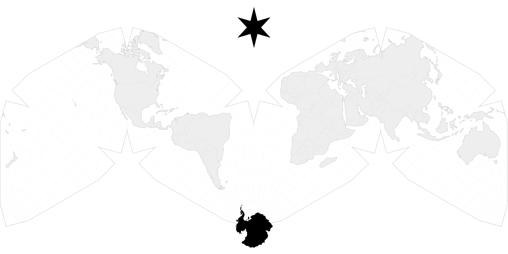
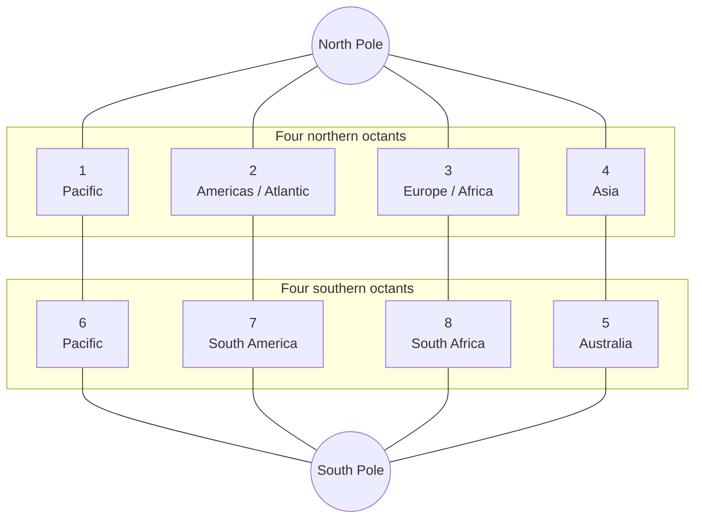
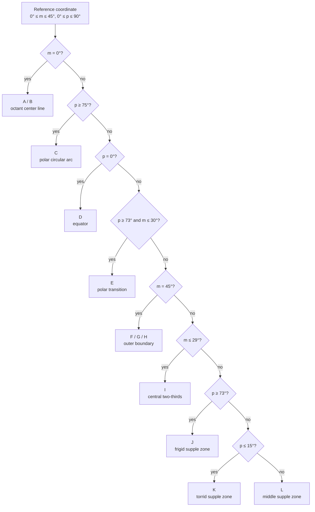
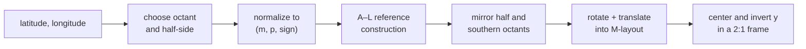

# Cahill-Keyes geometric context

[Documentation index](../index.md) ·
[Implementation notes](cahill-keyes-implementation-notes.md) ·
[Bibliography](cahill-keyes-bibliography.md)

## What kind of projection this is

The Cahill-Keyes is a polyhedral world map. Conceptually, the globe is divided
among the eight triangular faces of an octahedron: four faces meet at the North
Pole and four at the South Pole. Each spherical face covers 90 degrees of
longitude and one hemisphere. Unfolding and arranging those faces produces the
characteristic Cahill-Keyes M-shaped map.

This construction is unlike a cylindrical projection with one formula applied
continuously across a rectangular longitude-latitude grid. It deliberately has
cuts between selected octants. Within an octant, meridians and parallels are
constructed piecewise to control the relative shape and scale of geographic
cells. The implementation therefore follows a geometric construction rather
than a single closed-form equation.

<p align="center">
  
</p>

The illustration is the checked-in 44-by-22-inch Visionscarto SVG. Its outer
frame has the required 2:1 ratio. The graticule exposes the triangular octants,
the repeated polar vertices, and the intentional gaps at the map's cuts.

## Quadrants, octants, and half-octants

“Quadrant” is useful as a general orientation term, but the construction's
algorithmic unit is an **octant**. A hemisphere has four 90-degree longitude
sectors; adding north and south makes eight spherical octants. The seams are
rotated relative to the prime meridian, so the ordinary northeast, northwest,
southeast, and southwest geographic quadrants do not coincide with projection
faces.

The canonical numbering inherited from `MegamapMaker-prep9.pl` is:

| Longitude sector | North | South | Broad geographic context |
| --- | ---: | ---: | --- |
| 160° E through 180° and 180° through 110° W | 1 | 6 | Pacific, western North America, New Zealand |
| 110° W to 20° W | 2 | 7 | North America and North Atlantic; South America |
| 20° W to 70° E | 3 | 8 | Europe, Africa, and the Middle East |
| 70° E to 160° E | 4 | 5 | Asia; Australia |



This diagram shows geographic pairing, not the final planar positions. The
rotations and translations that form the M-layout are described below.

Each octant is itself split down its central meridian. All coordinate
construction can then happen in one reference **half-octant**:

- `p = |latitude|` is the parallel, from 0° at the equator to 90° at a
  pole.
- `m` is the absolute angular distance from the octant's central meridian,
  from 0° on the center line to 45° on an outer edge.
- A sign records which side of the center line supplied the point. It mirrors
  the reference coordinate before octant assembly.

Thus eight octants become sixteen mirrored half-octants, but the difficult
geometry is calculated only once.

## Geometry inside the reference half-octant

The template starts with the 10,000-unit scaffold `MG`. Important points on
the center line, equator, outer boundary, and transition curves establish the
graticule. Rays and line intersections form each meridian's torrid, middle,
and frigid segments. Circular arcs control the polar region. A specially
constructed circle supplies the 15° transition through the “supple” zones near
the outer third of the octant.

The original construction names twelve regions A through L. Dispatch order
matters where their boundary conditions overlap:



The purpose of the piecewise construction is continuity through the intended
joins while preserving Keyes's chosen proportions. A point may be computed by
linear interpolation along a constructed meridian, by a polar circular arc, or
by a line-circle intersection, depending on its zone. The exact formulas are
in the [implementation notes](cahill-keyes-implementation-notes.md#reference-half-octant-construction).

## From one template to the M-layout

After constructing `(x, y)` in the reference half-octant, the longitude-side
sign mirrors `y`. The result is rotated and translated according to its octant.
Southern octants first reflect the template horizontally about `x = MG`.

| Octant | Southern reflection | Rotation | Horizontal translation |
| ---: | :---: | ---: | ---: |
| 1 | no | -120° | `-MG` |
| 2 | no | -60° | `-MG` |
| 3 | no | -120° | `+MG` |
| 4 | no | -60° | `+MG` |
| 5 | yes | -60° | `+MG` |
| 6 | yes | -120° | `-MG` |
| 7 | yes | -60° | `-MG` |
| 8 | yes | -120° | `+MG` |

Every octant then receives the same vertical translation,
`MG sin(60°)`. These rigid transformations form the standard M-profile without
changing any local half-octant geometry.



## The 2:1 rendering frame

The canonical scaffold has `MG = 10,000` and an M-layout span of 40,000 units.
For a frame of width `W` and height `H`, this implementation requires
`W = 2H` and chooses:

```text
MG = H / 2 = W / 4
frame center = (W / 2, H / 2)
```

The native construction uses Cartesian coordinates with positive `y` upward.
Rendering uses screen coordinates with positive `y` downward, so the final
conversion is:

```text
X = W / 2 + x
Y = H / 2 - y
```

Scaling only changes lengths, not angles, zone boundaries, octant selection,
or relative positions. The same code therefore fits a 44-by-22 logical frame,
the 4224-by-2112 SVG coordinate space, the 13200-by-6600 300-DPI raster, and
arbitrary fractional 2:1 frames.

## Cuts, seams, and paths

A polyhedral projection is discontinuous at its cut edges. The point API makes
a deterministic octant choice at every longitude boundary, but a line or
polygon crossing a cut must be split instead of connected through the blank
space between octants. Projection-specific path handling remains in
[`a60-carto-projection-cahill-keyes-functions.h`](../src/a60-carto-projection-cahill-keyes-functions.h).

The native class is a **forward** projection only. It converts geographic
coordinates to map coordinates; it does not solve the inverse map-to-globe
problem.

[Documentation index](../index.md) ·
[Implementation notes](cahill-keyes-implementation-notes.md) ·
[Bibliography](cahill-keyes-bibliography.md)
