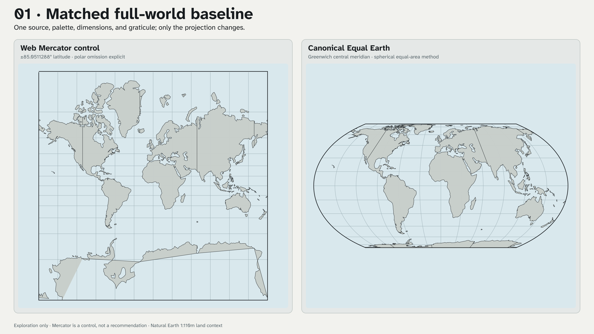
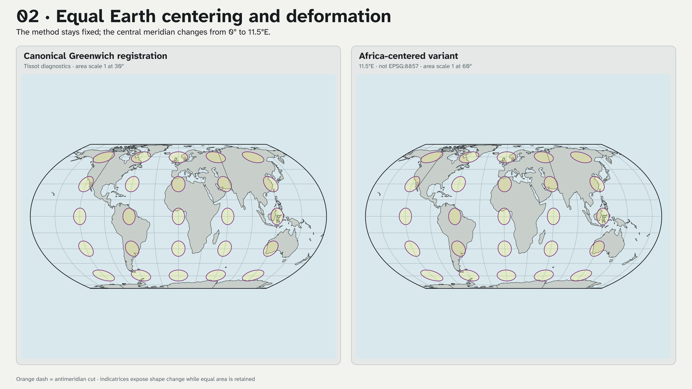
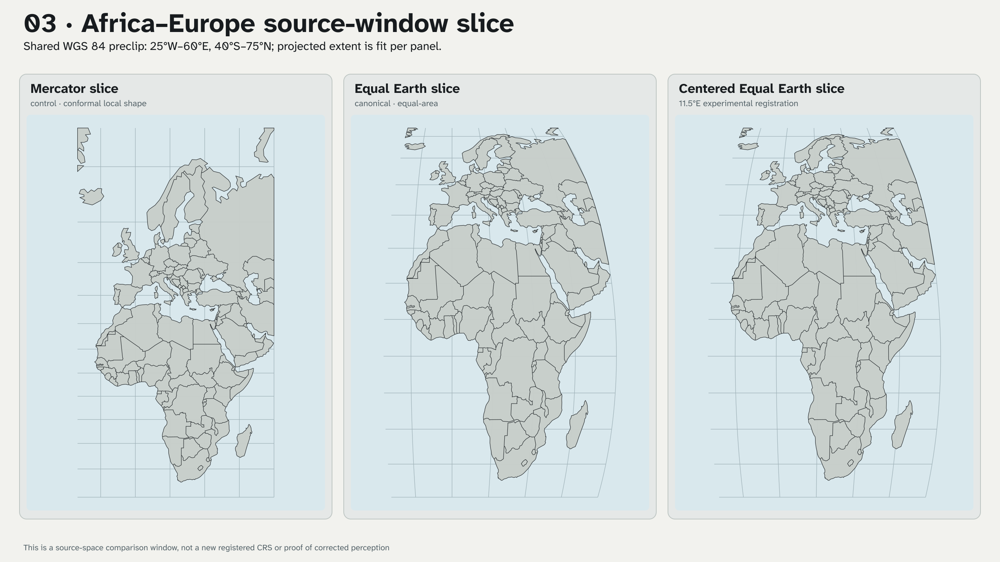
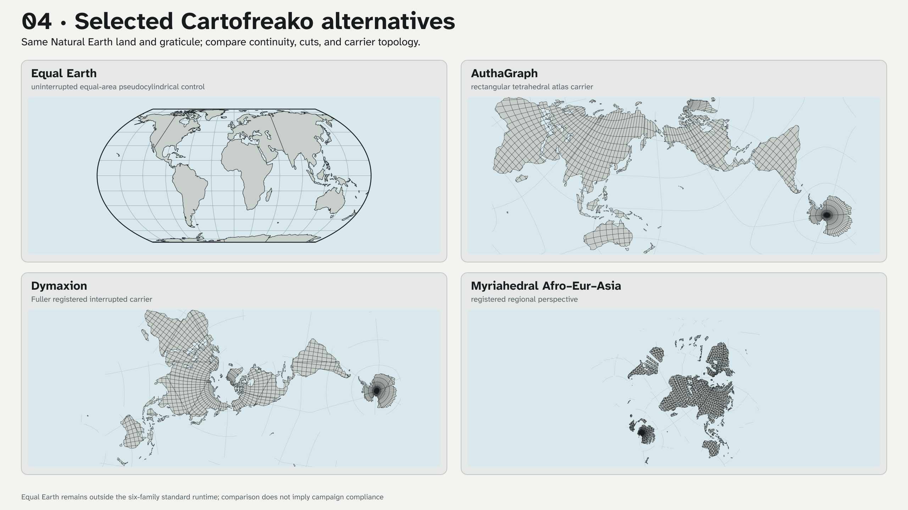
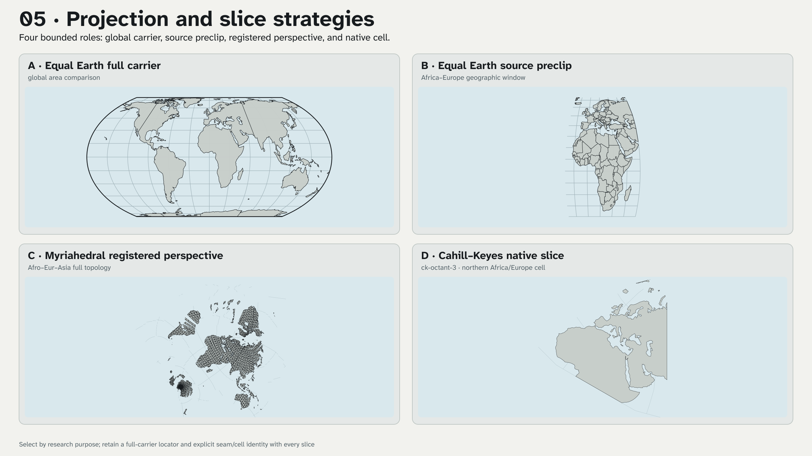

# Equal Earth positioning and slice speculations v01

[Development records](README.md) · [Stage 16 ledger](stage-16.md) ·
[Equal Earth implementation](../pages/projections/equal-earth/implementation.md)

These five 2560 × 1440 PNGs implement the Stage 16J one-to-five comparison
queue. They are local research previews. Equal Earth remains outside the six
standard release projections, and none of these files enters `make all`, a
GitHub release, or UCB AAO/S3.

## Recommended one-to-five sequence

| Iteration | Projection and slice | Recommended use | Required caution |
| --- | --- | --- | --- |
| 1 | Web Mercator at its explicit `±85.0511288°` limit beside canonical Greenwich Equal Earth, both full world | Establish the familiar control before discussing area and positioning | Mercator omits the polar caps; do not let familiarity become an unstated quality criterion. |
| 2 | Canonical Equal Earth and the same method centered on `11.5°E`, both full world with identical indicatrices | Isolate centering as the named layout variable and inspect area-preserving shape deformation | The centered variant is not EPSG:8857. Tissot diagnostics test mathematics, not audience response. |
| 3 | One WGS 84 source window, `25°W–60°E, 40°S–75°N`, through Mercator, canonical Equal Earth, and centered Equal Earth | Compare an Africa–Europe regional discussion without changing the source selection | Each panel is fit to its projected extent. It is a source slice, not a newly registered regional CRS. |
| 4 | Canonical Equal Earth, AuthaGraph, Dymaxion, and Myriahedral Afro–Eur–Asia as full carriers | Compare uninterrupted area, rectangular continuity, Fuller interruption, and registered regional topology | Cuts and carrier geometry change together; this is not a single-variable perceptual study. |
| 5 | Equal Earth full, centered Equal Earth geographic preclip, Myriahedral Afro–Eur–Asia registered perspective, and CK `ck-octant-3` native-cell mask | Choose a slice grammar by purpose: planetary, regional source window, interpretive registered perspective, or repeatable native cell | Every sliced delivery needs a full-carrier locator plus seam, cell, source-window, and inverse-behavior metadata. |

### 01 · Matched full-world baseline



### 02 · Centering and Tissot diagnostics



### 03 · Africa–Europe source-window slice



### 04 · Full-carrier alternatives



### 05 · Projection and slice strategies



## Numerical and evidence controls

The implementation-neutral bundle under
[`fixtures/projections/equal-earth-v1/`](../../fixtures/projections/equal-earth-v1/)
contains 30 cases across canonical and `11.5°E` layouts. PROJ and D3 are
recorded as cross-implementation oracles. C++ and JavaScript consume the same
neutral raw/page contract, and the offline checker adds forward/reverse,
outside-carrier, seam, pole, Jacobian, local-scale, angular-deformation,
Tissot, and spherical area-scale diagnostics.

The Mercator plate is a control only. The Equal Earth plates demonstrate an
implemented equal-area method and explicit centering alternatives; they do
not establish compliance with `#CorrectTheMap`, correction of human bias, a
decolonial outcome, or a preferred projection for every task. Those require
campaign criteria and participatory human evaluation beyond Stage 16J.

## Reproduce headlessly

```sh
make check-equal-earth-projection
make render-equal-earth-positioning-v01
```

The renderer uses checked local 1:110m geometry, the dedicated Equal Earth
module, the six-family WebAssembly runtime for comparison carriers, GDAL for
the regional source preclip, Inkscape for rasterization, and ImageMagick for
stable PNG metadata. It performs no network access, acquisition,
authorization, email, release, upload, or external transfer.

`make all-experiments` includes this renderer because its five products are
implemented and non-release. Promotion remains a separate human decision.
