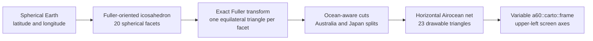
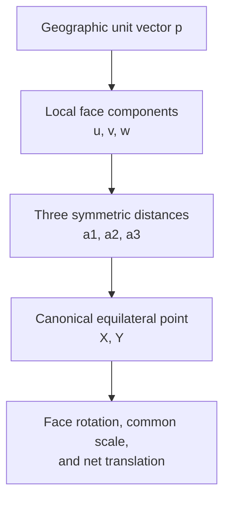

# Dymaxion geometric context

[Documentation index](../index.md) ·
[Implementation notes](dymaxion-implementation-notes.md) ·
[Bibliography](dymaxion-bibliography.md)

## Which Dymaxion map this implements

“Dymaxion map” names more than one historical object. Fuller's 1943 map used
a cuboctahedron. The familiar later map, developed with Shoji Sadao and
published in 1954 as the Airocean World Map, uses a specially oriented
icosahedron. This implementation is the later icosahedral form.

Its geometric pipeline is:



The polyhedron is a mathematical organizer. The implementation does not
construct a solid, render it in 3D, or project through a camera. It directly
selects a spherical facet and evaluates the corresponding planar equations.

## Why an icosahedron

A regular icosahedron has 20 congruent equilateral faces, 30 edges, and 12
vertices. Projecting its edges radially to the sphere divides the globe into
20 congruent spherical triangles. Each triangle is small enough that its
flattening error is distributed among many facets instead of accumulating at
one global seam or pole.

```text
regular icosahedron

vertices:       12
edges:          30
faces:          20
edges per face:  3
faces at vertex: 5
```

The central angle of each spherical edge is:

```text
2 asin(sqrt(5-sqrt(5)) / sqrt(10))
  = 63.43494882292201 degrees
```

Fuller's orientation is as important as the choice of solid. It places most
facet cuts through ocean, allowing the continents to read as one connected
world island in one world ocean. The result avoids treating north as an
obligatory top or any one meridian as an obligatory center.

## The unfolded net

<p align="center">
  <a href="https://s3-ewh.ist.berkeley.edu/adekosnik-bucket01/cartofreako/v12/tree/png/geometry-dymaxion-44-20.78461.png">
    
  </a>
</p>

The gray triangles are the native drawable pieces. Eighteen correspond
one-to-one with complete icosahedron faces. Two parent faces are cut again in
the plane so that land is not forced across an exterior map cut:

- one parent face becomes two Australia pieces; and
- one parent face becomes three Japan pieces.

Thus the flat drawing has 23 triangles while the spherical polyhedron still
has 20 faces. A subface does not introduce a new spherical projection model;
it uses its parent's local Fuller transform and selects another placement in
the net.

The topological distinction is visible in the outline:

- a **hinge** is an edge where neighboring planar triangles remain attached;
- a **cut** is an icosahedron or subface edge whose two sides appear in
  different places on the page; and
- a **split copy** is a portion of one parent face moved to preserve a land
  connection elsewhere.

Adjacent geographic points must not be joined blindly. Two points can be very
close on the globe and far apart on the flat map when their shared spherical
edge is a cut.

## The local face picture

For one complete spherical face with vertices `q0`, `q1`, and `q2`, the
implementation builds a local orthonormal frame:

```text
                         z
                         ^  face-center direction
                         |
                         o----> y  toward q0
                        /
                       x       y cross z orientation
```

Every point in the selected face is expressed as `(u,v,w)` in that basis.
The threefold symmetry of an equilateral triangle then supplies three
equivalent arc-distance coordinates, one associated with each side.



The canonical transform is the same for every complete face. Only the local
basis and final face placement change.

## Why the transform is not gnomonic

A gnomonic face projection draws a ray from the center of the sphere to the
flat icosahedron face. It is simple, and it maps great circles to straight
lines, but its scale along an icosahedron edge is not uniform: equal spherical
arc intervals crowd differently near the edge midpoint and vertices.

The Fuller/Gray transform instead computes spherical arc distances and uses
those distances in the planar equilateral triangle. Its defining boundary
property is:

```text
fraction of spherical facet edge
    = fraction of corresponding planar facet edge
```

The two methods share the same icosahedron orientation and the same vertex
positions, so coast-only images can look remarkably similar. Their graticules
and numeric coordinates are nevertheless different. This implementation uses
the exact Fuller equations; PROJ's current Airocean projection is used for its
permissively licensed face/net registration, not as the face-transform
formula.

## Reading the Earth result

<p align="center">
  <a href="https://s3-ewh.ist.berkeley.edu/adekosnik-bucket01/cartofreako/v12/tree/png/earth-dymaxion-44-20.78461.png">
    
  </a>
</p>

White page regions are outside the unfolded polyhedron. Blue regions are
pieces of one connected spherical ocean, separated only because the
icosahedron has been opened and laid flat. Beige land uses the same cuts, but
the selected aspect avoids the most disruptive continental separations.

The phrase “one island in one ocean” is a way to read the relationships in
this aspect, not a topological claim that the paper outline is itself one
uncut polygon. Some ocean cuts are necessarily prominent because flattening a
closed sphere requires an interruption tree.

There is no universally privileged up direction. The checked-in aspect uses
the official net's horizontal orientation because it fits print and video
carriers efficiently. Rotating the entire page would not change the
projection; selecting a different hinge/cut arrangement would define a
different aspect of the same icosahedral projection.

## Graticules, poles, and facet edges

<p align="center">
  <a href="https://s3-ewh.ist.berkeley.edu/adekosnik-bucket01/cartofreako/v12/tree/png/graticules-dymaxion-44-20.78461.png">
    
  </a>
</p>

The graticule makes several properties visible:

- meridians and parallels are complex curves assembled from face-local
  pieces;
- lines break at exterior facet cuts but remain continuous across hinges;
- neither pole lies at a net vertex; both are ordinary points inside facets;
- no meridian or parallel is generally identical to a facet edge; and
- curve direction can change at a retained facet boundary because the two
  planar triangles have different orientations.

The implementation detects each face transition in geographic space, bisects
it, and compares the two limiting planar positions. This uses topology rather
than an arbitrary visual jump threshold.

## Facets versus quadrants

Dymaxion's mathematical units are facets, not geographic quadrants. A
north/south-east/west partition would cut across the Fuller-oriented
icosahedron and has no role in the forward formula.

The geometry artifact nevertheless contains four blue **screen quadrants**.
They are the generator's common diagnostic carrier partition, shared by all
projections. For the standard 44-inch Dymaxion frame they are:

| Screen quadrant | Frame x interval | Native-net x interval |
| ---: | ---: | ---: |
| 1 | `[0, 11)` | `[0, W0/4)` |
| 2 | `[11, 22)` | `[W0/4, W0/2)` |
| 3 | `[22, 33)` | `[W0/2, 3W0/4)` |
| 4 | `[33, 44]` | `[3W0/4, W0]` |

These rectangles are useful for print inspection and possible carrier
slicing, but they cut through native triangles and have no stable continent,
hemisphere, or face identity. A seam-safe Dymaxion slice should be specified
in terms of complete face/subface masks or explicit clipping geometry, not by
assuming those four bands are geographic quadrants.

There are also ordinary signs of the local `(u,v)` coordinates inside each
face, but calling those four sign combinations “quadrants” is not helpful:
the exact formula is threefold symmetric and is more naturally described by
its three edge distances or six 60-degree local sectors.

## Aspect ratio from the triangular lattice

Let `e` be the native planar edge length. The selected horizontal net is
`11/2` edges wide and three equilateral altitudes high:

```text
width  = (11/2)e
height = 3(sqrt(3)/2)e

width / height = 11 / (3sqrt(3))
               = 2.116950987028628...
```

Uniformly enlarging this lattice is harmless. Forcing it into `2:1`, `16:9`,
or another convenient rectangle would stretch every face in one direction,
adding anisotropic distortion unrelated to the Fuller projection. That is why
the public constructor validates the aspect ratio rather than silently
resizing axes independently.

## Distortion and intended use

The Fuller projection is a compromise projection:

- it is not conformal;
- it is not equal-area;
- most distances and directions are not preserved; and
- its facet edges do have correct uniform scale.

Distortion is limited spatially because every location is within one small
icosahedron face. Esri describes distortion as increasing away from facet
edges. This differs from many familiar world projections, where error is
organized around one pole, equator, or central meridian.

The heavily interrupted net is intended for the entire globe and for seeing
relationships among all land masses. A regional street, navigation, or
continuous ocean route map usually benefits from a projection with a single
local seam and a directly useful inverse.

## Naming and trademarks

These documents use “Dymaxion” for the familiar 1954 icosahedral Fuller/Sadao
map and “Airocean net” when referring specifically to its unfolded aspect.
The Buckminster Fuller Institute identifies `Dymaxion`, `Spaceship Earth`, and
`Fuller Projection Map` as BFI trademarks and invites licensing inquiries.
Repository filenames are technical identifiers; they do not imply ownership,
certification, sponsorship, or endorsement by BFI.

---

[Documentation index](../index.md) ·
[Implementation notes](dymaxion-implementation-notes.md) ·
[Bibliography](dymaxion-bibliography.md)
