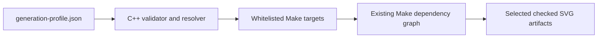

# Generation methods and Stage 7 selection design

[Documentation index](../index.md) ·
[Generation guide](generation.md) ·
[Prerequisites](prerequisites.md)

## Outcome

Stage 7 adds a project-level JSON preference for the common development case:
select one or more projections, select one or more generation passes, and let
a bare `make` build only that cross-product. The checked-in default selects
Cahill-Keyes plus the Earth and complementary physical-feature passes.

The implementation keeps the existing Make dependency graph authoritative.
The profile resolver translates validated names into existing, public Make
targets; the generators still own all geographic, astronomical, orbital, SVG,
and embedded verification behavior.

This distinction is intentional: Stage 7 selects **generation passes**, not
individual semantic layers inside one generated SVG. Internal layer sets are
generator-specific contracts. Selecting them would require a different schema
and generator API rather than a build-orchestration preference.

## Methods evaluated

| Method | Benefits | Costs and risks | Decision |
| --- | --- | --- | --- |
| Invoke explicit Make targets | Existing, precise, no new mechanism | Repetitive for a changing projection/pass matrix; preferences are not saved | Retained for one-off and automation use |
| Make command-line variables such as `PROJECTIONS=... PASSES=...` | Small implementation; easy CI override | Ephemeral; weak list validation and quoting; no durable profile | Not the primary interface |
| Include a user-authored `.mk` fragment | Native Make expansion and dependency behavior | The preference file is executable Make syntax, not data; typos can alter arbitrary variables or rules | Rejected for a user preference |
| Parse JSON with `jq` | Concise query expressions | Adds a tool that is not otherwise a required build dependency; shell quoting and target validation still need code | Rejected |
| Parse JSON with Python | Good validation libraries and diagnostics | Adds a runtime language to the native C++/Make generation path | Rejected |
| Generate and include a `.mk` file from JSON | Makes the selected targets visible during Make's parse phase | Requires include-file remakes and Make restarts; stale generated fragments and bootstrap ordering complicate a small feature | Rejected |
| Filter layers inside every generator | Could eventually control individual SVG layers | Starts expensive generators before work can be excluded; layer vocabulary differs among terrestrial, astronomy, and orbital products; duplicates Make's role | Rejected for Stage 7 |
| Validated C++ resolver followed by recursive Make | Durable JSON, strict diagnostics, reuse of the existing C++20/RapidJSON stack, safe fixed targets, normal Make dependencies and parallelism | Builds one small resolver and starts one recursive Make | Selected |

The selected approach has one deliberate limitation: configured generation
produces layered SVG source artifacts. PDF and PNG format selection was not
added to schema version 1 because the request concerned projection and pass
selection, and exports are cheap to express with existing explicit artifact
or aggregate targets. A later schema can add formats without changing the
meaning of the current fields.

## Selected workflow



[`generation-profile.json`](../generation-profile.json) is the default input.
[`generation-profile.h`](../src.generate/generation-profile.h) owns schema
validation, alias normalization, and target expansion. The thin
[`resolve-generation-profile.cc`](../src.generate/resolve-generation-profile.cc)
entry point provides machine-readable target output and the human-readable
plan. The [Makefile](../Makefile) compiles it, makes `configured` the default
goal, and invokes a recursive Make with the resolved targets.

The recursion is a useful boundary rather than a second build system:

- the resolver cannot inject recipes or variables because it emits names from
  a fixed projection/pass table;
- Make still decides whether each artifact is current;
- command-line settings such as `NATURAL_EARTH_DIR`, `ASTRO_PROFILE`,
  `ORBITING_PROFILE`, compiler options, `-B`, and `-j` propagate normally; and
- explicit targets and `make all` do not read or depend on the selection
  profile.

## Profile schema version 1

```json
{
  "schema_version": 1,
  "description": "Fast Cahill-Keyes terrestrial development profile",
  "projections": ["cahill_keyes"],
  "passes": ["earth", "ocean"]
}
```

`schema_version`, `projections`, and `passes` are required. `description` is
optional. Unknown members are rejected so a misspelled selector cannot be
silently ignored. Both selectors are nonempty arrays; `"all"` is valid only
when it is the sole item.

Normalization is limited and deterministic:

- matching is case-insensitive and `_` becomes `-`;
- `cahill_keyes`, `cahillkeyes`, and `ck` become `cahill-keyes`;
- `star_x` and `starx` become `star-x`;
- `autha_graph` becomes `authagraph`;
- `voroni` remains accepted as an alias for `voronoi`;
- `graticule` becomes `graticules`;
- `astro` becomes `astronomy`;
- `orbiting` becomes `orbital-technosphere`; and
- `ocean` becomes `water`, the current name of the complementary Natural
  Earth physical-feature generation pass.

Aliases are canonicalized before duplicate detection. For example,
`["water", "ocean"]` is rejected rather than generating the same artifact
twice.

The supported cross-product is:

| Projection selector | Geometry | Graticules | Earth | Water | Astronomy | Orbital Technosphere |
| --- | --- | --- | --- | --- | --- | --- |
| `cahill-keyes` | 1 SVG | 1 SVG | 1 SVG | 1 SVG | 2 SVGs | 2 SVGs |
| `authagraph` | 1 SVG | 1 SVG | 1 SVG | 1 SVG | 2 SVGs | 2 SVGs |
| `dymaxion` | 1 SVG | 1 SVG | 1 SVG | 1 SVG | 2 SVGs | 2 SVGs |
| `myriahedral` | 1 SVG | 1 SVG | 1 SVG | 1 SVG | 2 SVGs | 2 SVGs |
| `star-x` | 1 SVG | 1 SVG | 1 SVG | 1 SVG | 2 SVGs | 2 SVGs |
| `voronoi` | 1 SVG | 1 SVG | 1 SVG | 1 SVG | 2 SVGs | 2 SVGs |

Astronomy resolves to `generate-astro-PROJECTION`, which intentionally makes
both all-sky and observer products. Orbital Technosphere resolves to
`generate-orbiting-PROJECTION`, which makes both global and observer
products. The four terrestrial passes resolve to uniform
`generate-PASS-PROJECTION` targets.

Stage 7 adds uniform Cahill-Keyes aliases for that last rule. In particular,
`generate-earth-cahill-keyes` produces only the whole-map Earth SVG, whereas
the older `generate-earth-ck` compatibility target also produces 12
Cahill-Keyes slices.

## Available generation methods

### Saved development selection

Preview the resolved names, then build them:

```sh
make generation-plan
make
```

`make configured` is the explicit spelling of the default goal. Use `make -B`
to force regeneration of only the configured selection.

For an uncommitted personal profile, create `generation-profile.local.json`
and select it on the command line:

```sh
make GENERATION_PROFILE=generation-profile.local.json generation-plan
make GENERATION_PROFILE=generation-profile.local.json
```

### Complete checked-in artifact suite

```sh
make all
```

This remains the release/review build. It creates all 67 layered SVGs and
exports all 67 PDFs and 67 opaque PNGs, including slice and perspective
families that are outside the configurable matrix. The aliases
`generate-projections`, `generated-projections`, and `make-generated` retain
the same full-suite behavior.

### Projection, pass, and product families

Existing family targets are useful when the desired selection does not need
to be saved:

```sh
make generate-star-x
make generate-earth-projections
make generate-astro-observer
make generate-orbiting-global
make generate-water-myriahedral-perspectives
make generate-ck-slices
```

Projection family targets generate SVGs unless their documented target says
`artifacts`. `generate-orbiting-artifacts`, for example, adds PDF and PNG
exports for that product family.

### Exact targets and artifact paths

Multiple explicit targets already express an ad hoc matrix:

```sh
make generate-earth-cahill-keyes generate-water-cahill-keyes
make generate-geometry-star-x generate-graticules-voronoi
```

Generated PDF and PNG paths are also direct Make targets. Their pattern rules
first update the corresponding checked SVG and then invoke Inkscape:

```sh
make assets.generated/png/earth-ck-44-22.png
make assets.generated/pdf/astro-observer-star-x-34-44.pdf
```

### Input acquisition and verification

Acquisition remains explicit because it changes reproducibility inputs:

```sh
make fetch-natural-earth-10m
make fetch-astro-data
make fetch-orbiting-data
```

`make check` compiles and runs the native algorithm/API suite, including
generation-profile schema and alias tests. SVG generators instead run their
own structural validation whenever their generation target executes.

## Scope boundaries and future extensions

The generation profile does not override astronomical or orbital calculation
properties. The astronomy and Orbital Technosphere profiles remain the sole
authorities for timestamp, observer location, source snapshots, and display
budgets. Stage 7 only decides which Make branches to enter.

The following remain explicit rather than configurable in schema version 1:

- SVG/PDF/PNG format selection;
- one astronomy product instead of both;
- one Orbital Technosphere product instead of both;
- Cahill-Keyes four- and eight-slice generation;
- Myriahedral perspective and face-group slice generation; and
- semantic layer enable/disable switches inside a generator.

If repeated workflows justify schema version 2, formats and product variants
can be modeled as additional validated dimensions. Individual SVG layer
selection should be designed separately, with a shared naming contract and
generator-specific dependency analysis, rather than overloaded onto the pass
selector.
