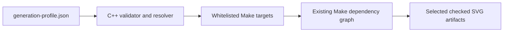

# Generate-pass methods and decision record

[Documentation index](../index.md) ·
[Generation guide](generation.md) ·
[Prerequisites](prerequisites.md)

## Scope and preservation policy

This is the central decision record for work whose proposed deliverable is a
`src.generate/generate-*.cc` pass or infrastructure that selects
`generate-*` Make targets. It intentionally excludes projection-algorithm,
WebAssembly, browser, and general documentation evaluations.

The repository does not retain chat transcripts. It retains two durable forms
of the generation discussions:

- [`converge-generation.md`](converge-generation.md) is the raw request and
  stage ledger; and
- this document and the pass-specific implementation notes summarize
  evaluation conclusions that can be supported by implemented code, profiles,
  data snapshots, tests, and committed documentation.

An evaluation request is not treated as an approved design. Where a proposed
pass has no confirmed plan or implementation in the repository, the ledger
below says so explicitly. This avoids turning an exploratory prompt into a
decision after the fact.

## Generate-pass evaluation ledger

| Stage | Proposed pass | Repository status | Preserved evaluation record |
| --- | --- | --- | --- |
| 4.1 | `generate-astro` / space and astronomy | **Implemented** | Visualization-grade feasibility, source roles, profile authority, calculation methods, products, and limits are summarized below and detailed in the [astronomy implementation notes](astro-implementation-notes.md) |
| 4.1a | `generate-cloud-atmosphere` | **Requested; not evaluated to a repository decision** | The raw request identifies timestamped cloud/atmosphere conditions and JAXA Earth data, but no confirmed source contract, profile, product split, or implementation is preserved |
| 4.2 | `generate-orbiting` / Orbital Technosphere | **Implemented** | Naming, NASA/CelesTrak feasibility, OMM/SGP4, profile authority, products, and limits are summarized below and detailed in the [Orbital Technosphere implementation notes](orbital-technosphere-implementation-notes.md) |
| 4.4 | `generate-network` | **Requested; not evaluated to a repository decision** | The raw request records variable GeoJSON input, `properties.downloaders`, Alpha60 prior art, and two visual references; no confirmed schema or rendering plan is preserved |
| 4.5 | `generate-art-agua-roulette` | **Requested; not evaluated to a repository decision** | The raw request proposes mapping bathymetric depth to increasingly complex Izzi roulette curves; no confirmed curve mapping, topology policy, or implementation is preserved |
| 6 | `generate-world-game` | **Requested; not evaluated to a repository decision** | The raw request identifies World Game and Fuller archival collections; no confirmed digitization, licensing, normalized dataset, layer model, or implementation is preserved |
| 7 | Configurable `generate-*` selection | **Implemented infrastructure** | JSON profile, validation, safe target expansion, default Make behavior, alternatives, and scope boundaries are recorded in this document |

The unnumbered `solar/high-energy`, `atmosphere/cloud`, and
`small-body/mission` lines in the raw ledger are taxonomy notes, not separate
approved passes. Astronomy currently owns the implemented solar,
high-energy, and representative small-body content. No inference is made
about a future split.

## Implemented evaluation conclusions

### Stage 4.1: astronomy

The evaluation concluded that an astronomy pass is feasible for
visualization and atlas placement, provided it does not claim observatory- or
navigation-grade ephemerides. The implemented choices were:

- use the same six spherical projection implementations as terrestrial maps,
  with declination mapped to latitude and profile-oriented right ascension
  mapped to synthetic longitude;
- produce complementary `all-sky` and observer-filtered products rather than
  one ambiguous view;
- make a JSON profile the sole authority for calculation timestamp, observer
  position, orientation, instrument bands, transient window, source paths,
  and display budgets;
- keep normal generation offline through bounded, checked-in snapshots;
- use NASA Planetary Data for discovery/provenance, not as a universal sky
  catalog; use Gaia for stars, the NASA Exoplanet Archive for confirmed host
  systems, JPL elements and SBDB for Solar System bodies, and curated
  GCN/NSSDC/HEASARC context for persistent and transient high-energy sources;
  and
- state the approximation boundary: linear Gaia proper motion, approximate
  major-planet and lunar elements, two-body small-body propagation, simplified
  sidereal/visibility calculations, and no atmospheric or terrain model.

JAXA Earth data was evaluated as a possible future atmosphere/cloud context,
not as a source of celestial coordinates. The implementation, exact formulas,
source-role table, validation, and deferred precision work are recorded in
[`astro-implementation-notes.md`](astro-implementation-notes.md).

### Stage 4.2: Orbital Technosphere

The evaluation concluded that a human-made orbit pass is feasible at
visualization scale, but that no single requested NASA source supplies the
complete current Earth-orbit population. The implemented choices were:

- use **Orbital Technosphere** for public output and metadata while retaining
  `generate-orbiting` as the concise Make and source namespace;
- use CelesTrak OMM CSV as the broad population and category-membership feed,
  the Vallado/CelesTrak SGP4 reference implementation for propagation, and
  NASA SSCWeb positions as independent checks for selected spacecraft;
- treat the supplied Wikipedia pages and Starlink infrastructure essay as
  terminology and design context, not reproducible catalog truth;
- store the exact calculation instant, make-invocation reference location,
  catalog roles, freshness rules, visibility rules, and budgets in a JSON
  profile rather than reading host time or inferring location;
- produce a global terrestrial-subpoint product and an above-horizon observer
  product for every projection; and
- bound the claim to visualization: public-element age and uncertainty,
  simplified Earth orientation and illumination, and absence of covariance,
  maneuvers, photometry, weather, or operational safety guarantees remain
  explicit limitations.

The naming alternatives, source matrix, OMM/SGP4 conversions, coordinate
pipeline, detiling layers, tests, and accuracy boundary are recorded in
[`orbital-technosphere-implementation-notes.md`](orbital-technosphere-implementation-notes.md).

## Unresolved generation-pass proposals

The following entries preserve the useful content of the requests without
claiming that an evaluation or confirmation occurred:

- **Cloud/atmosphere:** intended as timestamped atmospheric conditions in
  `generate-cloud-atmosphere.cc`, initially using JAXA Earth data. Before
  implementation it still needs a concrete product definition, temporal and
  spatial resolution policy, acquisition and cache contract, observer/global
  distinction, profile schema, missing-data behavior, and licensing review.
- **Network:** intended to detile cumulative swarm GeoJSON and visualize
  `properties.downloaders` using a variable source, starting from the cited
  Alpha60 results dataset. It still needs a versioned input schema, semantics
  for cumulative versus instantaneous values, aggregation and privacy rules,
  projection/seam behavior, visual encoding contract, and test fixture.
- **Art Agua Roulette:** intended to replace ordinary bathymetric color steps
  with progressively more complex roulette curves. It still needs a
  deterministic depth-to-curve parameterization, fill versus stroke rules,
  clipping and hole behavior, density/performance budgets, palette policy,
  and a reproducible visual acceptance test.
- **World Game:** intended to map Fuller's *Inventory of World Resources,
  Human Trends, and Needs* using BFI, Virginia Tech, Stanford, and California
  archival holdings. It still needs an accessible machine-readable corpus,
  rights and citation review, edition/time semantics, normalized resource
  ontology, geographic registration method, uncertainty policy, and a bounded
  first product.

These are open design questions, not newly imposed requirements. A future
evaluation should add its evidence, alternatives, recommendation, and
confirmation state here before implementation begins.

## Stage 7 configured-selection outcome

Stage 7 adds a project-level JSON preference for the common development case:
select one or more projections, select one or more generation passes, and let
a bare `make` build only that cross-product. The checked-in default selects
Cahill-Keyes plus the Earth and complementary physical-feature passes.

The implementation keeps the existing Make dependency graph authoritative.
The profile resolver translates validated names into existing, public Make
targets; the generators still own all geographic, astronomical, orbital, SVG,
and embedded verification behavior.

This distinction is intentional: Stage 7 selects **generation passes**, not
individual semantic layers inside one generated SVG. Internal layer sets are
generator-specific contracts. Selecting them would require a different schema
and generator API rather than a build-orchestration preference.

## Stage 7 orchestration methods evaluated

| Method | Benefits | Costs and risks | Decision |
| --- | --- | --- | --- |
| Invoke explicit Make targets | Existing, precise, no new mechanism | Repetitive for a changing projection/pass matrix; preferences are not saved | Retained for one-off and automation use |
| Make command-line variables such as `PROJECTIONS=... PASSES=...` | Small implementation; easy CI override | Ephemeral; weak list validation and quoting; no durable profile | Not the primary interface |
| Include a user-authored `.mk` fragment | Native Make expansion and dependency behavior | The preference file is executable Make syntax, not data; typos can alter arbitrary variables or rules | Rejected for a user preference |
| Parse JSON with `jq` | Concise query expressions | Adds a tool that is not otherwise a required build dependency; shell quoting and target validation still need code | Rejected |
| Parse JSON with Python | Good validation libraries and diagnostics | Adds a runtime language to the native C++/Make generation path | Rejected |
| Generate and include a `.mk` file from JSON | Makes the selected targets visible during Make's parse phase | Requires include-file remakes and Make restarts; stale generated fragments and bootstrap ordering complicate a small feature | Rejected |
| Filter layers inside every generator | Could eventually control individual SVG layers | Starts expensive generators before work can be excluded; layer vocabulary differs among terrestrial, astronomy, and orbital products; duplicates Make's role | Rejected for Stage 7 |
| Validated C++ resolver followed by recursive Make | Durable JSON, strict diagnostics, reuse of the existing C++20/RapidJSON stack, safe fixed targets, normal Make dependencies and parallelism | Builds one small resolver and starts one recursive Make | Selected |

The selected approach has one deliberate limitation: configured generation
produces layered SVG source artifacts. PDF and PNG format selection was not
added to schema version 1 because the request concerned projection and pass
selection, and exports are cheap to express with existing explicit artifact
or aggregate targets. A later schema can add formats without changing the
meaning of the current fields.

## Selected workflow



[`generation-profile.json`](../generation-profile.json) is the default input.
[`generation-profile.h`](../src.generate/generation-profile.h) owns schema
validation, alias normalization, and target expansion. The thin
[`resolve-generation-profile.cc`](../src.generate/resolve-generation-profile.cc)
entry point provides machine-readable target output and the human-readable
plan. The [Makefile](../Makefile) compiles it, makes `configured` the default
goal, and invokes a recursive Make with the resolved targets.

The recursion is a useful boundary rather than a second build system:

- the resolver cannot inject recipes or variables because it emits names from
  a fixed projection/pass table;
- Make still decides whether each artifact is current;
- command-line settings such as `NATURAL_EARTH_DIR`, `ASTRO_PROFILE`,
  `ORBITING_PROFILE`, compiler options, `-B`, and `-j` propagate normally; and
- explicit targets and `make all` do not read or depend on the selection
  profile.

## Profile schema version 1

```json
{
  "schema_version": 1,
  "description": "Fast Cahill-Keyes terrestrial development profile",
  "projections": ["cahill_keyes"],
  "passes": ["earth", "ocean"]
}
```

`schema_version`, `projections`, and `passes` are required. `description` is
optional. Unknown members are rejected so a misspelled selector cannot be
silently ignored. Both selectors are nonempty arrays; `"all"` is valid only
when it is the sole item.

Normalization is limited and deterministic:

- matching is case-insensitive and `_` becomes `-`;
- `cahill_keyes`, `cahillkeyes`, and `ck` become `cahill-keyes`;
- `star_x` and `starx` become `star-x`;
- `autha_graph` becomes `authagraph`;
- `voroni` remains accepted as an alias for `voronoi`;
- `graticule` becomes `graticules`;
- `astro` becomes `astronomy`;
- `orbiting` becomes `orbital-technosphere`; and
- `ocean` becomes `water`, the current name of the complementary Natural
  Earth physical-feature generation pass.

Aliases are canonicalized before duplicate detection. For example,
`["water", "ocean"]` is rejected rather than generating the same artifact
twice.

The supported cross-product is:

| Projection selector | Geometry | Graticules | Earth | Water | Astronomy | Orbital Technosphere |
| --- | --- | --- | --- | --- | --- | --- |
| `cahill-keyes` | 1 SVG | 1 SVG | 1 SVG | 1 SVG | 2 SVGs | 2 SVGs |
| `authagraph` | 1 SVG | 1 SVG | 1 SVG | 1 SVG | 2 SVGs | 2 SVGs |
| `dymaxion` | 1 SVG | 1 SVG | 1 SVG | 1 SVG | 2 SVGs | 2 SVGs |
| `myriahedral` | 1 SVG | 1 SVG | 1 SVG | 1 SVG | 2 SVGs | 2 SVGs |
| `star-x` | 1 SVG | 1 SVG | 1 SVG | 1 SVG | 2 SVGs | 2 SVGs |
| `voronoi` | 1 SVG | 1 SVG | 1 SVG | 1 SVG | 2 SVGs | 2 SVGs |

Astronomy resolves to `generate-astro-PROJECTION`, which intentionally makes
both all-sky and observer products. Orbital Technosphere resolves to
`generate-orbiting-PROJECTION`, which makes both global and observer
products. The four terrestrial passes resolve to uniform
`generate-PASS-PROJECTION` targets.

Stage 7 adds uniform Cahill-Keyes aliases for that last rule. In particular,
`generate-earth-cahill-keyes` produces only the whole-map Earth SVG, whereas
the older `generate-earth-ck` compatibility target also produces 12
Cahill-Keyes slices.

## Available generation methods

### Saved development selection

Preview the resolved names, then build them:

```sh
make generation-plan
make
```

`make configured` is the explicit spelling of the default goal. Use `make -B`
to force regeneration of only the configured selection.

For an uncommitted personal profile, create `generation-profile.local.json`
and select it on the command line:

```sh
make GENERATION_PROFILE=generation-profile.local.json generation-plan
make GENERATION_PROFILE=generation-profile.local.json
```

### Complete checked-in artifact suite

```sh
make all
```

This remains the release/review build. It creates all 67 layered SVGs and
exports all 67 PDFs and 67 opaque PNGs, including slice and perspective
families that are outside the configurable matrix. The aliases
`generate-projections`, `generated-projections`, and `make-generated` retain
the same full-suite behavior.

### Projection, pass, and product families

Existing family targets are useful when the desired selection does not need
to be saved:

```sh
make generate-star-x
make generate-earth-projections
make generate-astro-observer
make generate-orbiting-global
make generate-water-myriahedral-perspectives
make generate-ck-slices
```

Projection family targets generate SVGs unless their documented target says
`artifacts`. `generate-orbiting-artifacts`, for example, adds PDF and PNG
exports for that product family.

### Exact targets and artifact paths

Multiple explicit targets already express an ad hoc matrix:

```sh
make generate-earth-cahill-keyes generate-water-cahill-keyes
make generate-geometry-star-x generate-graticules-voronoi
```

Generated PDF and PNG paths are also direct Make targets. Their pattern rules
first update the corresponding checked SVG and then invoke Inkscape:

```sh
make assets.generated/png/earth-ck-44-22.png
make assets.generated/pdf/astro-observer-star-x-34-44.pdf
```

### Input acquisition and verification

Acquisition remains explicit because it changes reproducibility inputs:

```sh
make fetch-natural-earth-10m
make fetch-astro-data
make fetch-orbiting-data
```

`make check` compiles and runs the native algorithm/API suite, including
generation-profile schema and alias tests. SVG generators instead run their
own structural validation whenever their generation target executes.

## Scope boundaries and future extensions

The generation profile does not override astronomical or orbital calculation
properties. The astronomy and Orbital Technosphere profiles remain the sole
authorities for timestamp, observer location, source snapshots, and display
budgets. Stage 7 only decides which Make branches to enter.

The following remain explicit rather than configurable in schema version 1:

- SVG/PDF/PNG format selection;
- one astronomy product instead of both;
- one Orbital Technosphere product instead of both;
- Cahill-Keyes four- and eight-slice generation;
- Myriahedral perspective and face-group slice generation; and
- semantic layer enable/disable switches inside a generator.

If repeated workflows justify schema version 2, formats and product variants
can be modeled as additional validated dimensions. Individual SVG layer
selection should be designed separately, with a shared naming contract and
generator-specific dependency analysis, rather than overloaded onto the pass
selector.
