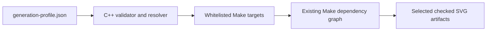

# Generate-pass methods and decision record

[Documentation index](../index.md) ·
[Generation guide](generation.md) ·
[Prerequisites](prerequisites.md)

## Scope and preservation policy

This is the central decision record for work whose proposed deliverable is a
`src.generate/generate-*.cc` pass or infrastructure that selects
`generate-*` Make targets. It intentionally excludes projection-algorithm,
WebAssembly, browser, and general documentation evaluations.

The repository does not retain chat transcripts. It retains two durable forms
of the generation discussions:

- [`converge-generation.md`](converge-generation.md) is the raw request and
  stage ledger; and
- this document and the pass-specific implementation notes summarize
  evaluation conclusions that can be supported by implemented code, profiles,
  data snapshots, tests, and committed documentation.

An evaluation request is not treated as an approved design. Where a proposed
pass has no confirmed plan or implementation in the repository, the ledger
below says so explicitly. This avoids turning an exploratory prompt into a
decision after the fact.

## Generate-pass evaluation ledger

| Stage | Proposed pass | Repository status | Preserved evaluation record |
| --- | --- | --- | --- |
| 4.1 | `generate-astro` / space and astronomy | **Implemented** | Visualization-grade feasibility, source roles, profile authority, calculation methods, products, and limits are summarized below and detailed in the [astronomy implementation notes](astro-implementation-notes.md) |
| 4.1a | `generate-cloud-atmosphere` | **Implemented** | Confirmed P-Tree physical-cloud contract, regional/daytime coverage, process-start solar calculation, source-timed JAXA atmosphere layers, H3 preparation, products, and limits are detailed in the [Cloud-atmosphere implementation notes](cloud-atmosphere-implementation-notes.md) |
| 4.2 | `generate-orbiting` / Orbital Technosphere | **Implemented** | Naming, NASA/CelesTrak feasibility, OMM/SGP4, profile authority, products, and limits are summarized below and detailed in the [Orbital Technosphere implementation notes](orbital-technosphere-implementation-notes.md) |
| 4.4 | `generate-network-swarm` | **Implemented** | Confirmed variable-input contract, fixed cumulative snapshot, H3/Izzi clustering, projection-safe components, independent downloader layers, products, and limits are detailed in the [network-swarm implementation notes](network-swarm-implementation-notes.md) |
| 4.5 | `generate-bathymetry-roulette` | **Implemented** | Confirmed depth-to-curve catalogue, explicit varied page-space line fields, Natural Earth clipping, accepted moiré, products, and limits are detailed in the [Bathymetry Roulette implementation notes](bathymetry-roulette-implementation-notes.md) |
| 6 | `generate-resources` / World Game | **Implemented** | Confirmed bounded 1960 production-leader transcription, page and digest provenance, conservative source-rights boundary, representative geography, separate FAO/IRENA context, products, and limits are detailed in the [resources implementation notes](resources-implementation-notes.md) |
| 7 | Configurable `generate-*` selection | **Implemented infrastructure** | JSON profile, validation, safe target expansion, default Make behavior, alternatives, and scope boundaries are recorded in this document |
| 8 | `generate-anthropocene` | **Implemented** | Confirmed source-separated indicator atlas, literal 2026 duration, H3 cell-days, EPA PM2.5/smoke separation, Canada/Russia fire-source roles, partial-coverage semantics, deferred coral phase, products, and limits are detailed in the [Anthropocene implementation notes](anthropocene-implementation-notes.md) |
| 9 | `generate-network-infrastructure` | **Implemented** | Confirmed external-source contract, normal cloud/CDN site atlas, explicit CC BY-NC-SA 3.0 topology opt-in, physical/logical relation boundary, projection-safe paths, Izzi detiling, products, and limits are detailed in the [network-infrastructure implementation notes](network-infrastructure-implementation-notes.md) |

The unnumbered `solar/high-energy`, `atmosphere/cloud`, and
`small-body/mission` lines in the raw ledger are taxonomy notes, not extra
passes beyond the numbered stages. Astronomy owns celestial solar,
high-energy, and representative small-body content; Cloud-atmosphere owns
terrestrial solar illumination and physical atmosphere observations.

## Implemented evaluation conclusions

### Stage 4.1: astronomy

The evaluation concluded that an astronomy pass is feasible for
visualization and atlas placement, provided it does not claim observatory- or
navigation-grade ephemerides. The implemented choices were:

- use the same six spherical projection implementations as terrestrial maps,
  with declination mapped to latitude and profile-oriented right ascension
  mapped to synthetic longitude;
- produce complementary `all-sky` and observer-filtered products rather than
  one ambiguous view;
- make a JSON profile the sole authority for calculation timestamp, observer
  position, orientation, instrument bands, transient window, source paths,
  and display budgets;
- keep normal generation offline through bounded, checked-in snapshots;
- use NASA Planetary Data for discovery/provenance, not as a universal sky
  catalog; use Gaia for stars, the NASA Exoplanet Archive for confirmed host
  systems, JPL elements and SBDB for Solar System bodies, and curated
  GCN/NSSDC/HEASARC context for persistent and transient high-energy sources;
  and
- state the approximation boundary: linear Gaia proper motion, approximate
  major-planet and lunar elements, two-body small-body propagation, simplified
  sidereal/visibility calculations, and no atmospheric or terrain model.

JAXA Earth data is not a source of celestial coordinates and is now consumed
by the separate Stage 4.1a pass. The astronomy implementation, exact formulas,
source-role table, validation, and deferred precision work are recorded in
[`astro-implementation-notes.md`](astro-implementation-notes.md).

### Stage 4.1a: Cloud-atmosphere

The evaluation concluded that a physical atmosphere pass is feasible if it
preserves source coverage and time rather than filling gaps or presenting a
mixed-age mosaic as simultaneous. The confirmed and implemented choices were:

- use credentialed P-Tree Himawari-9 L2 Cloud Property 1.0 for physical cloud
  fraction, optical thickness, top height, and ISCCP type;
- keep P-Tree's regional and daytime-only coverage visible, with missing cells
  defined as unobserved rather than clear or zero;
- calculate subsolar position and twilight at one process-start instant,
  sharing the exact solar ephemeris with astronomy without duplicating
  celestial sources or observer-horizon layers;
- use public JAXA Earth STAC COGs for GCOM-C daytime AOD at 500 nm, GSMaP
  daily gauge-adjusted precipitation rate, and JASMES daily surface shortwave
  radiation, while retaining each source interval and a latest-not-after rule;
- keep AOD distinct from observed smoke and PM2.5 exposure, and precipitation
  distinct from floods and extreme-event counts;
- normalize QA-filtered raster samples into resolution-3 H3 cells before the
  six shared projection implementations; and
- keep credentialed network refresh and large local observations outside
  `make all`, with explicit fetch, prepare, verify, SVG, and artifact targets.

The source matrix, QA bits, profile schema, time contract, acquisition and
preparation workflow, layer contract, terms, validation, and deferred
water-vapor/GOSAT/EarthCARE classifications are recorded in
[`cloud-atmosphere-implementation-notes.md`](cloud-atmosphere-implementation-notes.md).

### Stage 4.2: Orbital Technosphere

The evaluation concluded that a human-made orbit pass is feasible at
visualization scale, but that no single requested NASA source supplies the
complete current Earth-orbit population. The implemented choices were:

- use **Orbital Technosphere** for public output and metadata while retaining
  `generate-orbiting` as the concise Make and source namespace;
- use CelesTrak OMM CSV as the broad population and category-membership feed,
  the Vallado/CelesTrak SGP4 reference implementation for propagation, and
  NASA SSCWeb positions as independent checks for selected spacecraft;
- treat the supplied Wikipedia pages and Starlink infrastructure essay as
  terminology and design context, not reproducible catalog truth;
- store the exact calculation instant, make-invocation reference location,
  catalog roles, freshness rules, visibility rules, and budgets in a JSON
  profile rather than reading host time or inferring location;
- produce a global terrestrial-subpoint product and an above-horizon observer
  product for every projection; and
- bound the claim to visualization: public-element age and uncertainty,
  simplified Earth orientation and illumination, and absence of covariance,
  maneuvers, photometry, weather, or operational safety guarantees remain
  explicit limitations.

The naming alternatives, source matrix, OMM/SGP4 conversions, coordinate
pipeline, detiling layers, tests, and accuracy boundary are recorded in
[`orbital-technosphere-implementation-notes.md`](orbital-technosphere-implementation-notes.md).

### Stage 4.4: cumulative network-swarm

The evaluation concluded that the corrected cumulative aggregate is feasible
as a density atlas, but not as a graph because its Point features contain no
edge or route semantics. The confirmed and implemented choices were:

- pin the corrected `house-of-the-dragon-301` ZIP and both compressed and
  uncompressed SHA-256 digests while retaining a variable local source;
- validate the cumulative FeatureCollection, all ten unsigned downloader
  fields, unique resolution-5 H3 cells, coordinates, and source metadata;
- group under H3 resolution-3 parents, split groups at projection-native
  cells, and use Izzi center-filled radial hexagon positions;
- attach optional displacement tethers to true projected coordinates without
  representing them as traffic links;
- treat the overlapping specialized counts as independent semantic layers,
  with fixed log/p99 scales and raw values preserved in the SVG;
- generate one layered network-swarm map on each production projection and
  export all six SVG/PDF/PNG products; and
- bound interpretation to cumulative, source-defined aggregate observations,
  not simultaneity, rates, bandwidth, endpoints, causality, or peer flows.

The input audit, visual-reference conclusions, profile, clustering formulas,
Izzi lattice safeguard, layer grammar, verification, previews, and deferred
edge-data work are recorded in
[`network-swarm-implementation-notes.md`](network-swarm-implementation-notes.md).

### Stage 4.5: Bathymetry Roulette

The evaluation concluded that a monochrome roulette bathymetry pass is
feasible by reusing the twelve nested Natural Earth depth polygons as
projection-safe SVG clips and Izzi's closed roulette paths as explicit
page-space line fields. The confirmed and implemented choices were:

- use the canonical name `bathymetry-roulette`, while accepting the requested
  `bathymetry-rolette` spelling and historical `art-agua-roulette` name as
  generation-profile aliases;
- keep one pale ground and one dark ink for every depth so curve structure,
  rather than a changing color ramp, carries the encoding;
- increase point-distance ratio strictly with depth, progress from simple
  1:1 curves through 5:2 and 11:7 curves, and use outline motifs through
  -6,000 m followed by even-odd filled motifs;
- expand each representative depth curve into twelve deterministic diameter,
  point-distance, phase, and center-offset variations;
- place those curves on staggered 1.10-unit projected-page cells with
  overlapping diameters, producing a continuous field rather than an icon
  grid;
- serialize every curve instance instead of using SVG pattern references, with
  no artifact-size constraint on this generative pass;
- paint nested thresholds shallow to deep with a common opaque ground,
  making visible exclusive bands without polygon differences;
- retain the six-production-projection topology and a complete visible key;
  and
- accept dense interference and moiré as intentional artwork while making
  clear that neither encodes additional bathymetric measurements.

The exact twelve-row catalogue, SVG layer contract, products, verification,
and interpretation boundary are recorded in
[`bathymetry-roulette-implementation-notes.md`](bathymetry-roulette-implementation-notes.md).

### Stage 6: World Game resources

The evaluation found an inspectable primary scan for Fuller and McHale's 1963
*Inventory of World Resources, Human Trends, and Needs*, but no licensed,
machine-readable corpus covering every World Game archival resource. The
confirmed and implemented bounded product therefore:

- transcribes all 40 headings, world totals, and asterisk-marked leaders from
  the report's explicitly selected 1960 production matrix;
- retains source units and page pointers, preserves Thorium's `N.A.` as null,
  and does not infer values from blank country cells;
- records historical country labels while mapping only documented
  representative points, never extraction sites or modern boundary claims;
- checks in the factual profile but neither the rights-restricted scan nor its
  page images, and provides no automated BFI fetch;
- treats OCR as a human-audit aid rather than profile authority; and
- adds selected fisheries, aquatic production, primary-crop, and installed
  solar indicators as visibly separate, year- and source-labelled modern
  context rather than a continuation of the 1960 matrix.

The archive findings, rights decision, exact 40-row data contract, modern
source facts, collision layout, SVG grammar, easy workflow, re-audit procedure,
and limitations are recorded in
[`resources-implementation-notes.md`](resources-implementation-notes.md).

### Stage 8: Anthropocene observation atlas

The evaluation concluded that a multi-source climate-impact observation atlas
is feasible, but a generic point count cannot attribute each mapped event to
human-caused climate change. The confirmed and implemented choices were:

- fix the default duration to literal calendar year 2026 in JSON, retain a
  source-specific partial-snapshot date, and never infer either from the host
  clock;
- aggregate positive unique source-reporting days into resolution-4 H3 cells,
  preserve raw counts and source roles, and define absence as unobserved or
  unavailable rather than zero;
- keep temperature highs, temperature lows, precipitation records, heavy
  precipitation, active fire, observed smoke, flood/heavy-rain reports,
  severe-weather reports, and PM2.5 exposure as independent semantic layers;
- use EPA AirData for the enabled-by-default
  `air-quality-exposure:pm25-exceedance-days` layer and keep it categorically
  and visually distinct from NOAA HMS observed smoke;
- use public CWFIS daily hotspots as the default Canada/North America fire
  feed, support credentialed NASA FIRMS as the global/Russian point source,
  and retain Copernicus Sentinel-3 and Rosleskhoz as validation sources rather
  than pretending CAL FIRE supplies northern coverage;
- keep normal generation offline from a checksum-pinned normalized snapshot,
  with explicit raw fetch and candidate-preparation targets that cannot
  overwrite checked data; and
- classify `ocean-heat:coral-bleaching-stress-days` as scientifically valuable
  but require a separate reef-mask/raster phase, with Stage 8 verification
  rejecting an accidental coral metric group.

The source matrix, exact station-record and precipitation formulas, snapshot
audit, additional resource classifications, fire-source research, SVG layer
grammar, refresh procedure, products, and interpretation limits are recorded
in [`anthropocene-implementation-notes.md`](anthropocene-implementation-notes.md).

### Stage 9: network infrastructure

The evaluation concluded that a network-infrastructure atlas is feasible when
cloud/CDN sites, physical submarine routes, and logical exchange membership
remain distinct evidence classes. The confirmed and implemented choices were:

- rename the cumulative H3 pass to `network-swarm`, reserving
  `network-infrastructure` for infrastructure records and topology;
- read variable external Git checkouts through commit-, path-, digest-, and
  count-pinned profiles rather than copying upstream data into this repository;
- make the cloud/CDN site atlas a normal six-projection pass and keep all null
  geometries in provenance without inventing coordinates;
- put TeleGeography cable and exchange layers behind the explicit
  `generate-network-infrastructure-topology` rule, outside `make all` and
  generation-profile `"all"`, with visible CC BY-NC-SA 3.0 attribution;
- render submarine paths as source-backed physical routes and exchange spokes
  as source-backed logical membership, never inferred fiber, peering, traffic,
  or cross-source connectivity;
- split and densify routes before shared projection seam processing, while all
  point families share a deterministic Izzi radial-hexagon collision layout;
  and
- reject source drift, malformed geometries, duplicate identifiers, profile
  count mismatches, topology without the license opt-in, and invalid SVG/XML
  metadata.

The audited counts, source discrepancy decision, license boundary, spherical
hub formula, clustering behavior, layer contract, previews, and verification
are recorded in
[`network-infrastructure-implementation-notes.md`](network-infrastructure-implementation-notes.md).

## Stage 7 configured-selection outcome

Stage 7 adds a project-level JSON preference for the common development case:
select one or more projections, select one or more generation passes, and let
a bare `make` build only that cross-product. The checked-in default selects
Cahill-Keyes plus the Earth and complementary physical-feature passes.

The implementation keeps the existing Make dependency graph authoritative.
The profile resolver translates validated names into existing, public Make
targets; the generators still own all geographic, astronomical, orbital, SVG,
and embedded verification behavior.

This distinction is intentional: Stage 7 selects **generation passes**, not
individual semantic layers inside one generated SVG. Internal layer sets are
generator-specific contracts. Selecting them would require a different schema
and generator API rather than a build-orchestration preference.

## Stage 7 orchestration methods evaluated

| Method | Benefits | Costs and risks | Decision |
| --- | --- | --- | --- |
| Invoke explicit Make targets | Existing, precise, no new mechanism | Repetitive for a changing projection/pass matrix; preferences are not saved | Retained for one-off and automation use |
| Make command-line variables such as `PROJECTIONS=... PASSES=...` | Small implementation; easy CI override | Ephemeral; weak list validation and quoting; no durable profile | Not the primary interface |
| Include a user-authored `.mk` fragment | Native Make expansion and dependency behavior | The preference file is executable Make syntax, not data; typos can alter arbitrary variables or rules | Rejected for a user preference |
| Parse JSON with `jq` | Concise query expressions | Adds a tool that is not otherwise a required build dependency; shell quoting and target validation still need code | Rejected |
| Parse JSON with Python | Good validation libraries and diagnostics | Adds a runtime language to the native C++/Make generation path | Rejected |
| Generate and include a `.mk` file from JSON | Makes the selected targets visible during Make's parse phase | Requires include-file remakes and Make restarts; stale generated fragments and bootstrap ordering complicate a small feature | Rejected |
| Filter layers inside every generator | Could eventually control individual SVG layers | Starts expensive generators before work can be excluded; layer vocabulary differs among terrestrial, astronomy, orbital, and network-swarm products; duplicates Make's role | Rejected for Stage 7 |
| Validated C++ resolver followed by recursive Make | Durable JSON, strict diagnostics, reuse of the existing C++20/RapidJSON stack, safe fixed targets, normal Make dependencies and parallelism | Builds one small resolver and starts one recursive Make | Selected |

The selected approach has one deliberate limitation: configured generation
produces layered SVG source artifacts. PDF and PNG format selection was not
added to schema version 1 because the request concerned projection and pass
selection, and exports are cheap to express with existing explicit artifact
or aggregate targets. A later schema can add formats without changing the
meaning of the current fields.

## Selected workflow



[`generation-profile.json`](../generation-profile.json) is the default input.
[`generation-profile.h`](../src.generate/generation-profile.h) owns schema
validation, alias normalization, and target expansion. The thin
[`resolve-generation-profile.cc`](../src.generate/resolve-generation-profile.cc)
entry point provides machine-readable target output and the human-readable
plan. The [Makefile](../Makefile) compiles it, makes `configured` the default
goal, and invokes a recursive Make with the resolved targets.

The recursion is a useful boundary rather than a second build system:

- the resolver cannot inject recipes or variables because it emits names from
  a fixed projection/pass table;
- Make still decides whether each artifact is current;
- command-line settings such as `NATURAL_EARTH_DIR`, `ASTRO_PROFILE`,
  `ORBITING_PROFILE`, `RESOURCES_PROFILE`, compiler options, `-B`, and `-j`
  propagate normally; and
- explicit targets and `make all` do not read or depend on the selection
  profile.

## Profile schema version 1

```json
{
  "schema_version": 1,
  "description": "Fast Cahill-Keyes terrestrial development profile",
  "projections": ["cahill_keyes"],
  "passes": ["earth", "ocean"]
}
```

`schema_version`, `projections`, and `passes` are required. `description` is
optional. Unknown members are rejected so a misspelled selector cannot be
silently ignored. Both selectors are nonempty arrays; `"all"` is valid only
when it is the sole item.

Normalization is limited and deterministic:

- matching is case-insensitive and `_` becomes `-`;
- `cahill_keyes`, `cahillkeyes`, and `ck` become `cahill-keyes`;
- `star_x` and `starx` become `star-x`;
- `autha_graph` becomes `authagraph`;
- `voroni` remains accepted as an alias for `voronoi`;
- `graticule` becomes `graticules`;
- `astro` becomes `astronomy`;
- `orbiting` becomes `orbital-technosphere`;
- the former `network` name and short `swarm` name become `network-swarm`;
- `infrastructure` becomes `network-infrastructure`;
- `resource`, `world-game`, `world-game-resources`, and the historical request
  typo `resouces` become `resources`;
- `bathymetry-rolette` and `art-agua-roulette` become
  `bathymetry-roulette`; and
- `ocean` becomes `water`, the current name of the complementary Natural
  Earth physical-feature generation pass.

Aliases are canonicalized before duplicate detection. For example,
`["water", "ocean"]` is rejected rather than generating the same artifact
twice.

The supported cross-product is:

| Projection selector | Geometry | Graticules | Earth | Water | Astronomy | Orbital Technosphere | Network-swarm | Resources | Bathymetry Roulette | Anthropocene | Network infrastructure |
| --- | --- | --- | --- | --- | --- | --- | --- | --- | --- | --- | --- |
| `cahill-keyes` | 1 SVG | 1 SVG | 1 SVG | 1 SVG | 2 SVGs | 2 SVGs | 1 SVG | 1 SVG | 1 SVG | 1 SVG | 1 SVG |
| `authagraph` | 1 SVG | 1 SVG | 1 SVG | 1 SVG | 2 SVGs | 2 SVGs | 1 SVG | 1 SVG | 1 SVG | 1 SVG | 1 SVG |
| `dymaxion` | 1 SVG | 1 SVG | 1 SVG | 1 SVG | 2 SVGs | 2 SVGs | 1 SVG | 1 SVG | 1 SVG | 1 SVG | 1 SVG |
| `myriahedral` | 1 SVG | 1 SVG | 1 SVG | 1 SVG | 2 SVGs | 2 SVGs | 1 SVG | 1 SVG | 1 SVG | 1 SVG | 1 SVG |
| `star-x` | 1 SVG | 1 SVG | 1 SVG | 1 SVG | 2 SVGs | 2 SVGs | 1 SVG | 1 SVG | 1 SVG | 1 SVG | 1 SVG |
| `voronoi` | 1 SVG | 1 SVG | 1 SVG | 1 SVG | 2 SVGs | 2 SVGs | 1 SVG | 1 SVG | 1 SVG | 1 SVG | 1 SVG |

Astronomy resolves to `generate-astro-PROJECTION`, which intentionally makes
both all-sky and observer products. Orbital Technosphere resolves to
`generate-orbiting-PROJECTION`, which makes both global and observer
products. The four terrestrial passes resolve to uniform
`generate-PASS-PROJECTION` targets.

Network-swarm resolves to `generate-network-swarm-PROJECTION` and makes the
one cumulative swarm product. Bathymetry Roulette similarly resolves to
`generate-bathymetry-roulette-PROJECTION` and makes one monochrome depth map.
Resources resolves to `generate-resources-PROJECTION` and makes one historical
production-leader atlas with separate modern context, stored as a
deterministic `.svg.gz` archive.
Anthropocene resolves to `generate-anthropocene-PROJECTION` and makes one
source-separated observation atlas. Network infrastructure resolves to
`generate-network-infrastructure-PROJECTION` and makes only the cloud/CDN site
atlas; licensed topology is intentionally not a profile-selectable product.

Stage 7 adds uniform Cahill-Keyes aliases for the terrestrial rule. In
particular,
`generate-earth-cahill-keyes` produces only the whole-map Earth SVG, whereas
the older `generate-earth-ck` compatibility target also produces 12
Cahill-Keyes slices.

## Available generation methods

### Saved development selection

Preview the resolved names, then build them:

```sh
make generation-plan
make
```

`make configured` is the explicit spelling of the default goal. Use `make -B`
to force regeneration of only the configured selection.

For an uncommitted personal profile, create `generation-profile.local.json`
and select it on the command line:

```sh
make GENERATION_PROFILE=generation-profile.local.json generation-plan
make GENERATION_PROFILE=generation-profile.local.json
```

### Complete checked-in artifact suite

```sh
make all
```

This remains the release/review build. It creates all 97 layered SVGs and
exports all 97 PDFs and 97 opaque PNGs, including slice and perspective
families that are outside the configurable matrix. The aliases
`generate-projections`, `generated-projections`, and `make-generated` retain
the same full-suite behavior.

### Projection, pass, and product families

Existing family targets are useful when the desired selection does not need
to be saved:

```sh
make generate-star-x
make generate-earth-projections
make generate-astro-observer
make generate-orbiting-global
make generate-anthropocene
make generate-resources
make generate-network-swarm
make generate-network-infrastructure
make generate-bathymetry-roulette
make generate-water-myriahedral-perspectives
make generate-ck-slices
```

Projection family targets generate SVGs unless their documented target says
`artifacts`; resources stores those SVGs as deterministic `.svg.gz` archives.
`generate-orbiting-artifacts`, for example, adds PDF and PNG exports for that
product family.
`generate-network-swarm-artifacts` does the same for all six network-swarm
products.
`generate-network-infrastructure-artifacts` does the same for the six
cloud/CDN site products. The separate
`generate-network-infrastructure-topology` and
`generate-network-infrastructure-topology-artifacts` targets are explicit
CC BY-NC-SA 3.0 opt-ins and never dependencies of the normal family.
`generate-anthropocene-artifacts` does the same for all six Anthropocene
products.
`generate-resources-artifacts` adds PDF and PNG exports to all six compressed
World Game resources SVG products.
`generate-bathymetry-roulette-artifacts` does the same for all six roulette
bathymetry products.

### Exact targets and artifact paths

Multiple explicit targets already express an ad hoc matrix:

```sh
make generate-earth-cahill-keyes generate-water-cahill-keyes
make generate-geometry-star-x generate-graticules-voronoi
```

Generated PDF and PNG paths are also direct Make targets. Their pattern rules
first update the corresponding checked SVG and then invoke Inkscape:

```sh
make assets.generated/png/earth-ck-44-22.png
make assets.generated/pdf/astro-observer-star-x-34-44.pdf
```

### Input acquisition and verification

Acquisition remains explicit because it changes reproducibility inputs:

```sh
make fetch-natural-earth-10m
make fetch-astro-data
make fetch-orbiting-data
make fetch-anthropocene-data
make prepare-anthropocene-data
make prepare-network-swarm-data
make check-network-infrastructure-sources
make check-network-infrastructure-topology-sources
```

There is intentionally no `fetch-resources-data` target. Normal resources
generation is offline from the checked factual profile; source-scan re-audits
follow the manual authorized-copy workflow in the
[resources notes](resources-implementation-notes.md).

`make check` compiles and runs the native algorithm/API suite, including
generation-profile schema and alias tests. SVG generators instead run their
own structural validation whenever their generation target executes.

## Scope boundaries and future extensions

The generation profile does not override astronomical, orbital, resources,
Anthropocene, network-swarm, or network-infrastructure calculation
properties. Their pass-specific
profiles remain the sole authorities for source state, calculation or
clustering choices, and display budgets. Stage 7 only decides which Make
branches to enter.

The following remain explicit rather than configurable in schema version 1:

- SVG/PDF/PNG format selection;
- one astronomy product instead of both;
- one Orbital Technosphere product instead of both;
- Cahill-Keyes four- and eight-slice generation;
- Myriahedral perspective and face-group slice generation;
- the CC BY-NC-SA 3.0 network-infrastructure topology product; and
- semantic layer enable/disable switches inside a generator.

If repeated workflows justify schema version 2, formats and product variants
can be modeled as additional validated dimensions. Individual SVG layer
selection should be designed separately, with a shared naming contract and
generator-specific dependency analysis, rather than overloaded onto the pass
selector.
