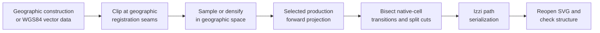

# SVG generation pipeline

[Documentation index](../index.md) ·
[Prerequisites](prerequisites.md) ·
[Cahill-Keyes context](cahill-keyes-context.md)

## Purpose

The repository contains six C++20 generation programs under `src.generate/`.
Four exercise all five production projections through the real Alpha60 and
Izzi APIs. Two derive enlarged Cahill-Keyes quadrant and octant views from the
whole-earth SVG. They write layered SVGs under `assets.generated/svg/`, then
reopen those files and verify dimensions, layer structure, path counts, and
numeric sanity. Inkscape subsequently exports each validated SVG as PDF and
as a 3840-pixel-long-side PNG.

| Artifact | Generator | Principal input |
| --- | --- | --- |
| Geometry | [`src.generate/generate-geometry.cc`](../src.generate/generate-geometry.cc) | Native projection faces and screen quadrants |
| Graticules | [`src.generate/generate-graticules.cc`](../src.generate/generate-graticules.cc) | Sampled latitude and longitude lines |
| Earth | [`src.generate/generate-earth.cc`](../src.generate/generate-earth.cc) | Natural Earth 1:10m ocean and land |
| Water | [`src.generate/generate-water.cc`](../src.generate/generate-water.cc) | Every other Natural Earth 1:10m physical layer |
| Four slices | [`src.generate/generate-4-slice.cc`](../src.generate/generate-4-slice.cc) | Four horizontal quadrant enlargements from the Cahill-Keyes Earth SVG |
| Eight slices | [`src.generate/generate-8-slice.cc`](../src.generate/generate-8-slice.cc) | Eight exact-octant enlargements from the Cahill-Keyes Earth SVG |

The aggregate target generates all four artifact families for all five
projections plus all 12 Cahill-Keyes slices:

```sh
make all
```

`make generated-projections`, `make generate-projections`, and
`make make-generated` are equivalent aliases. The original individual
Cahill-Keyes targets also remain available.

The artifact-family aggregate targets include all five projections.

The suite fixes the largest print dimension at 44 inches while retaining each
projection's exact aspect-ratio contract:

| Projection | Frame | Exact construction |
| --- | ---: | --- |
| Cahill-Keyes | `44 × 22` | `2:1` |
| AuthaGraph | `44 × 19.052559` | height `= 11√3` |
| Myriahedral | `44 × 24.75` | `16:9` |
| Star-X | `34 × 44` | `17:22` |
| Voronoi | `44 × 22.916667` | height `= 275/12`, ratio `48:25` |

The numeric frame is also the SVG's unitless coordinate system. Generated
root documents attach `in` to `width` and `height`, but leave `viewBox`
numeric: a Cahill-Keyes document is therefore `width="44in"`,
`height="22in"`, and `viewBox="0 0 44 22"`. One viewBox coordinate unit maps
to one physical inch without changing projection formulas or path data.

The filenames round irrational or recurring dimensions to six decimals,
matching Izzi's serialized `viewBox`; the in-memory frames use the exact
double expressions. These files are diagnostic and illustrative rather than
a general map-rendering command line.

## Build orchestration and inputs

The [top-level Makefile](../Makefile) compiles every generator with C++20 and
`-Wall -Wextra -Wpedantic -Werror`. The geometry and graticule programs need
the neighboring Alpha60 and Izzi source trees. The Earth and water programs
also use GDAL's vector API and require GDAL to have GEOS support for polygon
intersection.

The default locations can be overridden:

| Make variable | Default | Purpose |
| --- | --- | --- |
| `ALPHA60_SRC` | `../alpha60/src` | Alpha60 headers |
| `IZZI_SRC` | `../izzi/src` | Izzi SVG headers |
| `GDAL_CONFIG` | `gdal-config` | GDAL compiler and linker flags |
| `NATURAL_EARTH_DIR` | `assets.static/natural-earth/10m-physical-vectors` | Extracted shapefiles |
| `INKSCAPE` | `inkscape` | Command-line PDF and PNG exporter |
| `PNG_LONG_SIDE` | `3840` | Pixel count assigned to each PNG's longest side |

Run one target normally:

```sh
make generate-geometry
make generate-graticules-ck
make generate-earth-ck
make generate-water-ck
make generate-authagraph
make generate-myriahedral
make generate-star-x
make generate-voronoi
make all
```

`make` rebuilds only when a declared dependency is newer. Use `make -B`
when an unconditional regeneration is wanted. `make clean` removes the
generator binaries and generated SVG, PDF, PNG, and WASM build products, but
deliberately retains the downloaded Natural Earth input and checked-in WASM
sources.

The generators are not part of `make check`; invoking a `generate-*`
target both writes its artifact and runs that generator's embedded structural
checks.

The 32 artifacts in each of `assets.generated/svg/`, `assets.generated/pdf/`,
and `assets.generated/png/` are checked in. This makes visual and XML diffs
reviewable, but it also means that regenerating with a different GDAL, GEOS,
or Inkscape version can produce ordering, coordinate, or rendering differences
even though the input archive is pinned.

## PDF and 4K PNG export

Every PDF and PNG has a direct Make dependency on its layered SVG, so
conversion starts only after that SVG generator and its embedded structural
checks succeed. Inkscape uses the SVG page as the export area and preserves
the original projection aspect ratio. PNG exports set the background to white
at full opacity and select 8-bit RGB output without an alpha channel,
flattening transparent page regions without changing the layered SVG or PDF
sources.

The default `PNG_LONG_SIDE=3840` follows UHD 4K video's horizontal pixel
resolution. Landscape Cahill-Keyes, AuthaGraph, Myriahedral, and Voronoi maps
set their PNG width to 3840 pixels. Portrait Star-X maps set their PNG height
to 3840 pixels. Supplying only the longer dimension lets Inkscape derive the
other dimension without anisotropic scaling. Override the resolution when
needed:

```sh
make -B PNG_LONG_SIDE=7680 all
```

Inkscape exports vector PDFs at the SVG's physical page size without changing
the layered SVG originals. For example, a 44-by-22-inch Cahill-Keyes page is
3168 by 1584 PDF points. The explicit PNG pixel override is independent of
that physical page size.
Final files are grouped by format rather than mixed at the `assets.generated/` root:

```text
assets.generated/
├── svg/
├── pdf/
└── png/
```

### Natural Earth acquisition

[`scripts/fetch-natural-earth-10m.sh`](../scripts/fetch-natural-earth-10m.sh)
downloads Natural Earth 5.1.1's complete 1:10m physical-vector archive. It:

1. checks for a completion stamp and the `.shp`, `.shx`, `.dbf`, and
   `.prj` components of every required dataset;
2. downloads the official archive only when the local archive is absent;
3. verifies its fixed SHA-256 digest before extraction;
4. extracts only the named physical datasets; and
5. creates the completion stamp last, so interrupted extraction is retried.

The Earth and water targets depend on that stamp and pass
`NATURAL_EARTH_DIR` to their executables. The archive digest and licensing
are recorded in the
[Natural Earth data note](natural-earth-10m-physical-vectors.md).

## Shared coordinate pipeline

The four whole-map generators use
[`projection-generation-common.h`](../src.generate/projection-generation-common.h)
to select a production projection, construct its exact frame, and call the
shared public API in `(latitude, longitude)` order. Projected coordinates use
an upper-left SVG origin.

The two slicing programs instead use
[`cart0freak0-cahill-keyes-slicing.h`](../src.projections/cart0freak0-cahill-keyes-slicing.h),
which owns the slice descriptors, clipping geometry, SVG wrapper construction,
and verification rules.



The ordering matters. A point projection alone does not say whether adjacent
input points remain connected in an unfolded net. Geographic clipping keeps
antimeridian and registered Cahill-Keyes closures local. Densification then
ensures adjacent samples cross at most one small native cell. The shared path
projector identifies that cell transition, bisects it 48 times, compares the
two limiting projected points, and starts a new SVG subpath only when those
limits are genuinely separated.

### Registered cut meridians

The native Cahill-Keyes construction changes octants at `-110`, `-20`,
`70`, and `160` degrees. The public projection adds one degree to input
longitude to retain registration with the Visionscarto base map, so generator
input must instead be split at:

```text
-111°, -21°, 69°, 159°
```

The geometry and graticule programs describe four cyclic sectors. The Pacific
sector is represented as `159° ... 249°`, then canonicalized back into the
public `[-180°, 180°]` domain point by point. The polygon programs use five
linear clipping bands because the cyclic Pacific sector is divided by the
antimeridian.

Every generator offsets a cut by `1e-7` degree. That epsilon avoids asking
the piecewise projection to choose both sides of the same boundary. It is
small enough to be visually negligible at the fixture scale, but it is still
a deliberate microscopic gap rather than an exact topological weld.

### Sampling and densification

The Cahill-Keyes/Star-X geometry outlines sample analytic boundaries every
2.5 degrees. Graticules use 0.5-degree samples so even the depth-5
Myriahedral mesh crosses no more than one native edge per input segment. The
Natural Earth generators retain source vertices, apply
topology-preserving simplification, then call GDAL `segmentize()` so no input
segment exceeds a configured angular length.

Both approaches are fixed-step approximations. They are predictable and
compact, but not adaptive to projected curvature. A degree of longitude also
represents less physical distance near a pole than at the equator. If these
outputs are enlarged substantially or used as numeric reference artwork,
projected-space error should be measured and the sampling threshold reduced
or made adaptive.

Consecutive points that project to exactly the same coordinate are removed.
All generators reject non-finite points and material out-of-frame results,
then clamp tolerated roundoff at the frame boundary.

## Folding, clipping, and discontinuities

The shared generator does not infer cuts from a projection-independent jump
distance. Instead it assigns every geographic sample to a native cell:

- eight registered octants for Cahill-Keyes and Star-X;
- the nearest tetrahedron vertex plus one of six local sectors for
  AuthaGraph;
- one of 5,120 subdivided spherical triangles for Myriahedral; or
- one of twenty rotated nearest-site faces for Voronoi.

When adjacent samples select different cells, a geographic bisection retains
the last point on the left cell and the first on the right. If the projected
limits agree within `44 × 10^-5`, the edge is joined in the planar net and both
limits stay in the same path. Otherwise the edge is a cut and a new subpath
begins. This tests the assembled net itself: tree-connected Myriahedral and
Voronoi faces remain joined, while their non-tree edges split without a
hard-coded list of thousands of relationships.

AuthaGraph has an additional periodic coordinate wrap that can occur without
changing its spherical sector. Adjacent projected samples separated by more
than one third of the frame's largest dimension trigger a second bisection;
the half interval containing the large jump is retained until its paired exit
and entry limits are found.

Filled rings still need more care than open lines. All source polygons are
first intersected with the five antimeridian-safe registered longitude bands
used by Cahill-Keyes. Cahill-Keyes and Star-X can then close those face-safe
pieces directly. AuthaGraph additionally uses a 5-degree geographic grid and
rejects any fragment whose projected closing edge exceeds 2.5 frame units.

Myriahedral and Voronoi use exact native-face clipping from
[`projection-area-generation.h`](../src.generate/projection-area-generation.h).
Every 5-degree geographic cell is densified, mapped separately through each
candidate face's local transform, repaired with GEOS if necessary, and
intersected with that face's exact planar triangle. Myriahedral uses the same
3D-chord affine coordinates as its 5,120-face implementation; Voronoi uses
the same face-local gnomonic transform and unfolding affine. Only the clipped
planar pieces are normalized into the output frame, so a filled ring never
needs a chord between unrelated net edges. Same-color area hairlines hide
microscopic cracks along adjacent pieces.

## Geometry generator

[`src.generate/generate-geometry.cc`](../src.generate/generate-geometry.cc) constructs the
selected projection's explanatory skeleton rather than reading external
data. The `triangular-faces` layer is constructed from each projection's
native topology:

| Projection | Face construction | Path count |
| --- | --- | ---: |
| AuthaGraph | Exact 24-sector planar assembly table, cyclically shifted and clipped at the periodic frame edges | at least 24 |
| Cahill-Keyes | Sampled registered octants | 8 |
| Myriahedral | Normalized planar triangles from the fixed depth-5 layout | 5,120 |
| Star-X | Sampled Cahill-Keyes octants assembled into the two stacked groups | 8 |
| Voronoi | Twenty face-local gnomonic triangles transformed through the fixed unfolding tree | 20 |

For Cahill-Keyes and Star-X, the generator additionally:

1. defines four registered 90-degree longitude sectors and their official
   northern and southern octant numbers;
2. traces each octant along its equator edge, eastern seam, pole, and western
   seam;
3. splits every octant at its central meridian to produce two half-octants;
4. constructs four equal-width screen-space rectangles matching Alpha60's
   map-quadrant convention; and
5. writes four semantic SVG layers, plus a Star-X-only `polar-marks` layer.

For those two projections the additional layer counts are:

| Layer | Count | Meaning |
| --- | ---: | --- |
| `triangular-faces` | 8 | Filled presentation of the eight octahedral faces |
| `quadrants` | 4 | Equal-width drawing regions, not spherical quadrants |
| `octants` | 8 | Outlined and officially numbered projected octants |
| `half-octants` | 16 | Western/eastern halves used by the piecewise construction |
| `polar-marks` | 1 | Star-X-only eight-point star centered on the North-pole locus |

The `polar-marks` row applies only to Star-X. The `triangular-faces` and
`octants` layers intentionally contain the same
geometric outlines with different IDs and styles. One communicates the
polyhedral faces perceptually; the other exposes the geographic numbering for
inspection.

Near a pole, the boundary meridians stop at `90° - epsilon`; the exact pole
is then projected at the sector center. This chooses the intended copy of a
polar vertex instead of allowing a seam longitude to choose an adjacent face.
The visible pole duplication is a property of the unfolded net, not numerical
noise.

Every projection also receives four equal-width screen-space `quadrants`.
The program verifies the projection-specific view box, native face count,
quadrant count, optional octant layers, and absence of NaN or infinity.

## Graticule generator

[`src.generate/generate-graticules.cc`](../src.generate/generate-graticules.cc)
creates a conventional ten-degree geographic reference grid:

- 17 parallels from `80°S` through the equator to `80°N`;
- 36 meridians from `180°` through `170°E`;
- seam-safe subpaths determined from native-cell transitions; and
- explicit octant-sector and hemisphere pieces for Cahill-Keyes and Star-X.

Splitting a parallel by longitude sector prevents a line from jumping between
distant octants. Splitting a meridian at the equator reflects the fact that
its northern and southern halves belong to different octahedral faces even
though they touch geographically.

Each line is a named SVG subgroup with paths, a title, and one visible degree
label. Multiples of 30 degrees receive stronger styling. The label is placed
at the midpoint sample of the longest projected subpath, which keeps it on a
visible part of irregular nets without projection-specific anchor constants.
`180°` is displayed without an east/west suffix.

These are layout heuristics, not a general label-placement engine. They are
tuned for the 44-unit diagnostic frames. Dense overlays or different
typography may require collision detection, leader lines, or multiple labels
per disconnected parallel.

The self-check expects 17 latitude groups and labels, 36 longitude groups and
labels, at least one visible path per group, and finite coordinates. The
subpath count is projection-dependent.

## Natural Earth physical-map generators

[`src.generate/natural-earth-generation.h`](../src.generate/natural-earth-generation.h)
contains the shared GDAL-to-Izzi rendering pipeline. The thin
[`generate-earth.cc`](../src.generate/generate-earth.cc) and
[`generate-water.cc`](../src.generate/generate-water.cc) entry points select two
complementary artifact kinds, ensuring that both use identical clipping,
densification, projection, styling, and validation logic.

### Geometry processing

For each shapefile, the program:

1. opens the first GDAL vector layer read-only and requires a geographic
   spatial reference;
2. clones each nonempty feature;
3. optionally simplifies it while preserving topology;
4. skips clipping bands that cannot overlap the feature envelope;
5. intersects the feature with every relevant seam-safe longitude band;
6. for AuthaGraph, Myriahedral, and Voronoi, further clips areas to a
   5-degree geographic grid;
7. densifies each surviving piece with `segmentize()`;
8. projects lines with native-cell bisection and areas either directly or by
   exact Myriahedral/Voronoi face-local triangle intersection; and
9. serializes the result as one named Izzi path per source feature and band.

Interior polygon rings are retained, and area paths use SVG's `evenodd`
fill rule so lakes or other holes are not painted solid. All tolerances below
are in geographic degrees, because simplification and densification happen
before projection:

The Natural Earth ocean is a complex polygon with interior rings. On the
unfolded Cahill-Keyes net, clipping those rings at an octant boundary and
closing each resulting subpath independently can expose a broad false hole
between otherwise adjacent ocean pieces. Cahill-Keyes and Star-X therefore
paint ten seam-safe background pieces first inside the existing `ocean`
group: five registered longitude bands, each split at the equator and
densified before projection. The detailed Natural Earth ocean is painted over
that underlay, followed by land. A page-sized blue rectangle would also color
the intentional cuts and the area outside the projection, whereas the
face-local underlay keeps those regions white. The Earth self-check verifies
both the piece count and that this paint order is preserved.

| Layer family | Simplification | Maximum segment |
| --- | ---: | ---: |
| Ocean and twelve bathymetry levels | 0.04 | 0.50 |
| Land | 0.03 | 0.50 |
| Minor islands | 0.005 | 0.25 |
| Glaciated areas and Antarctic ice shelves | 0.02 | 0.35 |
| Lakes and reservoirs | 0.01 | 0.25 |
| Playas | 0.005 | 0.25 |
| Rivers and lake centerlines | 0.01 | 0.25 |
| Reefs | 0.005 | 0.20 |
| Coastline | 0.02 | 0.25 |

Finer tolerances preserve small islands, reefs, and playas that would
disappear under the bathymetry setting. Densification is also finer for
features whose local bends or narrow scale matter perceptually.

### Complementary layer partition

The Earth document is an opaque base containing exactly two top-level SVG
groups, in paint order: `ocean` and `land`. The water document is a
transparent overlay containing every other physical family: twelve nested
bathymetry levels, minor islands, glaciated areas, Antarctic ice shelves,
lakes and reservoirs, playas, rivers, reefs, and coastline. It explicitly
contains neither `ocean` nor `land`.

The split is by source layer, not by a geographic definition of water. In
particular, `minor-islands` belongs to the overlay even though it is land
geometry, because the requested base is restricted to the two canonical
Natural Earth polygon families. Both artifacts use the same projection frame,
so compositing water over Earth reconstructs the original complete physical
stack without duplicating a group.

Star-X adds a layer-aware polar composition while preserving those public
group counts. Its default point transform first closes the central group gap
and enlarges the complete X 120 percent about the 34-by-44 page center. For
land, minor islands, glaciated areas, Antarctic ice shelves, and coastline,
the generator then splits the source at 60 degrees south. The northern part
uses the ordinary X; the southern part is a single South-polar shape centered
at the bottom and aligned with the lowest octant. Ocean and bathymetry stay in
the unfolded net. The Earth `land` group also contains the central
`north-pole-star` path, so Earth still has exactly two top-level groups and
water still has 22.

The Antarctic radial scale is derived from the Cahill-Keyes scaffold rather
than from the concept artwork. Its coastline distance from the South Pole is
linear in co-latitude and receives the same 1.2 enlargement as the main X.
This keeps the continent at the map's scale while resolving the perceptual
problem of recognizing its fragments across separate octants.

Within the water overlay, the twelve bathymetry polygons run from 0 m through
-10,000 m. Progressively deeper polygons are painted over shallower ones with
progressively darker blues. Minor islands, ice, lakes, playas, rivers, reefs,
and coastline follow.

Bathymetry here is a stack of depth classes, not a continuous elevation
surface or hillshade. Color steps emphasize categorical depth thresholds;
they are not guaranteed to be perceptually uniform. Likewise, line widths and
feature-specific simplification intentionally favor legibility at the target
view over equal treatment of every source vertex.

Izzi's path constructor requires a stroke color before emitting a path.
Filled areas therefore use a same-color 0.0025-unit hairline. Besides satisfying
the API, the stroke covers sub-pixel cracks between separately clipped pieces.
The tradeoff is that narrow shapes can appear slightly heavier and adjacent
fills can overlap by a fraction of a display pixel.

Each executable prints source-feature, output-path, and projected-point counts
for every selected layer. The Earth check requires exactly the `ocean` and
`land` groups and rejects every overlay group. The water check requires every
overlay group and all twelve bathymetry subgroups, while rejecting `ocean`
and `land`. Both also enforce minimum path counts, the projection-specific
view box, and finite coordinates. Star-X additionally requires its central
star, unified Antarctic land and ice shelves, and unified Antarctic
coastline.

## What the executable checks do—and do not—prove

The generators fail loudly on missing data, unsupported geometry types,
failed GDAL operations, invalid frame dimensions, non-finite projections,
materially out-of-frame coordinates, absent SVG layers, and unexpected
structural counts. This catches many broken-build and numeric regressions at
the point where the artifact is produced.

Those checks do not prove that:

- a polygon has no self-intersection after projection;
- an intended edge was split at every visual discontinuity;
- a simplification tolerance preserved every important small feature;
- labels do not overlap at every renderer zoom level;
- colors and line weights remain distinguishable for every viewer; or
- the separate Earth and water artifacts are perceptually balanced when
  composited.

Human review remains part of generation. Inspect the complete map, zoom into
all seams and poles, toggle layers in an SVG-aware editor, and check both
filled and outline features. The Earth and water files are currently much
larger than the geometry and graticule diagnostics, so browser and editor
performance is itself a practical review concern.

## Guidance for new generators

When adding another generated projection or layer:

1. Define the output frame and enforce its projection-specific aspect ratio.
2. Identify the projection's cuts in the same longitude registration used by
   its public API.
3. Split analytic lines explicitly and clip filled geographic topology before
   projection.
4. Densify in geographic space, then measure projected-space error at the
   intended display scale.
5. Preserve holes, stable IDs, source metadata, and meaningful layer groups.
6. Treat tiny seam strokes and epsilons as visible design decisions, not only
   numeric implementation details.
7. Add structural checks for dimensions, layer counts, provenance, and finite
   coordinates.
8. Review the resulting SVG perceptually; structural assertions cannot detect
   a convincing but incorrect fold.

---

[Documentation index](../index.md) ·
[Cahill-Keyes context](cahill-keyes-context.md)
