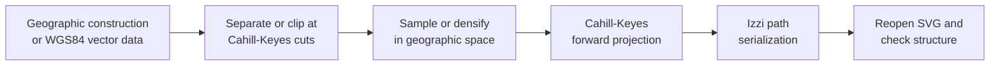

# SVG generation pipeline

[Documentation index](../index.md) ·
[Cahill-Keyes context](cahill-keyes-context.md) ·
[Hamonshū wave catalogue](hamonshu-wave-patterns.md)

## Purpose

The repository contains four C++20 programs that are both SVG generators and
structural tests. They exercise the production Cahill-Keyes projection through
the real Alpha60 and Izzi APIs, write a layered SVG at the repository root,
then reopen that file and verify its dimensions, layer structure, path counts,
and numeric sanity.

The four outputs describe progressively richer views of the same 44 by 22
Cahill-Keyes frame:

| Make target | Generator | Principal input | Output |
| --- | --- | --- | --- |
| `generate-geometry` | [`tests/generate-geometry.cc`](../tests/generate-geometry.cc) | Constructed octant boundaries | [`geometry-ck-44-22.svg`](../geometry-ck-44-22.svg) |
| `generate-graticules-ck` | [`tests/generate-graticules-ck.cc`](../tests/generate-graticules-ck.cc) | Sampled latitude and longitude lines | [`graticules-ck-44-22.svg`](../graticules-ck-44-22.svg) |
| `generate-earth-ck` | [`tests/generate-earth-ck.cc`](../tests/generate-earth-ck.cc) | Natural Earth 1:10m physical vectors | [`earth-ck-44-22.svg`](../earth-ck-44-22.svg) |
| `generate-ocean-ck` | [`tests/generate-ocean-ck.cc`](../tests/generate-ocean-ck.cc) | Natural Earth ocean and the *Hamonshū* catalogue | [`ocean-ck-44-22.svg`](../ocean-ck-44-22.svg) |

These files are diagnostic and illustrative rather than a general map-rendering
command line. Each generator currently asserts the exact `{44, 22}` fixture,
although the underlying Cahill-Keyes projection accepts any finite, positive
2:1 frame.

## Build orchestration and inputs

The [top-level Makefile](../Makefile) compiles every generator with C++20 and
`-Wall -Wextra -Wpedantic -Werror`. The geometry and graticule programs need
the neighboring Alpha60 and Izzi source trees. The Earth and ocean programs
also use GDAL's vector API and require GDAL to have GEOS support for polygon
intersection.

The default locations can be overridden:

| Make variable | Default | Purpose |
| --- | --- | --- |
| `ALPHA60_SRC` | `../alpha60/src` | Alpha60 headers |
| `IZZI_SRC` | `../izzi/src` | Izzi SVG headers |
| `GDAL_CONFIG` | `gdal-config` | GDAL compiler and linker flags |
| `NATURAL_EARTH_DIR` | `assets/natural-earth/10m-physical-vectors` | Extracted shapefiles |

Run one target normally:

```sh
make generate-geometry
make generate-graticules-ck
make generate-earth-ck
make generate-ocean-ck
```

`make` rebuilds only when a declared dependency is newer. Use `make -B`
when an unconditional regeneration is wanted. `make clean` removes the
generator binaries and all four generated SVGs, but deliberately retains the
downloaded Natural Earth input.

The generators are not part of `make check`; invoking a `generate-*`
target both writes its artifact and runs that generator's embedded structural
checks.

The generated SVGs are checked in. This makes visual and XML diffs reviewable,
but it also means that regenerating with a different GDAL or GEOS version can
produce ordering or coordinate differences even though the input archive is
pinned.

### Natural Earth acquisition

[`scripts/fetch-natural-earth-10m.sh`](../scripts/fetch-natural-earth-10m.sh)
downloads Natural Earth 5.1.1's complete 1:10m physical-vector archive. It:

1. checks for a completion stamp and the `.shp`, `.shx`, `.dbf`, and
   `.prj` components of every required dataset;
2. downloads the official archive only when the local archive is absent;
3. verifies its fixed SHA-256 digest before extraction;
4. extracts only the named physical datasets; and
5. creates the completion stamp last, so interrupted extraction is retried.

The Earth and ocean targets depend on that stamp and pass
`NATURAL_EARTH_DIR` to their executables. The archive digest and licensing
are recorded in the
[Natural Earth data note](../assets/natural-earth-10m-physical-vectors.md).

## Shared coordinate pipeline

All four generators use
[`cart0freak0-cahill-keyes.h`](../src/cart0freak0-cahill-keyes.h) through
`make_cahill_keyes_projection(frame {44, 22}, ...)`. Geographic calls use
the public API order `(latitude, longitude)`; projected coordinates use an
upper-left SVG origin.



The ordering matters. A map projection transforms points; it does not know
whether two adjacent input points should remain connected across a cut in the
unfolded octahedron. Cutting first preserves geographic topology. Densifying
before projection then approximates the curved projected edge with short SVG
line segments.

### Registered cut meridians

The native Cahill-Keyes construction changes octants at `-110`, `-20`,
`70`, and `160` degrees. The public projection adds one degree to input
longitude to retain registration with the Visionscarto base map, so generator
input must instead be split at:

```text
-111°, -21°, 69°, 159°
```

The geometry and graticule programs describe four cyclic sectors. The Pacific
sector is represented as `159° ... 249°`, then canonicalized back into the
public `[-180°, 180°]` domain point by point. The polygon programs use five
linear clipping bands because the cyclic Pacific sector is divided by the
antimeridian.

Every generator offsets a cut by `1e-7` degree. That epsilon avoids asking
the piecewise projection to choose both sides of the same boundary. It is
small enough to be visually negligible at the fixture scale, but it is still
a deliberate microscopic gap rather than an exact topological weld.

### Sampling and densification

The geometry and graticule generators sample analytic parallels and meridians
every 2.5 degrees. The Natural Earth generators retain source vertices, apply
topology-preserving simplification, then call GDAL `segmentize()` so no input
segment exceeds a configured angular length.

Both approaches are fixed-step approximations. They are predictable and
compact, but not adaptive to projected curvature. A degree of longitude also
represents less physical distance near a pole than at the equator. If these
outputs are enlarged substantially or used as numeric reference artwork,
projected-space error should be measured and the sampling threshold reduced
or made adaptive.

Consecutive points that project to exactly the same coordinate are removed.
All generators reject non-finite points and material out-of-frame results.
The Natural Earth programs additionally clamp tolerated roundoff at the frame
boundary; the analytic geometry and graticule programs retain their original
projected coordinates.

## Folding, clipping, and discontinuities

There are two related meanings of “folding” in this code:

- The Cahill-Keyes projection unfolds eight spherical octants into its planar
  M-shaped net.
- [`cart0freak0-cahill-keyes-functions.h`](../src/cart0freak0-cahill-keyes-functions.h)
  folds an already projected open path across opposite rectangular frame
  edges by splitting it into visually short segments.

The projected-path helper detects a large jump between opposite outer
quarters or opposite vertical halves. It temporarily unwraps the destination
coordinate, solves the segment/edge intersection

```text
t = (edge - start) / (end - start)
```

and interpolates the other coordinate at the same `t`. It emits a paired
exit point and entry point on opposite frame edges. Scale-aware
floating-point tolerances handle points that are nearly parallel to or
already on an edge.

That repair is appropriate for an ordered open polyline whose intended
continuity is already known. It is not sufficient for a filled polygon:
closing a ring after projection can create a false chord across several
octants and fill a large triangle that never existed on Earth. Consequently,
the current generators do not rely on projected-path folding:

- geometry and graticule paths are constructed as separate face-safe paths;
- Earth and ocean polygons are intersected with geographic clipping bands
  before projection.

This distinction also matters when adapting a generator to Star-X,
AuthaGraph, Myriahedral, or Voronoi. Their cut graphs and frame topology differ;
the Cahill-Keyes 2:1 rectangular wrap heuristics must not be reused merely
because the point API is the same.

## Geometry generator

[`tests/generate-geometry.cc`](../tests/generate-geometry.cc) constructs the
projection's explanatory skeleton rather than reading external data.
`test_ck_grids()`:

1. defines four registered 90-degree longitude sectors and their official
   northern and southern octant numbers;
2. traces each octant along its equator edge, eastern seam, pole, and western
   seam;
3. splits every octant at its central meridian to produce two half-octants;
4. constructs four equal-width screen-space rectangles matching Alpha60's
   map-quadrant convention; and
5. writes four semantic SVG layers.

| Layer | Count | Meaning |
| --- | ---: | --- |
| `triangular-faces` | 8 | Filled presentation of the eight octahedral faces |
| `quadrants` | 4 | Equal-width drawing regions, not spherical quadrants |
| `octants` | 8 | Outlined and officially numbered projected octants |
| `half-octants` | 16 | Western/eastern halves used by the piecewise construction |

The `triangular-faces` and `octants` layers intentionally contain the same
geometric outlines with different IDs and styles. One communicates the
polyhedral faces perceptually; the other exposes the geographic numbering for
inspection.

Near a pole, the boundary meridians stop at `90° - epsilon`; the exact pole
is then projected at the sector center. This chooses the intended copy of a
polar vertex instead of allowing a seam longitude to choose an adjacent face.
The visible pole duplication is a property of the unfolded net, not numerical
noise.

The program verifies the 44 by 22 view box, exact path count in every layer,
and absence of NaN or infinity.

## Graticule generator

[`tests/generate-graticules-ck.cc`](../tests/generate-graticules-ck.cc)
creates a conventional ten-degree geographic reference grid:

- 17 parallels from `80°S` through the equator to `80°N`;
- 36 meridians from `180°` through `170°E`;
- four seam-safe path segments for each parallel; and
- separate northern and southern path segments for each meridian.

Splitting a parallel by longitude sector prevents a line from jumping between
distant octants. Splitting a meridian at the equator reflects the fact that
its northern and southern halves belong to different octahedral faces even
though they touch geographically.

Each line is a named SVG subgroup with paths, a title, and one visible degree
label. Multiples of 30 degrees receive stronger styling. Latitude labels are
anchored at a projected point on longitude `-156°` with a small manual
offset. Longitude labels alternate between `3.5°S` and `3.5°N` to reduce
collisions near the equator; `180°` is displayed without an east/west suffix.

These are layout heuristics, not a general label-placement engine. They work
for the fixed 44 by 22 diagnostic. Dense overlays, different typography, or
another aspect ratio may require collision detection, leader lines, or
multiple labels per disconnected parallel.

The self-check expects 17 latitude groups and labels, 68 latitude paths, 36
longitude groups and labels, and 72 longitude paths.

## Natural Earth physical-map generator

[`tests/generate-earth-ck.cc`](../tests/generate-earth-ck.cc) turns the
pinned Natural Earth physical datasets into a layered vector map.

### Geometry processing

For each shapefile, the program:

1. opens the first GDAL vector layer read-only and requires a geographic
   spatial reference;
2. clones each nonempty feature;
3. optionally simplifies it while preserving topology;
4. skips clipping bands that cannot overlap the feature envelope;
5. intersects the feature with every relevant seam-safe longitude band;
6. densifies each surviving piece with `segmentize()`;
7. projects polygon rings or line strings point by point; and
8. serializes the result as one named Izzi path per source feature and band.

Interior polygon rings are retained, and area paths use SVG's `evenodd`
fill rule so lakes or other holes are not painted solid. All tolerances below
are in geographic degrees, because simplification and densification happen
before projection:

| Layer family | Simplification | Maximum segment |
| --- | ---: | ---: |
| Ocean and twelve bathymetry levels | 0.04 | 0.50 |
| Land | 0.03 | 0.50 |
| Minor islands | 0.005 | 0.25 |
| Glaciated areas and Antarctic ice shelves | 0.02 | 0.35 |
| Lakes and reservoirs | 0.01 | 0.25 |
| Playas | 0.005 | 0.25 |
| Rivers and lake centerlines | 0.01 | 0.25 |
| Reefs | 0.005 | 0.20 |
| Coastline | 0.02 | 0.25 |

Finer tolerances preserve small islands, reefs, and playas that would
disappear under the bathymetry setting. Densification is also finer for
features whose local bends or narrow scale matter perceptually.

### Layer order and visual interpretation

The document draws ocean first, followed by twelve nested bathymetry polygons
from 0 m through -10,000 m. Progressively deeper polygons are therefore
painted over shallower ones with progressively darker blues. Land, minor
islands, ice, lakes, playas, rivers, reefs, and coastline follow.

Bathymetry here is a stack of depth classes, not a continuous elevation
surface or hillshade. Color steps emphasize categorical depth thresholds;
they are not guaranteed to be perceptually uniform. Likewise, line widths and
feature-specific simplification intentionally favor legibility at the target
view over equal treatment of every source vertex.

Izzi's path constructor requires a stroke color before emitting a path.
Filled areas therefore use a same-color 0.0025-unit hairline. Besides satisfying
the API, the stroke covers sub-pixel cracks between separately clipped pieces.
The tradeoff is that narrow shapes can appear slightly heavier and adjacent
fills can overlap by a fraction of a display pixel.

The executable prints source-feature, output-path, and projected-point counts
for every layer. It then checks all required groups, all twelve bathymetry
subgroups, a minimum path count, the view box, and finite coordinates.

## Hamonshū ocean generator

[`tests/generate-ocean-ck.cc`](../tests/generate-ocean-ck.cc) combines one
Natural Earth ocean feature with 153 deterministic vector interpretations of
Mori Yūzan's 1903 *Hamonshū*, volume 2.

### Catalogue and provenance

[`tests/hamonshu-v2-patterns.inc`](../tests/hamonshu-v2-patterns.inc) is a
compile-time catalogue of illustrated page or page span, motif ordinal, and
descriptive English slug. A `static_assert` fixes the catalogue at 153
entries. The source has no printed motif captions, so these names are
descriptions rather than translations or historical titles.

The PDF is visual source material, not a runtime input and not an image
texture embedded in the SVG. Stable layer IDs and titles map each procedural
interpretation back to its illustrated page and PDF scan. The complete page
convention is documented in the
[*Hamonshū* wave-pattern catalogue](hamonshu-wave-patterns.md).

### Ocean mosaic

The program simplifies the complete ocean with a 0.04-degree
topology-preserving tolerance. One seam-clipped, 0.5-degree-densified version
becomes the pale base ocean.

For patterned regions, the source ocean is intersected with a 10 by 10 degree
geographic grid. Rows are traversed alternately west-to-east and
east-to-west—a serpentine order—then every tile is intersected again with the
Cahill-Keyes clipping bands. Pieces are retained only when:

- GDAL reports at least one square degree of area in the geographic source
  coordinate system; and
- the projected bounding box spans at least 0.08 unit in each direction.

The area threshold is a practical complexity filter, not an equal-area
measurement. A square degree changes physical size with latitude, and
irregular coastal fragments can pass or fail differently from compact
offshore pieces. The complete base ocean fills small pieces intentionally
omitted from the patterned mosaic.

Surviving regions are distributed round-robin across the 153 catalogue
entries. The serpentine traversal avoids a hard reset at every latitude row,
but the assignment is artistic and deterministic rather than geographic or
historical. Tile boundaries may be perceived as ocean regions even though
they encode no oceanographic phenomenon.

### Procedural line families

The descriptive slug classifies each catalogue entry into one of sixteen
families:

```text
waterline  crest   spiral   spray    arc      lattice
bubble     scroll  fan      breaker  braid    cascade
ripple     fountain cloud   cell
```

A stable integer seed derived from page range, motif number, and slug varies
row count, phase, direction, density, color, stroke width, and a small
rotation. There is no runtime randomness, so the same catalogue and geometry
select the same construction.

Curves are evaluated parametrically at fixed sample counts. Ellipses and
spirals are likewise converted to point sequences, and Izzi serializes them
as SVG paths. Motifs are authored in normalized `(u,v)` coordinates and
mapped into each assigned region's projected bounding box. This makes the
pattern fill its tile, but it also means a long narrow region stretches the
motif anisotropically and changes its apparent wavelength.

Each catalogue layer contains:

1. a colored path for its assigned ocean regions; and
2. one procedural line path clipped to those exact regions by an SVG
   `clipPath`.

A small seeded palette varies adjacent water fields and ink. This makes the
153 layers distinguishable in an editor and produces a deliberate patchwork,
but color boundaries can compete perceptually with coastlines or be mistaken
for bathymetric zones. Fixed output-space stroke widths can also appear denser
in small tiles than in large ones.

The self-check requires the base ocean, all 153 named groups, 153 clip paths,
two paths per catalogue layer, source titles, the 44 by 22 view box, and
finite coordinates. It verifies provenance and structure, not visual
fidelity to the scanned pages.

## What the executable checks do—and do not—prove

The generators fail loudly on missing data, unsupported geometry types,
failed GDAL operations, invalid frame dimensions, non-finite projections,
materially out-of-frame coordinates, absent SVG layers, and unexpected
structural counts. This catches many broken-build and numeric regressions at
the point where the artifact is produced.

Those checks do not prove that:

- a polygon has no self-intersection after projection;
- an intended edge was split at every visual discontinuity;
- a simplification tolerance preserved every important small feature;
- labels do not overlap at every renderer zoom level;
- colors and line weights remain distinguishable for every viewer; or
- a procedural wave is a facsimile of its historical specimen.

Human review remains part of generation. Inspect the complete map, zoom into
all seams and poles, toggle layers in an SVG-aware editor, and check both
filled and outline features. The Earth and ocean files are currently much
larger than the geometry and graticule diagnostics, so browser and editor
performance is itself a practical review concern.

## Guidance for new generators

When adding another generated projection or layer:

1. Define the output frame and enforce its projection-specific aspect ratio.
2. Identify the projection's cuts in the same longitude registration used by
   its public API.
3. Split analytic lines explicitly and clip filled geographic topology before
   projection.
4. Densify in geographic space, then measure projected-space error at the
   intended display scale.
5. Preserve holes, stable IDs, source metadata, and meaningful layer groups.
6. Treat tiny seam strokes and epsilons as visible design decisions, not only
   numeric implementation details.
7. Add structural checks for dimensions, layer counts, provenance, and finite
   coordinates.
8. Review the resulting SVG perceptually; structural assertions cannot detect
   a convincing but incorrect fold.

---

[Documentation index](../index.md) ·
[Cahill-Keyes context](cahill-keyes-context.md) ·
[Hamonshū wave catalogue](hamonshu-wave-patterns.md)
