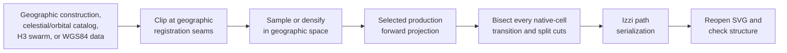

# SVG generation pipeline

[Documentation index](../index.md) ·
[Prerequisites](prerequisites.md) ·
[Generation methods](generation-methods.md) ·
[Cahill-Keyes context](cahill-keyes-context.md) ·
[Astronomy notes](astro-implementation-notes.md) ·
[Cloud-atmosphere notes](cloud-atmosphere-implementation-notes.md) ·
[P-Tree download quick start](ptree-production-download.md) ·
[Orbital Technosphere notes](orbital-technosphere-implementation-notes.md) ·
[World Game resources notes](resources-implementation-notes.md) ·
[Anthropocene notes](anthropocene-implementation-notes.md) ·
[Network-swarm notes](network-swarm-implementation-notes.md) ·
[Network-infrastructure notes](network-infrastructure-implementation-notes.md) ·
[Bathymetry Roulette notes](bathymetry-roulette-implementation-notes.md)

## Purpose

The repository contains fifteen C++20 SVG generation programs under
`src.generate/`.
Twelve exercise all six production projections through the real Alpha60 and
Izzi APIs. Three derive Cahill-Keyes or Myriahedral slices from an already
projected whole-earth SVG. They write layered SVGs under
`assets.generated/svg/`, then reopen those files and verify dimensions, layer
structure, path counts, and numeric sanity. Inkscape subsequently exports each
validated SVG as PDF and as a 3840-pixel-long-side PNG.

A separate C++20 profile resolver validates the user-configurable projection
and pass selection used by a bare `make`. It chooses existing Make targets; it
does not duplicate generation logic or filter SVG layers after generation.

| Artifact | Generator | Principal input |
| --- | --- | --- |
| Geometry | [`src.generate/generate-geometry.cc`](../src.generate/generate-geometry.cc) | Native projection faces and screen quadrants |
| Graticules | [`src.generate/generate-graticules.cc`](../src.generate/generate-graticules.cc) | Sampled latitude and longitude lines |
| Earth | [`src.generate/generate-earth.cc`](../src.generate/generate-earth.cc) | Natural Earth 1:10m ocean and land |
| Water | [`src.generate/generate-water.cc`](../src.generate/generate-water.cc) | Every other Natural Earth 1:10m physical layer |
| Bathymetry Roulette | [`src.generate/generate-bathymetry-roulette.cc`](../src.generate/generate-bathymetry-roulette.cc) | Twelve Natural Earth depth thresholds clipped over explicit, varied Izzi roulette line fields |
| Astronomy | [`src.generate/generate-astro.cc`](../src.generate/generate-astro.cc) | Profile timestamp and observer, bounded Gaia/exoplanet/SBDB snapshots, curated multi-band sources and events |
| Cloud-atmosphere | [`src.generate/generate-cloud-atmosphere.cc`](../src.generate/generate-cloud-atmosphere.cc) | Process-start solar geometry plus prepared, source-timed JAXA P-Tree cloud and JAXA Earth atmosphere observations |
| Orbital Technosphere | [`src.generate/generate-orbiting.cc`](../src.generate/generate-orbiting.cc) | Profile timestamp and observer, CelesTrak OMM population and memberships, NASA SSCWeb reference positions, and SGP4 |
| World Game resources | [`src.generate/generate-resources.cc`](../src.generate/generate-resources.cc) | Strict offline profile of all 40 commodity headings and 1960 production leaders from Fuller and McHale's 1963 inventory, plus source-separated modern context |
| Anthropocene | [`src.generate/generate-anthropocene.cc`](../src.generate/generate-anthropocene.cc) | Profile-fixed partial year and checksum-pinned H3 cell-day counts from GSN, EPA AirData, HMS, Storm Events, and CWFIS |
| Network swarm | [`src.generate/generate-network-swarm.cc`](../src.generate/generate-network-swarm.cc) | Validated cumulative swarm GeoJSON, H3 parent clustering, fixed display profile, and Izzi radial honeycombs |
| Network infrastructure | [`src.generate/generate-network-infrastructure.cc`](../src.generate/generate-network-infrastructure.cc) | Manifested cloud/CDN sites plus explicitly opted-in TeleGeography cable and Internet-exchange topology |
| Four slices | [`src.generate/generate-4-slice.cc`](../src.generate/generate-4-slice.cc) | Four full-height, quarter-width quadrant-pair enlargements from the Cahill-Keyes Earth SVG |
| Eight slices | [`src.generate/generate-8-slice.cc`](../src.generate/generate-8-slice.cc) | Eight exact-octant enlargements from the Cahill-Keyes Earth SVG |
| Myriahedral groups | [`src.generate/generate-myriahedral-slices.cc`](../src.generate/generate-myriahedral-slices.cc) | Two complementary exact-terminal-face masks from the Myriahedral water SVG |

The aggregate target generates all four terrestrial artifact families, the
monochrome Bathymetry Roulette family, two astronomy and two Orbital
Technosphere products, one World Game resources atlas, one Anthropocene
observation atlas, one cumulative
network-swarm product, and one cloud/CDN infrastructure-site atlas for all six
production projections, five exploratory
Myriahedral water perspectives, all 12 Cahill-Keyes slices, and two
Myriahedral face-group slices:

```sh
make all
```

`make generated-projections`, `make generate-projections`, and
`make make-generated` are equivalent aliases. The original individual
Cahill-Keyes targets also remain available.

The suite fixes the largest print dimension at 44 inches while retaining each
projection's exact aspect-ratio contract:

| Projection | Frame | Exact construction |
| --- | ---: | --- |
| Cahill-Keyes | `44 × 22` | `2:1` |
| AuthaGraph | `44 × 19.052559` | height `= 11√3` |
| Dymaxion | `44 × 20.78461` | height `= 44 × 3√3/11`, ratio `11/(3√3)` |
| Myriahedral | `44 × 24.75` | `16:9` |
| Star-X | `34 × 44` | `17:22` |
| Voronoi | `44 × 22.916667` | height `= 275/12`, ratio `48:25` |

The numeric frame is also the SVG's unitless coordinate system. Generated
root documents attach `in` to `width` and `height`, but leave `viewBox`
numeric: a Cahill-Keyes document is therefore `width="44in"`,
`height="22in"`, and `viewBox="0 0 44 22"`. One viewBox coordinate unit maps
to one physical inch without changing projection formulas or path data.

The filenames round irrational or recurring dimensions to six decimals,
matching Izzi's serialized `viewBox`; the in-memory frames use the exact
double expressions. These files are diagnostic and illustrative rather than
a general map-rendering command line.

## Build orchestration and inputs

The [top-level Makefile](../Makefile) compiles every generator with C++20 and
`-Wall -Wextra -Wpedantic -Werror`. The geometry and graticule programs need
the neighboring Alpha60 and Izzi source trees. The Earth, water, Bathymetry
Roulette, Cloud-atmosphere, resources, Anthropocene, and network-infrastructure programs
also use GDAL. Natural Earth vector clipping requires GEOS;
Cloud-atmosphere preparation additionally requires the GDAL GeoTIFF and
NetCDF raster drivers. Cloud-atmosphere and Anthropocene normalization and
generation also use H3.

The default locations can be overridden:

| Make variable | Default | Purpose |
| --- | --- | --- |
| `ALPHA60_SRC` | `../alpha60/src` | Alpha60 headers |
| `IZZI_SRC` | `../izzi/src` | Izzi SVG headers |
| `GDAL_CONFIG` | `gdal-config` | GDAL compiler and linker flags |
| `GENERATION_PROFILE` | `generation-profile.json` | Projection and generation-pass selection used by `make` and `make configured` |
| `NATURAL_EARTH_DIR` | `assets.static/natural-earth/10m-physical-vectors` | Extracted shapefiles |
| `ASTRO_DATA_DIR` | `assets.static/astronomy` | Astronomy profile and bounded catalog snapshots |
| `ASTRO_PROFILE` | `$(ASTRO_DATA_DIR)/astro-profile.json` | Authoritative timestamp, point of reference, orientation, instrumentation, event window, and catalog paths |
| `CLOUD_ATMOSPHERE_DATA_DIR` | `assets.static/cloud-atmosphere` | JAXA source profile plus ignored raw and prepared refresh staging |
| `CLOUD_ATMOSPHERE_PROFILE` | `$(CLOUD_ATMOSPHERE_DATA_DIR)/cloud-atmosphere-profile.json` | Process-time, latest-not-after, source, freshness, QA, H3 aggregation, and display contract |
| `CLOUD_ATMOSPHERE_GEOJSON` | `$(CLOUD_ATMOSPHERE_DATA_DIR)/.prepared/cloud-atmosphere-latest.geojson` | Locally prepared, checksum-verified H3 observation snapshot |
| `ORBITING_DATA_DIR` | `assets.static/orbital-technosphere` | Orbital Technosphere profile, OMM CSV snapshots, NASA reference, and checksums |
| `ORBITING_PROFILE` | `$(ORBITING_DATA_DIR)/orbital-technosphere-profile.json` | Authoritative propagation instant, make-invocation reference point, catalog roles, freshness rules, visibility rules, and display budgets |
| `ANTHROPOCENE_DATA_DIR` | `assets.static/anthropocene` | Checked profile, normalized 2026 H3 GeoJSON, checksum, and ignored refresh staging |
| `ANTHROPOCENE_PROFILE` | `$(ANTHROPOCENE_DATA_DIR)/anthropocene-profile.json` | Literal duration year, snapshot date, source coverage, thresholds, metric enablement, scales, and styles |
| `ANTHROPOCENE_GEOJSON` | `$(ANTHROPOCENE_DATA_DIR)/anthropocene-2026.geojson` | Checksum-pinned, source-separated H3 cell-day snapshot |
| `RESOURCES_DATA_DIR` | `assets.static/resources` | Checked historical and modern-context profile plus source-workflow README |
| `RESOURCES_PROFILE` | `$(RESOURCES_DATA_DIR)/resources-profile.json` | Source years, 40 historical commodity records, page pointers, representative leader points, modern context, and display contract |
| `NETWORK_SWARM_SOURCE` | `assets.static/network-swarm/house-of-the-dragon-301-cumulative-aggregate.geojson.zip` | Local ZIP or plain GeoJSON source prepared for the network-swarm pass |
| `NETWORK_SWARM_GEOJSON` | `assets.static/network-swarm/.prepared/house-of-the-dragon-301-cumulative-aggregate.geojson` | Prepared cumulative swarm staging destination |
| `NETWORK_SWARM_PROFILE` | `assets.static/network-swarm/network-swarm-profile.json` | H3 clustering, physical marker dimensions, labels/tethers, fixed scales, and provenance |
| `NETWORK_INFRASTRUCTURE_CLOUD_SOURCE` | `../cloud_cdn_cache` | External checkout at the profile-pinned cloud/CDN commit |
| `SUBMARINE_CABLE_SOURCE` | `../www.submarinecablemap.com` | External TeleGeography cable checkout used only by topology opt-in targets |
| `INTERNET_EXCHANGE_SOURCE` | `../www.internetexchangemap.com` | External TeleGeography exchange checkout used only by topology opt-in targets |
| `NETWORK_INFRASTRUCTURE_SITES_PROFILE` | `assets.static/network-infrastructure/network-infrastructure-sites-profile.json` | Normal cloud/CDN site-atlas sources, counts, detiling, labels, and terms |
| `NETWORK_INFRASTRUCTURE_TOPOLOGY_PROFILE` | `assets.static/network-infrastructure/network-infrastructure-topology-profile.json` | Explicit TeleGeography topology layers, source pins, and CC BY-NC-SA 3.0 opt-in |
| `INKSCAPE` | `inkscape` | Command-line PDF and PNG exporter |
| `PNG_LONG_SIDE` | `3840` | Pixel count assigned to each PNG's longest side |
| `LABEL_FONT` | `atkinson_hyperlegible` | Installed font used for visible labels in graticule, astronomy, Cloud-atmosphere, Orbital Technosphere, resources, Anthropocene, network-swarm, network-infrastructure, and Bathymetry Roulette images |

### Generated label typography

All text-bearing generation passes share
[`generation-typography.h`](../src.generate/generation-typography.h). The
default `atkinson_hyperlegible` identifier serializes as the installed SVG
family `Atkinson Hyperlegible`; font sizes, weights, colors, and label
placement remain pass-specific. The generators reject unsafe or empty family
names and reopen each SVG to verify that every visible `<text>` element uses
the configured family.

Override the font for a deliberate artifact variant with an installed family
name. Use `-B` when outputs already exist so Make reruns the generators and
their PDF/PNG exports:

```sh
make -B LABEL_FONT='Atkinson Hyperlegible Next' generate-graticules-projections
make -B LABEL_FONT='Atkinson Hyperlegible Next' generate-astro
make -B LABEL_FONT='Atkinson Hyperlegible Next' generate-orbiting
make -B LABEL_FONT='Atkinson Hyperlegible Next' generate-anthropocene-artifacts
make -B LABEL_FONT='Atkinson Hyperlegible Next' generate-resources-artifacts
make -B LABEL_FONT='Atkinson Hyperlegible Next' generate-network-swarm-artifacts
make -B LABEL_FONT='Atkinson Hyperlegible Next' generate-network-infrastructure-artifacts
make -B LABEL_FONT='Atkinson Hyperlegible Next' generate-bathymetry-roulette-artifacts
```

When invoking a generator binary directly, set
`CARTOFREAKO_LABEL_FONT` instead. Installation and exact-family validation are
documented in the [prerequisites](prerequisites.md#label-font).

### Configured development generation

A bare `make` now reads the checked-in
[`generation-profile.json`](../generation-profile.json) and builds only the
selected projection/pass combinations as layered SVGs. The default profile is
the fast development case requested for Stage 7:

```json
{
  "schema_version": 1,
  "description": "Fast Cahill-Keyes terrestrial development profile",
  "projections": ["cahill_keyes"],
  "passes": ["earth", "ocean"]
}
```

Inspect the normalized selection and exact Make targets without generating
anything:

```sh
make generation-plan
```

Then build that selection with either equivalent command:

```sh
make
make configured
```

Use another profile without modifying the checked-in preference:

```sh
make GENERATION_PROFILE=/absolute/path/development.json generation-plan
make GENERATION_PROFILE=/absolute/path/development.json
```

Both selectors must be nonempty JSON arrays. The sole value `"all"` expands
to every supported value. Canonical projections are `cahill-keyes`,
`authagraph`, `dymaxion`, `myriahedral`, `star-x`, and `voronoi`. Canonical
passes and their SVG result counts per projection are:

| Profile pass | Result per projection |
| --- | --- |
| `geometry` | One native-face geometry SVG |
| `graticules` | One labeled graticule SVG |
| `earth` | One Natural Earth `ocean`/`land` base SVG |
| `water` | One complementary physical-feature SVG |
| `astronomy` | All-sky and observer SVGs |
| `cloud-atmosphere` | One process-start solar and source-timed physical-atmosphere SVG |
| `orbital-technosphere` | Global and observer SVGs |
| `anthropocene` | One source-separated observation-atlas SVG |
| `resources` | One historical production-leader atlas with separate modern context |
| `network-swarm` | One cumulative network-swarm SVG |
| `bathymetry-roulette` | One monochrome, explicitly varied roulette-line-field depth SVG |
| `network-infrastructure` | One cloud/CDN infrastructure-site SVG; never the licensed topology product |

Names are case-insensitive, and underscores normalize to hyphens. The
resolver also accepts `ck`, `starx`, and the established `voroni` spelling as
projection aliases; `graticule`, `astro`, `orbiting`, and the former `network`
and short `swarm` names for `network-swarm`, `infrastructure` for
`network-infrastructure`, `clouds`, `atmosphere`, `solar-atmosphere`, and
`solar/cloud/atmosphere` for `cloud-atmosphere`, plus
`resource`, `world-game`, `world-game-resources`, and the legacy typo
`resouces` for `resources`, plus
`bathymetry-rolette`, and `art-agua-roulette` are pass aliases.
For compatibility with the requested `earth, ocean` vocabulary, `ocean`
normalizes to the current `water` generation pass. It does not mean the
`ocean` layer inside the Earth base SVG.

Profile `"all"` means the six projections by twelve selectable passes. It
produces 84 SVGs because astronomy and Orbital Technosphere each have two
products. It deliberately excludes Cahill-Keyes slices, exploratory
Myriahedral perspectives and slices, and PDF/PNG exports. Those products do
not form a projection/pass cross-product and remain available through their
explicit targets. It includes Cloud-atmosphere and therefore requires a
current locally prepared JAXA snapshot. `make all` retains the credential-free
97 SVG (six stored as deterministic `.svg.gz` archives), 97 PDF, and 97 PNG
standard suite and excludes Cloud-atmosphere. The
six opt-in topology products per format also remain separate.

The resolver rejects empty selectors, duplicate aliases or JSON members,
unknown names or members, a mixed `"all"` selector, and unsupported schema
versions before recursive Make begins. It emits only whitelisted target names,
and the recursive Make retains normal dependency checks, `-j` jobserver
behavior, and command-line overrides. The
[generation methods decision record](generation-methods.md) compares this
design with Make variables, included Make fragments, external JSON tools, and
generator-runtime filtering. It also centralizes the preserved evaluation
conclusions and status of proposed `generate-*` passes.

List every supported top-level build, test, generation, export, and cleanup
target alphabetically with:

```sh
make list-targets
```

Run one target normally:

```sh
make generate-geometry
make generate-graticules-ck
make generate-earth-ck
make generate-water-ck
make generate-authagraph
make generate-dymaxion
make generate-myriahedral
make generate-water-myriahedral-perspectives
make generate-myriahedral-slices
make generate-star-x
make generate-voronoi
make generate-astro
make fetch-cloud-atmosphere-data
make prepare-cloud-atmosphere-data
make generate-cloud-atmosphere
make generate-orbiting
make generate-anthropocene
make generate-resources
make prepare-network-swarm-data
make generate-network-swarm
make generate-network-infrastructure
make generate-network-infrastructure-topology
make generate-bathymetry-roulette
make all
```

Every Make workflow rebuilds only when a declared dependency is newer. Use
`make -B`
when an unconditional regeneration is wanted. `make clean` removes the
generator binaries and generated SVG, PDF, PNG, and WASM build products, but
deliberately retains the downloaded Natural Earth input and checked-in WASM
sources.

The full generators are not part of `make check`; invoking a `generate-*`
target both writes its artifact and runs that generator's embedded structural
checks.

The 97 standard artifacts plus six opt-in topology artifacts in each of
`assets.generated/svg/`, `assets.generated/pdf/`, and `assets.generated/png/`
are checked in. This makes visual and XML diffs
reviewable, but it also means that regenerating with a different GDAL, GEOS,
or Inkscape version can produce ordering, coordinate, or rendering differences
even though the input archive is pinned. Cloud-atmosphere artifacts are local,
source-timed opt-in products and are not checked in by the standard suite.

## PDF and 4K PNG export

Every PDF and PNG has a direct Make dependency on its layered SVG, so
conversion starts only after that SVG generator and its embedded structural
checks succeed. Inkscape uses the SVG page as the export area and preserves
the original projection aspect ratio. PNG exports set the background to white
at full opacity and select 8-bit RGB output without an alpha channel,
flattening transparent page regions without changing the layered SVG or PDF
sources.

The default `PNG_LONG_SIDE=3840` follows UHD 4K video's horizontal pixel
resolution. Landscape Cahill-Keyes, AuthaGraph, Dymaxion, Myriahedral, and
Voronoi maps set their PNG width to 3840 pixels. Portrait Star-X maps,
Cahill-Keyes slices, and Myriahedral group 1 set their PNG height to 3840
pixels; Myriahedral group 2 is landscape. Supplying only the longer dimension
lets Inkscape derive the other dimension without anisotropic scaling. Override
the resolution when needed:

```sh
make -B PNG_LONG_SIDE=7680 all
```

Inkscape exports vector PDFs at the SVG's physical page size without changing
the layered SVG originals. For example, a 44-by-22-inch Cahill-Keyes page is
3168 by 1584 PDF points. The explicit PNG pixel override is independent of
that physical page size.

Final files are grouped by format rather than mixed at the `assets.generated/` root:

```text
assets.generated/
├── svg/
├── pdf/
└── png/
```

## Astronomy generation

The astronomy pass maps declination to geographic latitude and right
ascension to a configurable synthetic longitude before using the same six
projection implementations as the terrestrial generators. Its checked-in
profile contains both the calculation timestamp and the reference point; no
host clock or location is inferred. The default is a pinned San Francisco
multi-band profile with celestial handedness, RA 12h at the map center, and a
seven-day transient lookback.

Generate both all-sky and observer-filtered products for all projections with:

```sh
make generate-astro
```

The product-family targets are `generate-astro-all-sky` and
`generate-astro-observer`. Per-projection targets follow the
`generate-astro-PROJECTION` form. Supply another profile with
`ASTRO_PROFILE=/absolute/path/profile.json`.

Catalog acquisition is deliberately separate from rendering. The repository
contains bounded snapshots for reproducible offline generation; refresh Gaia
DR3, the NASA Exoplanet Archive, and named JPL Small-Body Database records
with:

```sh
make fetch-astro-data
```

That target changes calculation inputs and should be followed by review and
full artifact regeneration. It does not replace the authoritative profile or
the curated transient snapshot. The
[astronomy implementation notes](astro-implementation-notes.md) document the
profile schema, source evaluation, orbital and observer formulas,
instrument-band behavior, SVG layers, current limitations, and every output.

## Cloud-atmosphere generation

The Cloud-atmosphere pass calculates the terrestrial subsolar point and five
illumination zones once at generator process start, then overlays a prepared
H3 snapshot of JAXA physical observations. P-Tree supplies regional/daytime
Himawari cloud fraction, optical thickness, top height, and ISCCP type;
GCOM-C, GSMaP, and JASMES supply AOD, precipitation, and shortwave radiation.
Every source remains independently timed and missing values mean unobserved.

Refresh and render explicitly:

```sh
make fetch-cloud-atmosphere-data
make prepare-cloud-atmosphere-data
make verify-cloud-atmosphere-data
make generate-cloud-atmosphere
```

The fetch requires an existing P-Tree `.netrc` entry. Follow the
[credentialed production-download quick start](ptree-production-download.md)
to register, configure and test credentials, run a reproducible refresh, and
diagnose common failures. Use
`generate-cloud-atmosphere-PROJECTION` for one SVG,
`generate-cloud-atmosphere-projections` for all six SVGs, or
`generate-cloud-atmosphere-artifacts` for SVG/PDF/PNG output. This family is
excluded from `make all` because an offline build cannot assume credentials
or a current snapshot. The
[Cloud-atmosphere implementation notes](cloud-atmosphere-implementation-notes.md)
document the astro boundary, exact sources, time and QA rules, H3
preparation, source terms, layer contract, and tests.

## Orbital Technosphere generation

The Orbital Technosphere pass propagates checked-in OMM elements with the
published Vallado/CelesTrak SGP4 implementation at the exact instant stored in
its JSON profile. The global family maps Earth subpoints over a subdued
Natural Earth base; the observer family maps above-horizon topocentric
positions from the recorded San Francisco make-invocation point.

```sh
make generate-orbiting
```

Use `generate-orbiting-global`, `generate-orbiting-observer`, or
`generate-orbiting-PROJECTION` for a subset. Supply a different profile with
`ORBITING_PROFILE=/absolute/path/profile.json`.
`generate-orbiting-artifacts` additionally exports the 12 PDFs and PNGs.

Orbital refresh is an explicit, atomic action:

```sh
make fetch-orbiting-data
```

The refresh acquires OMM CSV groups from CelesTrak and selected-spacecraft
reference positions from NASA SSCWeb, then rewrites their checksums. It does
not change the profile's timestamp or location; those must be reviewed with
the NASA query interval. The
[implementation notes](orbital-technosphere-implementation-notes.md) cover
the source feasibility decision, profile schema, category memberships,
coordinate pipeline, SVG metadata, verification, and operational-use limits.

## Anthropocene generation

The Anthropocene pass maps positive unique-day counts from a checksum-pinned,
resolution-4 H3 FeatureCollection. Its checked profile fixes the literal 2026
calendar year, partial snapshot date, per-source coverage, record and
precipitation thresholds, metric enablement, scales, shapes, and colors. It
does not read the host clock or calculate a composite climate-attribution
score.

```sh
make generate-anthropocene
make generate-anthropocene-artifacts
```

Use `generate-anthropocene-PROJECTION` for one SVG and
`generate-anthropocene-projections` for all six SVGs. Supply a matching pair
with `ANTHROPOCENE_PROFILE` and `ANTHROPOCENE_GEOJSON`. The loader rejects a
year, snapshot, H3-resolution, filename, H3-center, or metric-total mismatch.
The Make rule independently verifies the GeoJSON against the SHA-256 declared
by the selected profile before generation.

EPA AirData PM2.5 exceedance days are enabled by default in the independent
`air-quality-exposure` group. They use a cross-square and never become NOAA
HMS `observed-smoke-days`, which use rings in the `atmosphere` group. Coral
bleaching stress is recorded in the profile and metadata as a separate future
raster/reef phase and is not rendered in Stage 8.

Ordinary generation is offline. These explicit targets stage a candidate
refresh without overwriting the checked GeoJSON:

```sh
make fetch-anthropocene-data
make prepare-anthropocene-data
```

The public CWFIS daily hotspot feed supplies default Canada/North America fire
coverage. Set `FIRMS_MAP_KEY` to add optional global NASA FIRMS chunks,
including northern Russia. Copernicus Sentinel-3 fire-radiative-power data and
Rosleskhoz operational reports remain validation sources. The
[Anthropocene implementation notes](anthropocene-implementation-notes.md)
document the feasibility boundary, classifications, exact formulas, source
audit, Canada/Russia fire evaluation, candidate resource types, SVG contract,
refresh workflow, and limits.

## World Game resources generation

The resources pass is an offline historical atlas. Its strict checked profile
preserves all 40 commodity headings, world totals, and marked leading-producer
shares from the 1960 production matrix in Fuller and McHale's 1963
*Inventory of World Resources, Human Trends, and Needs*. Thorium's source
`N.A.` remains unavailable rather than zero. Four FAO/IRENA comparison
indicators occupy a visibly and structurally separate modern-context layer.

```sh
make generate-resources-cahill-keyes
make generate-resources
make generate-resources-artifacts
```

Use `generate-resources-PROJECTION` for one gzip-compressed SVG and
`generate-resources-projections` for all six. The uncompressed SVGs are
ignored build intermediates used by Inkscape for PDF and PNG export; the
checked artifacts are `assets.generated/svg/resources-*.svg.gz`. Decompress
one for inspection without changing the checkout:

```sh
gzip -cd assets.generated/svg/resources-ck-44-22.svg.gz \
  > /tmp/resources-ck-44-22.svg
```

To decompress every SVG archive beneath `assets.generated` beside its archive
while retaining the compressed files:

```sh
find assets.generated -type f -name '*.svg.gz' \
  -exec gzip --decompress --keep -- {} +
```

Supply another audited profile
with `RESOURCES_PROFILE=/absolute/path/resources-profile.json`. The generator
rejects schema drift, invalid source pages, duplicate resources, inconsistent
nulls, and out-of-range shares before it draws anything.

Normal generation never downloads the historical scan. The source's current
rights and access terms require a manual, authorized maintainer workflow; the
optional OCR program is only an audit aid and cannot overwrite the checked
profile. The [resources implementation notes](resources-implementation-notes.md)
give the easy generation commands, source and archive findings, rights
boundary, complete schema/SVG contract, modern indicators, and step-by-step
re-audit procedure.

## Network-swarm generation

The network-swarm pass reads a strict cumulative swarm FeatureCollection,
validates all ten `properties.downloaders` values and 64-bit H3 cells, then groups
resolution-5 features under profile-selected resolution-3 parents. Parent
groups are split again by the selected projection's native cell before Izzi
radial honeycomb placement, preventing a cluster from crossing an unfolded
map seam. Thin optional tethers retain each true projected location.

```sh
make prepare-network-swarm-data
make generate-network-swarm
```

Use `generate-network-swarm-PROJECTION` for one SVG or
`generate-network-swarm-artifacts` for all six SVG/PDF/PNG products. A
compatible local ZIP or plain GeoJSON is selected with `NETWORK_SWARM_SOURCE`;
`NETWORK_SWARM_GEOJSON` changes the staging destination. Normal generation is
offline from the pinned archive.

The [network-swarm implementation notes](network-swarm-implementation-notes.md)
document the source audit and digests, schema validation, H3 resolution
decision, Izzi lattice canonicalization, independent overlapping fields, visual
grammar, SVG layers, output previews, verification, and interpretation
boundary.

## Network-infrastructure generation

The ordinary network-infrastructure product maps the 1,003 located cloud/CDN
records in an externally checked, commit-pinned manifest. All points enter one
projection-cell-aware Izzi radial-hexagon collision layout; unlocated source
records remain represented in provenance totals and are never assigned
invented coordinates. This non-TeleGeography site atlas is a normal generation
pass and is included in `make all`:

```sh
make check-network-infrastructure-sources
make generate-network-infrastructure
make generate-network-infrastructure-artifacts
```

Set `NETWORK_INFRASTRUCTURE_CLOUD_SOURCE` when the pinned `cloud_cdn_cache`
checkout is not at its default sibling path. The six SVG-only projection
targets use `generate-network-infrastructure-PROJECTION`.

Submarine cable routes, cable landings, Internet-exchange facilities, and
logical exchange-to-facility membership are a separate, explicitly opted-in
product because the source topology is CC BY-NC-SA 3.0:

```sh
make check-network-infrastructure-topology-sources
make generate-network-infrastructure-topology
make generate-network-infrastructure-topology-artifacts
```

The topology rules also require `SUBMARINE_CABLE_SOURCE` and
`INTERNET_EXCHANGE_SOURCE`, defaulting to the two documented sibling
checkouts. They validate all three commits, primary-file digests, and consumed
tracked paths before generation. Topology is deliberately excluded from
`make all` and generation-profile `"all"`; its SVGs visibly attribute
TeleGeography and embed the CC BY-NC-SA 3.0 boundary. Cable paths are
source-backed physical geometry, while dashed exchange membership spokes are
logical incidence—not inferred fiber or traffic.

The [network-infrastructure implementation notes](network-infrastructure-implementation-notes.md)
record the source audit, exact snapshots and counts, license boundary, profile
schema, seam handling, clustering, layer semantics, previews, verification,
and known limits.

## Bathymetry Roulette generation

The Bathymetry Roulette pass reuses the twelve nested Natural Earth depth
polygons as projection-safe clip paths. Each depth paints an opaque pale ground
and an explicit projected-page mosaic of Izzi epitrochoid or hypotrochoid
lines. Twelve staggered, overlapping phase/size/point-distance variations per
depth replace the former grid of one repeated symbol. One dark ink remains
constant while the base point distance, radius ratio, closure period, and
finally outline versus low-opacity even-odd fill become more complex with
depth. Every curve instance is serialized; output size is intentionally not a
generation constraint.

```sh
make generate-bathymetry-roulette
```

Use `generate-bathymetry-roulette-PROJECTION` for one SVG,
`generate-bathymetry-roulette-projections` for the six SVGs, or
`generate-bathymetry-roulette-artifacts` for all six SVG/PDF/PNG products.
The source catalogue is deterministic and needs no profile beyond the common
Natural Earth input. `bathymetry-roulette`, `bathymetry-rolette`, and
`art-agua-roulette` select the pass in a generation profile.

The [Bathymetry Roulette implementation notes](bathymetry-roulette-implementation-notes.md)
record the exact twelve curve parameter sets, nested-paint model, visible key,
SVG contract, verification, previews, accepted moiré, and interpretation
limits.

## Natural Earth acquisition

[`scripts/fetch-natural-earth-10m.sh`](../scripts/fetch-natural-earth-10m.sh)
downloads Natural Earth 5.1.1's complete 1:10m physical-vector archive. It:

1. checks for a completion stamp and the `.shp`, `.shx`, `.dbf`, and
   `.prj` components of every required dataset;
2. downloads the official archive only when the local archive is absent;
3. verifies its fixed SHA-256 digest before extraction;
4. extracts only the named physical datasets; and
5. creates the completion stamp last, so interrupted extraction is retried.

The Earth, water, Bathymetry Roulette, Cloud-atmosphere, resources, and
Anthropocene targets depend on that
stamp and pass
`NATURAL_EARTH_DIR` to their executables. The archive digest and licensing
are recorded in the
[Natural Earth data note](natural-earth-10m-physical-vectors.md).

## Shared coordinate pipeline

The twelve whole-map generators use
[`projection-generation-common.h`](../src.generate/projection-generation-common.h)
to select a production projection, construct its exact frame, and call the
shared public API in `(latitude, longitude)` order. Projected coordinates use
an upper-left SVG origin.

The three slicing programs instead use
[`cart0freak0-cahill-keyes-slicing.h`](../src.projections/cart0freak0-cahill-keyes-slicing.h),
or
[`cart0freak0-myriahedral-slicing.h`](../src.projections/cart0freak0-myriahedral-slicing.h).
Those headers own the slice descriptors, clipping geometry, SVG wrapper
construction, and verification rules.



The ordering matters. A point projection alone does not say whether adjacent
input points remain connected in an unfolded net. Geographic clipping keeps
antimeridian and registered Cahill-Keyes closures local. Densification makes
native-cell crossings short, but an edge that passes close to a mesh vertex
can still cross more than one small face. The shared path projector repeatedly
identifies and bisects the first cell transition until it reaches the endpoint
cell. Each bisection runs for 48 iterations, compares the two limiting
projected points, and starts a new SVG subpath only when those limits are
genuinely separated.

### Registered cut meridians

The native Cahill-Keyes construction changes octants at `-110`, `-20`,
`70`, and `160` degrees. The public projection adds one degree to input
longitude to retain registration with the Visionscarto base map, so generator
input must instead be split at:

```text
-111°, -21°, 69°, 159°
```

The geometry and graticule programs describe four cyclic sectors. The Pacific
sector is represented as `159° ... 249°`, then canonicalized back into the
public `[-180°, 180°]` domain point by point. The polygon programs use five
linear clipping bands because the cyclic Pacific sector is divided by the
antimeridian.

Every generator offsets a cut by `1e-7` degree. That epsilon avoids asking
the piecewise projection to choose both sides of the same boundary. It is
small enough to be visually negligible at the fixture scale, but it is still
a deliberate microscopic gap rather than an exact topological weld.

### Sampling and densification

The Cahill-Keyes/Star-X geometry outlines sample analytic boundaries every
2.5 degrees. Graticules use 0.5-degree samples to keep crossings of the
depth-5 Myriahedral mesh short. The Natural Earth generators retain source
vertices, apply topology-preserving simplification, then call GDAL
`segmentize()` so no input segment exceeds a configured angular length. These
steps greatly reduce the number of face transitions per edge but do not
assume there is only one; a short edge can graze a mesh vertex and enter two
or more faces.

Both approaches are fixed-step approximations. They are predictable and
compact, but not adaptive to projected curvature. A degree of longitude also
represents less physical distance near a pole than at the equator. If these
outputs are enlarged substantially or used as numeric reference artwork,
projected-space error should be measured and the sampling threshold reduced
or made adaptive.

Consecutive points that project to exactly the same coordinate are removed.
All generators reject non-finite points and material out-of-frame results,
then clamp tolerated roundoff at the frame boundary.

## Folding, clipping, and discontinuities

The shared generator does not infer cuts from a projection-independent jump
distance. Instead it assigns every geographic sample to a native cell:

- eight registered octants for Cahill-Keyes and Star-X;
- the nearest tetrahedron vertex plus one of six local sectors for
  AuthaGraph;
- one of 23 Fuller/Airocean faces or subfaces for Dymaxion;
- one of 5,120 subdivided spherical triangles for Myriahedral; or
- one of twenty rotated nearest-site faces for Voronoi.

When adjacent samples select different cells, a geographic bisection retains
the last point on the left cell and the first on the right. If the projected
limits agree within `44 × 10^-5`, the edge is joined in the planar net and both
limits stay in the same path. Otherwise the edge is a cut and a new subpath
begins. The search then resumes just inside the new cell and repeats until the
endpoint cell is reached, with a defensive limit of 64 transitions per source
edge. This tests the assembled net itself: retained Dymaxion hinges and
tree-connected Myriahedral and Voronoi faces remain joined, while exterior or
non-tree edges split without a hard-coded list of relationships.

Myriahedral cell lookup and point projection both canonicalize exact
longitude `+180` to `-180`. Without that shared tie rule, an endpoint on the
antimeridian can be classified in one face but projected through a distant
copy of another face, producing a false line across the map.

AuthaGraph has an additional periodic coordinate wrap that can occur without
changing its spherical sector. Adjacent projected samples separated by more
than one third of the frame's largest dimension trigger a second bisection;
the half interval containing the large jump is retained until its paired exit
and entry limits are found.

Filled rings still need more care than open lines. All source polygons are
first intersected with the five antimeridian-safe registered longitude bands
used by Cahill-Keyes. Cahill-Keyes and Star-X can then close those face-safe
pieces directly. AuthaGraph additionally uses a 5-degree geographic grid and
rejects any fragment whose projected closing edge exceeds 2.5 frame units.

Dymaxion, Myriahedral, and Voronoi use exact native-face clipping from
[`projection-area-generation.h`](../src.generate/projection-area-generation.h).
Every 5-degree geographic cell is densified, mapped separately through each
candidate face's local transform, repaired with GEOS if necessary, and
intersected with that face's exact planar triangle. Dymaxion uses Gray's exact
Fuller face transform and the selected subface registration; Myriahedral uses
the same central gnomonic barycentric transform as its 5,120-face
implementation; and Voronoi uses its face-local gnomonic transform and
unfolding affine. Only the clipped planar pieces are normalized into the
output frame, so a filled ring never needs a chord between unrelated net
edges. Same-color area hairlines hide microscopic cracks along adjacent
pieces.

## Geometry generator

[`src.generate/generate-geometry.cc`](../src.generate/generate-geometry.cc) constructs the
selected projection's explanatory skeleton rather than reading external
data. The `triangular-faces` layer is constructed from each projection's
native topology:

| Projection | Face construction | Path count |
| --- | --- | ---: |
| AuthaGraph | Exact 24-sector planar assembly table, cyclically shifted and clipped at the periodic frame edges | at least 24 |
| Cahill-Keyes | Sampled registered octants | 8 |
| Dymaxion | Exact planar triangles from the horizontal Airocean net | 23 |
| Myriahedral | Normalized planar triangles from the fixed depth-5 layout | 5,120 |
| Star-X | Sampled Cahill-Keyes octants assembled into the two stacked groups | 8 |
| Voronoi | Twenty face-local gnomonic triangles transformed through the fixed unfolding tree | 20 |

For Cahill-Keyes and Star-X, the generator additionally:

1. defines four registered 90-degree longitude sectors and their official
   northern and southern octant numbers;
2. traces each octant along its equator edge, eastern seam, pole, and western
   seam;
3. splits every octant at its central meridian to produce two half-octants;
4. constructs four equal-width screen-space rectangles matching Alpha60's
   map-quadrant convention; and
5. writes four semantic SVG layers, plus a Star-X-only `polar-marks` layer.

For those two projections the additional layer counts are:

| Layer | Count | Meaning |
| --- | ---: | --- |
| `triangular-faces` | 8 | Filled presentation of the eight octahedral faces |
| `quadrants` | 4 | Equal-width drawing regions, not spherical quadrants |
| `octants` | 8 | Outlined and officially numbered projected octants |
| `half-octants` | 16 | Western/eastern halves used by the piecewise construction |
| `polar-marks` | 1 | Star-X-only eight-point star centered on the North-pole locus |

The `polar-marks` row applies only to Star-X. The `triangular-faces` and
`octants` layers intentionally contain the same
geometric outlines with different IDs and styles. One communicates the
polyhedral faces perceptually; the other exposes the geographic numbering for
inspection.

Near a pole, the boundary meridians stop at `90° - epsilon`; the exact pole
is then projected at the sector center. This chooses the intended copy of a
polar vertex instead of allowing a seam longitude to choose an adjacent face.
The visible pole duplication is a property of the unfolded net, not numerical
noise.

Every projection also receives four equal-width screen-space `quadrants`.
The program verifies the projection-specific view box, native face count,
quadrant count, optional octant layers, and absence of NaN or infinity.

## Graticule generator

[`src.generate/generate-graticules.cc`](../src.generate/generate-graticules.cc)
creates a conventional ten-degree geographic reference grid:

- 17 parallels from `80°S` through the equator to `80°N`;
- 36 meridians from `180°` through `170°E`;
- seam-safe subpaths determined from native-cell transitions; and
- explicit octant-sector and hemisphere pieces for Cahill-Keyes and Star-X.

Splitting a parallel by longitude sector prevents a line from jumping between
distant octants. Splitting a meridian at the equator reflects the fact that
its northern and southern halves belong to different octahedral faces even
though they touch geographically.

Each line is a named SVG subgroup with paths, a title, and one visible degree
label. Multiples of 30 degrees receive stronger styling. The label is placed
at the midpoint sample of the longest projected subpath, which keeps it on a
visible part of irregular nets without projection-specific anchor constants.
`180°` is displayed without an east/west suffix.

These are layout heuristics, not a general label-placement engine. They are
tuned for the 44-unit diagnostic frames. Dense overlays or different
typography may require collision detection, leader lines, or multiple labels
per disconnected parallel.

The self-check expects 17 latitude groups and labels, 36 longitude groups and
labels, at least one visible path per group, and finite coordinates. The
subpath count is projection-dependent.

## Natural Earth physical-map generators

[`src.generate/natural-earth-generation.h`](../src.generate/natural-earth-generation.h)
contains the shared GDAL-to-Izzi rendering pipeline. The thin
[`generate-earth.cc`](../src.generate/generate-earth.cc) and
[`generate-water.cc`](../src.generate/generate-water.cc) entry points select two
complementary artifact kinds, ensuring that both use identical clipping,
densification, projection, styling, and validation logic.

### Geometry processing

For each shapefile, the program:

1. opens the first GDAL vector layer read-only and requires a geographic
   spatial reference;
2. clones each nonempty feature;
3. optionally simplifies it while preserving topology;
4. skips clipping bands that cannot overlap the feature envelope;
5. intersects the feature with every relevant seam-safe longitude band;
6. for Star-X, further clips filled areas into northern and southern pieces
   so closing a projected ring cannot bridge an exterior equatorial notch;
7. for AuthaGraph, Dymaxion, Myriahedral, and Voronoi, further clips areas to a
   5-degree geographic grid;
8. densifies each surviving piece with `segmentize()`;
9. projects lines with repeated native-cell bisection and areas either
   directly or by exact Dymaxion/Myriahedral/Voronoi face-local triangle
   intersection;
   and
10. serializes the result as one named Izzi path per source feature and band,
    with a hemisphere suffix on Star-X area paths.

Interior polygon rings are retained, and area paths use SVG's `evenodd`
fill rule so lakes or other holes are not painted solid. All tolerances below
are in geographic degrees, because simplification and densification happen
before projection:

The Natural Earth ocean is a complex polygon with interior rings. On the
unfolded Cahill-Keyes net, clipping those rings at an octant boundary and
closing each resulting subpath independently can expose a broad false hole
between otherwise adjacent ocean pieces. Cahill-Keyes and Star-X therefore
paint ten seam-safe background pieces first inside the existing `ocean`
group: five registered longitude bands, each split at the equator and
densified before projection. The detailed Natural Earth ocean is painted over
that underlay, followed by land. A page-sized blue rectangle would also color
the intentional cuts and the area outside the projection, whereas the
face-local underlay keeps those regions white. The Earth self-check verifies
both the piece count and that this paint order is preserved. Star-X also
checks that the cyclic band crossing the antimeridian has distinct north and
south ocean paths; without that split, SVG ring closure fills the lower-left
equatorial notch even though the synthetic face underlay is correct.

| Layer family | Simplification | Maximum segment |
| --- | ---: | ---: |
| Ocean and twelve bathymetry levels | 0.04 | 0.50 |
| Land | 0.03 | 0.50 |
| Minor islands | 0.005 | 0.25 |
| Glaciated areas and Antarctic ice shelves | 0.02 | 0.35 |
| Lakes and reservoirs | 0.01 | 0.25 |
| Playas | 0.005 | 0.25 |
| Rivers and lake centerlines | 0.01 | 0.25 |
| Reefs | 0.005 | 0.20 |
| Coastline | 0.02 | 0.25 |

Finer tolerances preserve small islands, reefs, and playas that would
disappear under the bathymetry setting. Densification is also finer for
features whose local bends or narrow scale matter perceptually.

### Complementary layer partition

The Earth document is an opaque base containing exactly two top-level SVG
groups, in paint order: `ocean` and `land`. The water document is a
transparent overlay containing every other physical family: twelve nested
bathymetry levels, minor islands, glaciated areas, Antarctic ice shelves,
lakes and reservoirs, playas, rivers, reefs, and coastline. It explicitly
contains neither `ocean` nor `land`.

The split is by source layer, not by a geographic definition of water. In
particular, `minor-islands` belongs to the overlay even though it is land
geometry, because the requested base is restricted to the two canonical
Natural Earth polygon families. Both artifacts use the same projection frame,
so compositing water over Earth reconstructs the original complete physical
stack without duplicating a group.

Star-X adds a layer-aware polar composition while preserving those public
group counts. Its default point transform first closes the central group gap
and enlarges the complete X 120 percent about the 34-by-44 page center. For
land, minor islands, glaciated areas, Antarctic ice shelves, and coastline,
the generator then splits the source at 60 degrees south. The northern part
uses the ordinary X; the southern part is a single South-polar shape centered
at the bottom and aligned with the lowest octant. Ocean and bathymetry stay in
the unfolded net. The Earth `land` group also contains the central
`north-pole-star` path, so Earth still has exactly two top-level groups and
water still has 22.

The Antarctic radial scale is derived from the Cahill-Keyes scaffold rather
than from the concept artwork. Its coastline distance from the South Pole is
linear in co-latitude and receives the same 1.2 enlargement as the main X.
This keeps the continent at the map's scale while resolving the perceptual
problem of recognizing its fragments across separate octants.

Within the water overlay, the twelve bathymetry polygons run from 0 m through
-10,000 m. Progressively deeper polygons are painted over shallower ones with
progressively darker blues. Minor islands, ice, lakes, playas, rivers, reefs,
and coastline follow.

Bathymetry here is a stack of depth classes, not a continuous elevation
surface or hillshade. Color steps emphasize categorical depth thresholds;
they are not guaranteed to be perceptually uniform. Likewise, line widths and
feature-specific simplification intentionally favor legibility at the target
view over equal treatment of every source vertex.

Izzi's path constructor requires a stroke color before emitting a path.
Filled areas therefore use a same-color 0.0025-unit hairline. Besides satisfying
the API, the stroke covers sub-pixel cracks between separately clipped pieces.
The tradeoff is that narrow shapes can appear slightly heavier and adjacent
fills can overlap by a fraction of a display pixel.

Each executable prints source-feature, output-path, and projected-point counts
for every selected layer. The Earth check requires exactly the `ocean` and
`land` groups and rejects every overlay group. The water check requires every
overlay group and all twelve bathymetry subgroups, while rejecting `ocean`
and `land`. Both also enforce minimum path counts, the projection-specific
view box, and finite coordinates. Star-X additionally requires its central
star, unified Antarctic land and ice shelves, and unified Antarctic
coastline.

## Cahill-Keyes enlargement slices

The slicing subsystem separates two concepts that must not be conflated:

- the **projection carrier** is the complete Cahill-Keyes world and must
  remain 2:1; and
- a **slice frame** is a viewport into already projected carrier coordinates
  and may have any aspect ratio.

Let the carrier be `W × H`, and let a source viewport be
`V = (x0, y0, w, h)`. The Earth is projected once on the carrier. A slice
only changes the visible coordinate window:

```text
x_local = x_carrier - x0
y_local = y_carrier - y0
```

There is no second forward projection and no geometric enlargement in the
SVG path data. The smaller physical page and the normal 4K raster export make
the selected region an enlargement when printed or displayed. In particular,
the slice frame must never be passed to `make_cahill_keyes_projection()`:
most useful slices are deliberately not 2:1.

[`cart0freak0-cahill-keyes-slicing.h`](../src.projections/cart0freak0-cahill-keyes-slicing.h)
owns carrier validation, slice descriptors, coordinate translation, octant
outlines, SVG wrappers, stable names, and structural checks. The two thin
entry points implement complementary publishing styles:

| Style | Generator | Geometry |
| --- | --- | --- |
| Four strips | [`generate-4-slice.cc`](../src.generate/generate-4-slice.cc) | Four full-height, quarter-width viewports containing octant pairs `(1,6)`, `(2,7)`, `(3,8)`, and `(4,5)` |
| Eight octants | [`generate-8-slice.cc`](../src.generate/generate-8-slice.cc) | Eight face-clipped viewports using each projected octant's natural rectangular bounds |

For the standard 44×22 carrier, the four source viewports begin at `x = 0`,
`11`, `22`, and `33`; each output page is 11×22 inches. The requested ordered
latitude contexts—`-30→20`, `20→-60`, `-50→30`, and `60→-40` degrees—are
stored as descriptive metadata. They do not define the viewport and do not
clip source data. A real latitude filter would need to operate on geographic
geometry before projection.

The exact-octant style samples each face perimeter, computes its tight
axis-aligned carrier bounds, and applies the same outline as an SVG clip path.
Its pages have naturally varying ratios. North and south octant bounds overlap
vertically in the M layout, so an ordinary 4×2 rectangular grid would not
isolate the eight semantic faces.

Slice SVGs are lightweight wrappers whose `<use>` references
`earth-ck-44-22.svg#earth-ck-44-22`. The root `width` and `height` carry inch
units while the `viewBox` stays in the original unitless carrier coordinates.
The master Earth SVG must therefore remain beside the slice SVGs. Inkscape
resolves that vector reference when exporting the self-contained PDFs and
opaque PNGs. With the default 3840-pixel long side, an 11×22 strip becomes
1920×3840 pixels.

Generate or verify the styles independently with:

```sh
make generate-4-slice
make generate-8-slice
make generate-ck-slices
```

The design follows Gene Keyes's historical use of four tall Megamap strips,
while deliberately distinguishing exact octants from his eight square Beta-1
printing installments. Those square installments used a convenient straight
cut at the central `y = 10000` line rather than the diagonal Equator, so each
included material from a neighboring octant. See Keyes's
[Beta-1 Megamap](https://www.genekeyes.com/MEGAMAP-BETA-1/Megamap-Beta-1.html),
[full-size octants](https://www.genekeyes.com/1-DEG-GLOBE/8-octants.html), and
[one-octant construction workflow](https://www.genekeyes.com/CKOG-OOo/7-CKOG-illus-%26-coastline.html).

## Myriahedral perspectives and face-group slices

The generation selector exposes five additional immutable depth-5
Myriahedral layouts: Americas, Atlantic, Afro Eur Asia, Pacific, and Antarctic.
Each has its own embedded Prim tree and planar registration, but uses the same
`44 × 24.75` carrier and Natural Earth water-layer pipeline as the reference
map. Generate their SVGs with:

```sh
make generate-water-myriahedral-perspectives
```

The requested two-way slice is an exact complementary partition of the
reference layout's 5120 terminal triangles. Group 1 contains 2722 faces
selected for North America, South America, Antarctica, Greenland, and Iceland;
group 2 contains the other 2398. Five retained hinges define the boundary.
The writer projects nothing a second time: it uses the union of each group's
carrier-space triangles as an SVG clip path around
`water-myriahedral-44-24.75.svg`, then adopts the group's tight `viewBox`.

The external `<use>` rule is the same as for Cahill-Keyes slices: the two
lightweight SVG wrappers must remain beside their master, while the PDF and
PNG derivatives are self-contained. Generate or verify them with:

```sh
make generate-myriahedral-slices
```

The complete configuration fields, alternate image links, hinge list,
selection method, face counts, and registered viewports are recorded in the
[Myriahedral implementation notes](myriahedral-implementation-notes.md#perspective-configuration-metadata)
and its [slicing section](myriahedral-implementation-notes.md#myriahedral-slicing).

## What the executable checks do—and do not—prove

The generators fail loudly on missing data, unsupported geometry types,
failed GDAL operations, invalid frame dimensions, non-finite projections,
materially out-of-frame coordinates, absent SVG layers, and unexpected
structural counts. This catches many broken-build and numeric regressions at
the point where the artifact is produced.

Those checks do not prove that:

- a polygon has no self-intersection after projection;
- an intended edge was split at every visual discontinuity;
- a simplification tolerance preserved every important small feature;
- labels do not overlap at every renderer zoom level;
- colors and line weights remain distinguishable for every viewer; or
- the separate Earth and water artifacts are perceptually balanced when
  composited.

Human review remains part of generation. Inspect the complete map, zoom into
all seams and poles, toggle layers in an SVG-aware editor, and check both
filled and outline features. The Earth and water files are currently much
larger than the geometry and graticule diagnostics, so browser and editor
performance is itself a practical review concern.

## Guidance for new generators

When adding another generated projection or layer:

1. Define the output frame and enforce its projection-specific aspect ratio.
2. Identify the projection's cuts in the same longitude registration used by
   its public API.
3. Split analytic lines explicitly and clip filled geographic topology before
   projection.
4. Densify in geographic space, then measure projected-space error at the
   intended display scale.
5. Preserve holes, stable IDs, source metadata, and meaningful layer groups.
6. Treat tiny seam strokes and epsilons as visible design decisions, not only
   numeric implementation details.
7. Add structural checks for dimensions, layer counts, provenance, and finite
   coordinates.
8. Review the resulting SVG perceptually; structural assertions cannot detect
   a convincing but incorrect fold.

---

[Documentation index](../index.md) ·
[Cahill-Keyes context](cahill-keyes-context.md)
