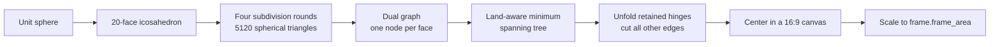

# Myriahedral geometric context

[Documentation index](../index.md) ·
[Implementation notes](myriahedral-implementation-notes.md) ·
[Bibliography](myriahedral-bibliography.md)

## One method, many maps

“Myriahedral” describes a family of polyhedral world maps made from a very
large number of faces. The name combines the idea of “myriad” faces with a
polyhedron. Unlike equirectangular projection, there is no single equation and
rectangle that uniquely identifies every Myriahedral map.

A configuration answers two separate questions:

1. How is the globe divided into small faces, and how is a point mapped within
   one face?
2. Which shared edges remain hinges, and which edges are cut so the surface
   can unfold?

Changing the cut tree can move an entire connected branch without changing
the local geometry inside any triangle. This implementation fixes both the
mesh and tree so every call has a deterministic answer.

## From globe to planar net



The spherical triangle mesh is the **primal graph**. A second, conceptual
**dual graph** puts a node at every triangle and connects nodes whose faces
share an edge. The fixed minimum spanning tree has all 5120 face nodes but
only 5119 connections. Tree connections are hinges; every omitted dual edge
corresponds to a cut in the primal mesh.

Because a tree has no cycles, opening its hinges cannot encounter a conflicting
closure constraint. The result can branch freely across the plane.

## The depth-5 icosahedral mesh

A regular icosahedron starts with 20 nearly equilateral spherical regions.
Each face is recursively divided into four by placing normalized points at
its edge midpoints:

```text
                 p1
                 /\
                /  \
               b----c
              / \  / \
             /   \/   \
            p0---a----p2
```

The four children are `(p0,b,a)`, `(b,p1,c)`, `(a,b,c)`, and `(a,c,p2)`.
Four rounds turn each original face into 256 small faces, for 5120 total.

The triangles are planar chords whose vertices lie on the unit sphere. The
projection maps each geographic point through the chord triangle associated
with its spherical region. A finer mesh reduces the visible effect of using a
piecewise affine transform.

## Why land influences cuts

If cuts were chosen without geographic information, they could split large
land masses into many disconnected pieces. The historical `myriaworld`
configuration estimates how much land occupies each face, smooths that signal
across neighbors, and weights the dual graph. Prim's algorithm then favors a
tree whose retained connections keep land together while allowing cuts to
travel mainly through ocean.

This is a preference, not a hard topological guarantee. Islands, narrow
isthmuses, the date line, and the finite Natural Earth source geometry all
affect the result. The 5120-face tree embedded here is the completed decision;
land geometry is not consulted during an ordinary point projection.

## Local coordinates within a face

Every spherical face and its unfolded planar copy have the same ordered three
vertices:

```text
Spherical chord face              Planar face

       p1                              q1
      /  \                            /  \
     / g  \       affine map         / q  \
    /______\          -->            /______\
   p0      p2                       q0      q2
```

The 3D point `g` is expressed using coefficients `alpha` and `beta` relative
to the chord directions `(p1-p0)` and `(p2-p0)`. The same coefficients place
`q` relative to `(q1-q0)` and `(q2-q0)`. This construction makes neighboring
faces agree exactly on a retained hinge. Along a cut, each face owns a
separate planar copy of the shared edge.

## Geographic quadrants

Latitude and longitude still describe the usual four geographic quadrants:

| Geographic quadrant | Latitude | Longitude | Example anchor |
| --- | ---: | ---: | --- |
| Northeast | positive | positive | Delhi or Tokyo |
| Northwest | positive | negative | New York or Los Angeles |
| Southeast | negative | positive | Durban or Sydney |
| Southwest | negative | negative | São Paulo |

Those quadrants are useful for checking input orientation, but they are **not
four rectangular regions of the output**. The cut tree, not signs of latitude
and longitude, decides which planar branch contains a point. Two nearby
coordinates on opposite sides of a cut can be far apart in `(x,y)`, while
points from different geographic quadrants may lie on adjacent branches.

The API test therefore exercises more than one point per quadrant. It includes
the center, near-poles, both sides of the antimeridian, southern-ocean seam
probes, and these city anchors:

```text
New York     Los Angeles   Paris       Durban
Delhi        Tokyo         Sydney      Moloka'i
São Paulo    Reykjavik     Suva        Villa Las Estrellas
```

Together these locations cover every sign combination, extreme latitudes,
the Pacific date-line neighborhood, and several narrow branches of the net.

## Cuts, hinges, and boundary choices

Consider two adjacent geographic faces:

```text
Retained hinge                    Cut edge

   /\  /\                         /\       /\
  /__\/__\       unfolds         /__\     /__\
  shared edge                    separate planar copies
```

Across a retained hinge, the projected coordinate is continuous. Across a cut,
the map is intentionally discontinuous. A point exactly on a cut belongs to
both spherical faces and therefore has two valid planar images. The C++ search
uses stable face order to choose one. This is analogous to selecting one side
of the antimeridian in a conventional cylindrical projection.

Longitude `-180` and `+180` are canonicalized to the same input before this
choice, so spelling the same geographic meridian two ways cannot change the
selected branch.

## Axes and screen coordinates

Unfolding happens in an ordinary mathematical plane:

```text
             +qy
              ^
              |
              +----> +qx
```

Rendering uses an upper-left origin:

```text
  (0,0) +----------> +x
        |
        |
        v
       +y
```

After unfolding, the implementation applies the fixed 335-degree rotation,
fits the whole net uniformly inside a normalized canvas, and reverses the
vertical coordinate. Scaling by the frame width and height produces the
public `(x,y)` result.

## The 16:9 canvas

The checked-in source raster is 4480 pixels wide by 2520 pixels high. Its
canvas ratio is exactly:

```text
4480 / 2520 = 16 / 9
```

The net is fitted with one scale factor and centered; unused space is retained
instead of stretching the geometry. Any other supported frame must preserve
that ratio—for example `1600 x 900`, `1920 x 1080`, or a
`frame::area {16*h/9, h}`.

This is the required ratio of this **raster-compatible configuration**, not a
law of all Myriahedral projections. Another cut tree can have different raw
bounds, and another rendering can choose a different crop.

## What is and is not preserved

The small-face construction aims to keep local distortion low and to move
interruptions away from important land connections. It should not be
described as an exact global equal-area or conformal transform:

- every face uses a finite affine approximation;
- cuts introduce intentional global discontinuities;
- distance between different branches has no direct geographic meaning;
- orientation changes abruptly only at cuts, but derivative behavior changes
  at every face boundary;
- using more, smaller faces generally reduces within-face distortion.

The method's visual strength is different: it turns the single long seam of a
conventional projection into a configurable branching set of mostly oceanic
cuts while preserving recognizable land groupings.
