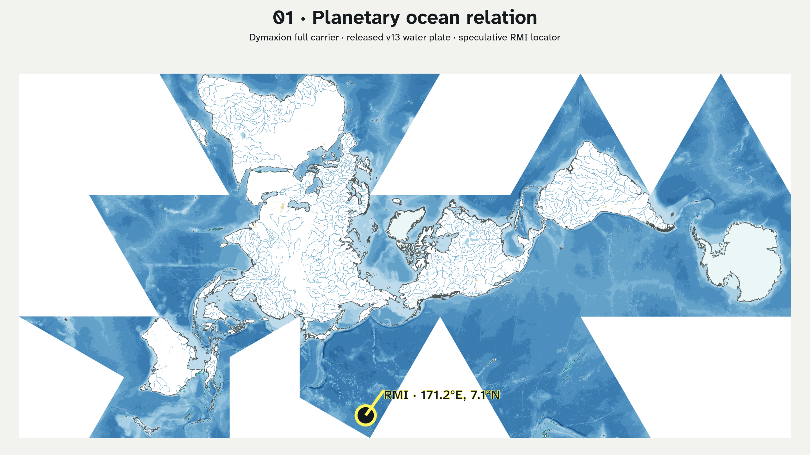
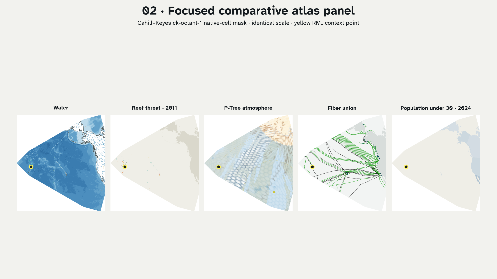
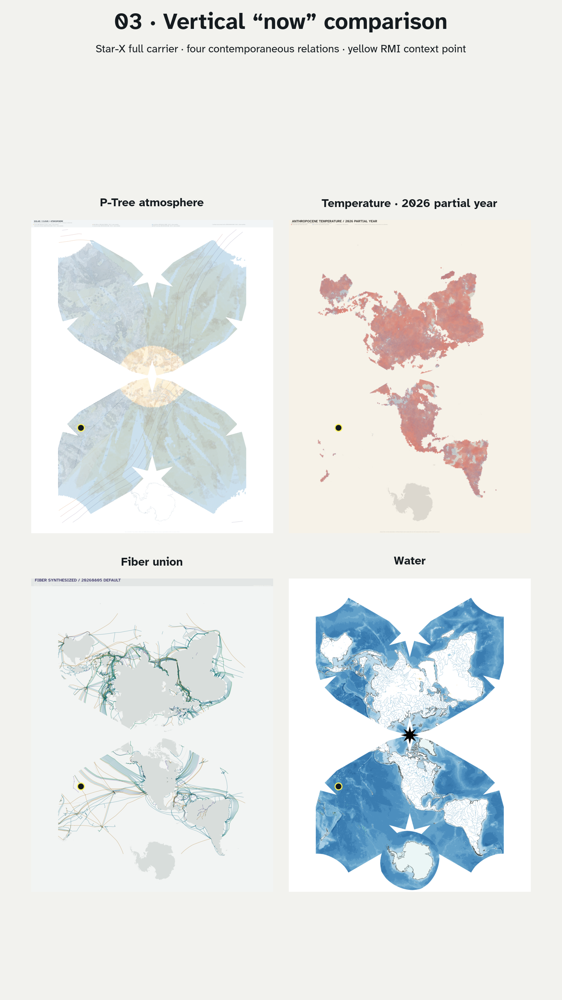
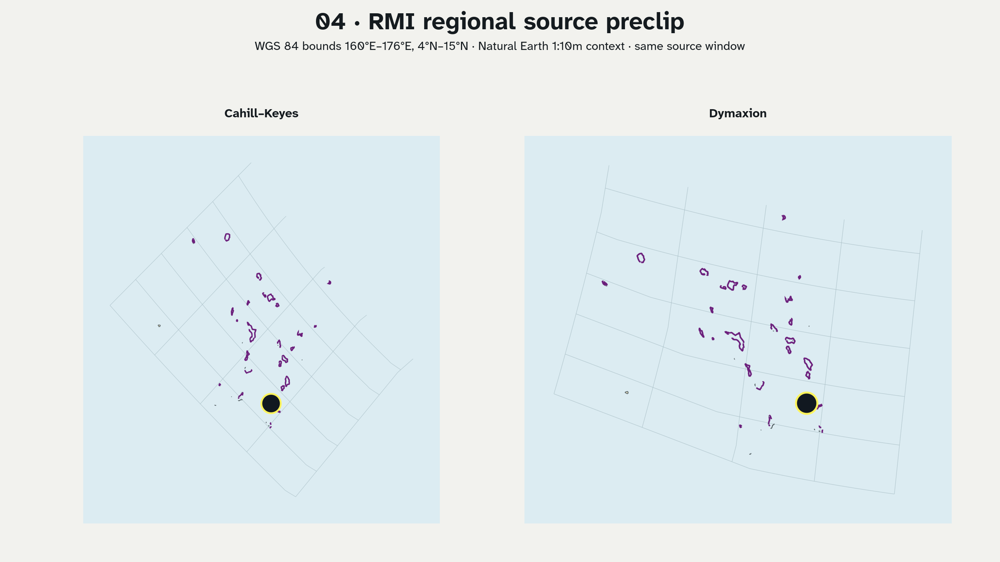
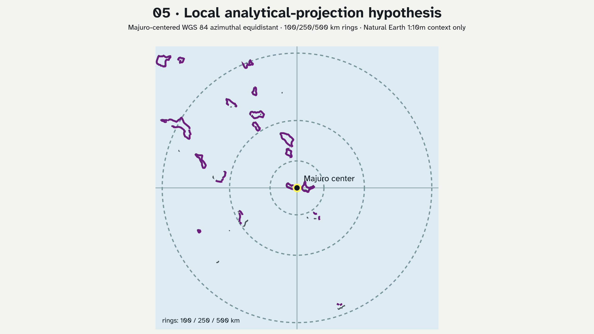

# Marshall Islands projection and slice speculations v01

[Development records](README.md) ·
[AI-agent and screen-consumer plan](../runtime/ai-agent-and-1080p-gaming.md)

Audit-outcomes source: local delivery file
`reports/cartofreako-audit-outcomes-01.pdf`, excluded from Git with other
generated report artifacts.

These five PNGs test the Marshall Islands sequence proposed in the audit. They
are exploratory comparison plates, not maps for navigation, inundation,
engineering, land tenure, present reef condition, or public policy. The
yellow point is a regional context locator, not an atoll footprint.

## One-to-five render plan and result

| Iteration | Implemented speculation | What it tests | Required next review |
| --- | --- | --- | --- |
| 1 | Full Dymaxion v13 water plate plus a runtime-projected RMI point | Whether a planetary ocean view makes RMI legible without turning it into a peripheral inset | Inspect the retained cut and locator at exhibition distance; add reviewed island names only with an appropriate source. |
| 2 | Exact CK `ck-octant-1` mask applied at one scale to water, 2011 reef threat, P-Tree atmosphere, fiber, and population-under-30 | Whether one focused native-cell panel can compare unlike evidence without changing projection scale | Review title/legend density, face ownership, source dates, and whether five subjects should remain separate rather than visually merged. |
| 3 | Four full Star-X portrait plates: atmosphere, 2026 partial-year temperature, fiber, and water | Whether the vertical “now” format supports a comparative exhibition sequence | Add a reading guide and safe title area; do not interpret the four dates/resolutions as one synchronized observation. |
| 4 | One geographic source window, `160°E–176°E, 4°N–15°N`, projected through CK and Dymaxion | Whether preprojection filtering plus a derived view removes empty global carrier area while preserving projection comparison | Add antimeridian-aware ordered multi-bounds, distortion diagnostics, and a full-carrier locator inset before promotion. |
| 5 | Majuro-centered WGS 84 azimuthal equidistant context with radial rings | Whether a source-governed local analytical tier can be linked back to the atlas | Replace Natural Earth context with authorized atoll-scale topobathymetry and verify CRS, horizontal/vertical datum, control points, units, uncertainty, permissions, and local review. |

### 01 · Planetary ocean relation



### 02 · Focused comparative atlas panel



### 03 · Vertical “now” comparison



### 04 · RMI regional source preclip



### 05 · Local analytical-projection hypothesis



## Reproduce headlessly

The renderer uses the checked forward API for locator placement and regional
preclipping, the checked CK slice writer for exact native-cell masks, GDAL/PROJ
for the local AEQD hypothesis, Inkscape for SVG rasterization, and ImageMagick
for labeled comparison plates. It writes intermediates under `/tmp`; the
delivery directory contains only the five PNGs.

```sh
make fetch-natural-earth-10m
make wasm-projections
make render-marshall-islands-speculations-v01
```

If local generated assets are absent, the renderer fetches the required PNGs
and `.svg.gz` objects from the immutable public v13 S3 prefix. It does not
authorize an external dataset, publish a release, upload to S3, or send a
message.

## AI-assisted atlas-explorer collaboration workflow

This experiment supplies evidence for describing Cartofreako as an
**AI-assisted atlas explorer** in a bounded sense:

1. an audit turns a research question into explicit projection and slice
   hypotheses;
2. a headless renderer binds those hypotheses to public code, immutable
   source artifacts, coordinates, and deterministic filenames;
3. the document records claim status, source periods, limitations, hashes,
   and the dyad relevance chain used to recover the reasoning context;
4. a collaborator can load the house-style skill, run the simplified prompt,
   reproduce or challenge a plate, and return a revision without needing this
   chat session; and
5. human and community review remains the promotion gate.

The intended collaborative possibility is that Eric Rodenbeck, Shannon
Jackson, or another invited reviewer can work from the public Cartofreako and
Izzi repositories plus the v13 S3 archive. Naming possible reviewers does not
claim participation, endorsement, a scheduled meeting, or authorization to
represent Marshallese communities.

## Portable simplified prompt

> Load the Devastation Pacific house-style skill. Clone the public
> `bdekoz/cartofreako` and `bdekoz/izzi` repositories. Read only the Marshall
> Islands sections of `reports/cartofreako-audit-outcomes-01.pdf`, this
> experiment document, and the creation records for the seven marker IDs in
> `dyad_context_chain`. Treat markers as relevance and attribution metadata,
> never as transcript, consent, or legal findings. Verify the five numbered
> PNGs against their source projection, slice kind, hash, and limitation.
> Reproduce the renderer from public v13 S3 artifacts and Natural Earth, then
> propose or render one clearly labeled revision for collaborative review.
> Preserve the authoritative projection-ratio, 44-inch-leading-edge and A0
> print products. Keep every Marshall Islands view speculative until invited
> local review and source-governed atoll evidence exist. Do not infer a private
> project, endorsement, patentability, or permission to publish.

## Intellectual-property boundary

The user's view that this may be patentable workflow work product is recorded
as an observed hypothesis. This experiment does not evaluate patentability,
inventorship, ownership, prior art, or the effect of public disclosure. It
also does not authorize publication. Those questions should be reviewed by
qualified patent counsel before a publication or filing decision.
