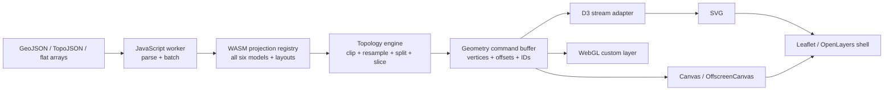

# Converged generation status and web projection architecture

**Status date:** 2026-08-06  
**Reviewed source:** [generation request ledger](generation-request-ledger.md)
**Related decision record:** [`docs/generation-methods.md`](../getting-started/generation-methods.md)

> **Snapshot scope:** this review describes the current working tree on the
> status date, including work not necessarily committed to Git. Stage 10 was
> implemented after the initial audit on the same date; this report now links
> to that implementation record. The historical Stage 1–9 evaluation below is
> otherwise retained.

## Executive assessment

`converge-generation.md` is a raw chronological request ledger, not a
completion document. The repository has nevertheless implemented nearly all
of its earlier requests and has a much more coherent generation architecture
than the ledger suggests.

The concise verdict is:

- the ten original stage requests through Stage 9 have concrete
  implementations, documentation, build integration, and tests, although the
  old Stage 6 resource interpretation is now intentionally historical and
  superseded by Stage 6b;
- Stage 7 implements projection/pass selection, but not literal selection of
  semantic layers inside an SVG;
- Stage 8b is partially complete: the global temperature field and global
  FIRMS release gate are implemented, while CAMS, PurpleAir, and ocean themes
  remain planned;
- Stage 6b now has one checked, non-sparse current-source default in each of
  its five resource families; and
- Stage 4.3 remains complete as originally requested, and the follow-on
  all-projection, topology-aware WebAssembly convergence is now implemented as
  Stage 10 ABI 1.

The ledger should therefore not yet be marked simply “complete.” It is more
accurate to call it **implemented through the first convergence pass, with
the remaining Stage 8b themes and Stage 7 layer wording open**. The browser work originally
proposed below became Stage 10 rather than a retroactive expansion of the original
Stage 4.3 request. See the
[`Stage 10 implementation notes`](../runtime/webassembly-architecture.md).

## How completion was evaluated

A stage counts as implemented here only when the current tree contains most of
the following:

1. an executable or reusable implementation;
2. a pinned profile or explicit input contract where external data are used;
3. Make targets;
4. executable checks;
5. durable implementation notes; and
6. generated output or a fixture-backed integration path.

An evaluation or enrichment plan alone counts as **planned**, even when the
plan is detailed and source research is complete. “Complete” also means
complete against the bounded contract actually documented by the repository;
it does not imply scientific completeness or live data.

## Stage-by-stage completion

| Ledger stage | Status on 2026-08-06 | Evidence and remaining boundary |
| --- | --- | --- |
| 4.1 astronomy | **Complete** | [`generate-astro.cc`](../../../src.generate/generate-astro.cc), checked profiles and snapshots, all-sky and observer products, all six projections, and [`astro-implementation-notes.md`](../passes/astronomy.md). It remains visualization-grade rather than an observatory ephemeris. |
| 4.1a cloud/atmosphere | **Complete, bounded** | [`generate-cloud-atmosphere.cc`](../../../src.generate/generate-cloud-atmosphere.cc), preparation, JAXA/P-Tree source contracts, H3 fixture, all six projections, shared solar geometry, and [`cloud-atmosphere-implementation-notes.md`](../passes/cloud-atmosphere.md). It is not a seamless forecast or global physical-cloud composite. |
| 4.2 orbiting | **Complete** | [`generate-orbiting.cc`](../../../src.generate/generate-orbiting.cc), OMM acquisition, SGP4 propagation, global and observer products, and [`orbital-technosphere-implementation-notes.md`](../passes/orbital-technosphere.md). It is a reproducible snapshot, not conjunction-grade orbit determination. |
| 4.3 browser Myriahedral | **Complete against the request** | [`cahill-myriahedral.cc`](../../../src.wasm/cahill-myriahedral.cc) still emits exactly ocean and land as a compatibility adapter. The separate Stage 10 runtime now generalizes geometry and slices to all six projections. |
| 4.4 network | **Complete under the later name `network-swarm`** | [`generate-network-swarm.cc`](../../../src.generate/generate-network-swarm.cc), variable pinned input, H3/Izzi detiling, all projections, and [`network-swarm-implementation-notes.md`](../passes/network-swarm.md). No unsupported graph edges are inferred. |
| 4.5 bathymetry roulette | **Complete** | [`generate-bathymetry-roulette.cc`](../../../src.generate/generate-bathymetry-roulette.cc), a checked depth/roulette catalogue, projection-safe clips, all projections, artifact targets, and [`bathymetry-roulette-implementation-notes.md`](../passes/bathymetry/roulette.md). Large explicit SVGs and moiré are accepted properties of the artwork. |
| 6 original World Game resources | **Complete historically; superseded** | The bounded 1960 interpretation remains historical documentation and is not a current-resource fallback. Stage 6b's five current-source families now own the production `resources` selectors and artifacts. |
| 7 configurable generation | **Complete infrastructure, with one scope mismatch** | `generation-profile.json`, the resolver, Make expansion, validation, and documentation select a projection/pass cross-product. They do **not** select semantic groups such as `land`, `labels`, or an individual data metric inside a generated product. That narrower interpretation is documented, but the raw request used the word “layers.” |
| 8 Anthropocene | **Complete first observation atlas** | The historical `generate-anthropocene.cc` implementation, now continued by [`generate-anthropocene-particulate.cc`](../../../src.generate/generate-anthropocene-particulate.cc), established a year/profile contract, source-separated metrics, preparation and validation, all projections, and [`anthropocene-implementation-notes.md`](../passes/anthropocene/implementation.md). Its station and regional-source coverage is deliberately sparse and North-America-heavy. |
| 9 network infrastructure | **Complete** | Rename compatibility, cloud/CDN atlas, opt-in licensed topology, source pinning, seam-safe routes, all projections, tests, and [`network-infrastructure-implementation-notes.md`](../passes/network-infrastructure.md). The current snapshots are not live network state. |
| 8b Anthropocene enrichment | **Partial** | Complete-2025 and partial-2026 global CPC temperature fields, explicit zero/missing semantics, balanced regional audits, year-bearing artifacts, and a hard global-FIRMS gate are implemented. A checked global FIRMS snapshot still needs a map key; CAMS fire/air, optional PurpleAir, OISST marine heat, and Coral Reef Watch heat stress remain planned in [`anthropocene-enrichment-plan.md`](../passes/anthropocene/enrichment-plan.md). |
| 6b resource families | **Complete first release** | [`resources-implementation-notes.md`](../passes/resources/implementation.md) records five independently generated families, a v2 profile/value schema, current IRENA/FAO-WDI/USGS/World Bank-UN inputs, one checked non-sparse default per family, all-six-projection targets, and tests. Additional catalog metrics remain future increments, not release blockers. |
| 10 projection-neutral browser renderer | **Complete for ABI 1** | One registry and command-buffer API covers all six projections, polygons/holes, SVG/Canvas/D3, workers, four slice kinds, compatibility base maps, license metadata, Node tests, and a real-browser smoke. See [`stage-10-webassembly.md`](../runtime/webassembly-architecture.md). |

## What is still missing from the convergence record

### 1. The ledger has no reconciliation layer

The raw ledger contains requests, confirmation language, changed names,
superseding stages, and exploratory taxonomy fragments in one sequence. It
does not state which requests were accepted, implemented, superseded, or
rejected. [`generation-methods.md`](../getting-started/generation-methods.md) supplies most of
that information for generate passes, but explicitly excludes WebAssembly and
browser architecture.

This dated report fills that gap without rewriting the historical ledger. A
small link near the top of `converge-generation.md` to this report would make
the relationship unambiguous.

### 2. Stage 6b has crossed from research to production

The five-family design now has one current, checked, non-sparse vertical
product per family: installed solar capacity, food production index, forest
area, rare-earth mine production, and population under 30. The v2 profile,
normalized values, coverage gates, generation targets, and tests are
implemented. The next work is selective catalog expansion, not proving the
family architecture. The older 1960 interpretation remains historical and is
not used to fill missing modern values.

### 3. Stage 8b has a field architecture but not yet a complete bundle

The CPC temperature products prove the global non-sparse field model. The
remaining highest-value increments are:

1. acquire and promote one globally audited FIRMS VIIRS snapshot;
2. implement a separate CAMS analysis-field product for PM2.5 and modeled
   organic-aerosol/smoke context;
3. implement OISST marine-heatwave days as the first global ocean field;
4. add Coral Reef Watch heat stress only after the production reef-mask rights
   are resolved; and
5. retain PurpleAir as a permission-gated, separately labelled community
   sensor product.

These should remain separate themes. Combining observations, analysis fields,
and community sensors into one score would erase the evidence distinctions the
Stage 8b schema now correctly preserves.

### 4. Stage 7 does not provide semantic layer selection

The current generation profile decides which generator runs. It cannot ask the
Anthropocene generator for only `temperature-record-highs`, or the base-map
renderer for only `ocean` and `land`. There are two honest choices:

- amend the Stage 7 interpretation and state that “layers” meant generation
  passes; or
- add a versioned per-pass `options` object whose schema is owned and validated
  by each generator.

A universal list of layer names would be brittle because each pass has a
different semantic contract. The better extension is namespaced configuration,
for example:

```json
{
  "schema_version": 2,
  "projections": ["cahill-keyes", "voronoi"],
  "passes": {
    "water": {"layers": ["ocean", "lakes", "rivers"]},
    "anthropocene-temperature": {
      "years": [2025, 2026],
      "layers": ["coverage", "record-highs", "record-lows"]
    }
  }
}
```

The default must remain each pass's complete validated layer contract. A
partial layer selection should never weaken data/provenance validation.

### 5. Before Stage 10, the browser pipeline was duplicated and too high-level

The two Stage 4.3 compatibility adapters both expose:

- a projection-specific JavaScript class;
- `project(latitude, longitude)`;
- `width()` and `height()`; and
- `generateBaseMapSvg(landGeoJson)`.

They then independently parse JavaScript GeoJSON through `emscripten::val`,
handle cuts, serialize XML, choose styling, and hard-code layer vocabulary.
This worked for Stage 4.3, but it does not scale to six projections, arbitrary
data layers, Canvas/WebGL output, or slices.

The abstraction Stage 10 supplied is not merely a common point projection. It is a
**projection plus spherical-geometry/topology pipeline**.

## Context: existing browser cartography

Cartofreako's maps are unusual in browser-cartography terms: they are finite,
print-oriented, frequently interrupted polyhedral nets rather than a wrapping
Web Mercator plane. Existing libraries are still useful, but in different
roles.

| System | Native model | Relevance to Cartofreako | Important limitation |
| --- | --- | --- | --- |
| [D3 `d3-geo`](https://d3js.org/d3-geo) | Spherical GeoJSON transformed through a projection stream into SVG or Canvas | **Closest conceptual match.** D3 formalizes rotation, spherical pre-clipping, adaptive resampling, forward projection, planar post-clipping, and rendering as separate stages. [`geoPath`](https://d3js.org/d3-geo/path) accepts any object with `projection.stream`, so a Cartofreako WASM adapter can participate without replacing D3. | A point callback or `geoTransform` alone is insufficient for interrupted nets; Cartofreako must supply seam-aware line/ring events. D3 and RFC 7946 also use different ring-winding assumptions, which must be normalized explicitly. |
| [`d3-geo-polygon`](https://github.com/d3/d3-geo-polygon) | Polyhedral/interrupted projections plus spherical polygon clipping | Excellent algorithmic and differential-test reference. It includes Cahill-Keyes, Airocean, polyhedral Voronoi, and arbitrary polygon clipping, and exposes the face tree for polyhedral layouts. | Its projections are not automatically identical to this repository's registrations, frame conventions, trees, AuthaGraph implementation, or licensing boundaries. It should be a reference/oracle, not a silent replacement. |
| [Leaflet](https://leafletjs.com/reference) | A single zoomable rectangular CRS with markers, overlays, and a tile grid | Good lightweight **interaction shell**. Use [`CRS.Simple`](https://leafletjs.com/examples/crs-simple/crs-simple.html) with a finite projected carrier and an [`SVGOverlay`](https://leafletjs.com/examples/overlays/) or Canvas layer; project data through WASM before giving it to Leaflet. Disable world wrapping. | A normal custom geographic CRS expects a usable inverse and continuous rectangular coordinates. Interrupted nets have duplicated/cut boundaries and no globally unique inverse, so Leaflet should not own the projection. |
| [OpenLayers](https://openlayers.org/) | GIS-oriented views, registered coordinate transforms, vector/raster layers, and browser reprojection | Stronger than Leaflet when custom projected extents, layer clipping, hit testing, raster reprojection, or worker rendering matter. It supports explicit [custom transforms](https://openlayers.org/en/latest/examples/wms-custom-proj.html) and triangulated [raster reprojection](https://openlayers.org/doc/tutorials/raster-reprojection.html). | Standard map interactions still work best with a forward and inverse CRS. A Cartofreako carrier can be registered as a finite planar view, but native interrupted semantics must stay in the WASM geometry layer. |
| [MapLibre GL JS](https://maplibre.org/maplibre-gl-js/docs) | GPU vector-tile renderer centered on Mercator plus globe/vertical-perspective modes | Attractive for large WebGL feature sets and custom layers. Its plugin list even includes PROJ-in-WASM work, demonstrating ecosystem interest in browser-native projection code. | General non-Mercator views remain [under consideration](https://maplibre.org/roadmap/maplibre-gl-js/non-mercator-projection/). Its style/tile pipeline is not presently a natural host for a disconnected Cahill-Keyes, Dymaxion, or Myriahedral carrier. A custom WebGL layer is feasible, but then Cartofreako owns projection, clipping, picking, and tiles. |
| [PROJ / proj-wasm](https://proj.org/en/stable/development/bindings.html) | General CRS and datum transformations | Useful before Cartofreako projection, for normalizing non-WGS84 source coordinates in a browser. It is also evidence that a projection core can be delivered as WASM. | It does not replace Cartofreako's custom net registrations, topology, layer grammar, or slice semantics. |

The practical conclusion is to use D3's stream contract as the interface
inspiration, Leaflet or OpenLayers as optional interaction shells, and direct
Canvas/WebGL rendering for high-volume paths. MapLibre integration should be
treated as a custom-layer experiment, not the core architecture.

## Should the WebAssembly pipeline be generalized?

**Yes—but the public abstraction should be a runtime projection registry, not
one C++ template instantiation or one hand-written adapter per projection.**

Templates or the existing `std::variant` are useful implementation tools. They
should remain behind a stable runtime API so JavaScript can select a projection
by identifier and inspect its capabilities. The existing
[`projection_spec` and `projection_variant`](../../../src.generate/projection-generation-common.h)
already prove this factory model natively.

### Recommended separation



The reusable core should move out of `src.generate/` and be split into
browser-safe pieces:

1. **Projection registry** — identifiers, frames, variants, layouts, version,
   license/provenance metadata, and construction.
2. **Topology contract** — native-cell classification, adjacency, retained
   hinges, cut edges, exact planar face polygons, and boundary tie rules.
3. **Geometry transformer** — points, seam-safe polylines, face-clipped rings,
   adaptive sampling, post-clipping, and slice filtering.
4. **Output adapters** — native Izzi SVG, browser SVG path data, D3 stream,
   Canvas commands, or WebGL buffers.
5. **Style/layer policy** — kept outside the projection core. A convenience
   base-map renderer may remain, but colors and SVG group names must not define
   the geometry API.

### Projection descriptor

Each model should publish a descriptor similar to:

```text
id                       cahill-keyes | authagraph | dymaxion |
                         myriahedral | star-x | voronoi
version                  projection/topology ABI version
native_frame_ratio       required width:height
layouts                  reference plus supported alternate layouts
native_cell_count        8 | 24 | 23 | 5120 | 8 | 20
topology_kind             continuous | periodic | folded | polyhedral
inverse_mode              none | unique | face-qualified | candidates
capabilities              points, lines, polygons, sphere, slices, tiles
license                   machine-readable implementation/data notices
```

This also fixes a weakness of the current abstract `projection_api`: it exposes
only image naming and forward point projection. It does not expose frame,
topology, clipping, inverse behavior, layouts, or capabilities—precisely the
information a browser renderer needs.

### Browser-facing API

A useful first API is handle-based and batched:

```js
const engine = await createCartofreakoModule();
const projection = engine.createProjection({
  id: "dymaxion",
  width: 2200,
  height: 1039.2305,
  layout: "reference"
});

const points = projection.projectPoints(lonLatFloat64Array);
const paths = projection.projectGeometry(geometryBuffer, {
  tolerancePx: 0.35,
  slice: null,
  clipExtent: null
});
const slices = projection.listSlices();
projection.delete();
```

`projectGeometry` should return typed arrays and offsets rather than a giant
styled SVG string:

- projected coordinates;
- subpath/ring/feature offsets;
- close-path flags;
- native cell and connected-component identifiers;
- retained feature IDs and properties indices; and
- cut, fallback, or clipping diagnostics.

The JavaScript D3 adapter can expose a synchronous-looking `stream(sink)`
object, buffer one geometry's events, invoke WASM once, and replay projected
commands to the sink. Calling across the JavaScript/WASM boundary once per
input vertex would defeat much of the benefit.

Likewise, passing a nested `emscripten::val` GeoJSON object through C++ one
coordinate at a time should be retired for high-volume paths. Parse JSON in
JavaScript, flatten it, and use a small C ABI or carefully bounded Embind
wrapper. Emscripten's [typed memory views](https://emscripten.org/docs/porting/connecting_cpp_and_javascript/embind.html#memory-views)
can avoid copies, but their lifetimes are unmanaged; with
`ALLOW_MEMORY_GROWTH`, a growing heap can invalidate old views. A worker-owned
copy/transfer protocol is safer for the first implementation.

### One module or six?

Build both forms from the same registry:

- an **all-projection module** for the interactive application and tests; and
- optional **projection-subset modules** for small embeds, licensing
  boundaries, and cache efficiency.

C++/WASM link-time dead-code elimination cannot remove projections selected
only at runtime from an all-model registry, so build-time inclusion macros are
reasonable. The source and JavaScript API should still be shared. This is
especially useful because the Cahill-Keyes implementation has distinct
attribution/usage terms that should remain visible rather than disappearing
inside an opaque omnibus binary.

Keep Emscripten's current ES-module/modularized output: it avoids global module
state and supports isolated instances. The official
[modularized-output guidance](https://emscripten.org/docs/compiling/Modularized-Output.html)
supports this direction. Serve `.wasm` with `application/wasm` so browsers can
use efficient [streaming instantiation](https://developer.mozilla.org/en-US/docs/WebAssembly/Reference/JavaScript_interface/instantiateStreaming_static).

### Worker model

Projection, clipping, large GeoJSON parsing, and SVG serialization should not
occupy the browser main thread. Start with an ordinary JavaScript Web Worker
hosting one WASM instance and transfer flat input/output buffers. Do not begin
with WASM threads: they add cross-origin-isolation and shared-memory complexity
before measurements show a need. Emscripten's
[Wasm Workers documentation](https://emscripten.org/docs/api_reference/wasm_workers.html)
is useful if later profiling demonstrates that one worker is insufficient.

## How generalized slicing should work

### First separate four different operations

The word “slice” currently covers geometrically different products:

| Operation | Coordinate stage | Meaning |
| --- | --- | --- |
| Carrier viewport | After projection | Show a rectangle of an already projected full carrier. Existing four-strip Cahill-Keyes output is this. |
| Native-face mask | During/after topology-aware projection | Retain selected octants, sectors, or faces and clip exactly to them. Existing eight-octant Cahill-Keyes and two-group Myriahedral output use this model. |
| Geographic subset | Before projection | Clip or filter by a WGS84 region, then run the normal projection pipeline. A requested latitude band belongs here, not in a `viewBox`. |
| Planar tile/LOD chunk | After seam-safe projection | Divide a finite carrier into rectangles for pan/zoom delivery. This is a publishing optimization, not a different projection. |

These must not share one ambiguous `slice(width, height)` call.

### Core invariant: carrier first

Every projection is created with a valid complete carrier satisfying its
native frame contract. If its carrier is `W × H` and a slice viewport is
`(x0, y0, w, h)`, the local slice transform is only:

```text
x_slice = x_carrier - x0
y_slice = y_carrier - y0
```

The slice's arbitrary `w:h` ratio is never passed back to the forward
projection factory. This is the correct invariant already documented for the
Cahill-Keyes and Myriahedral generators.

### Generic slice descriptor

```json
{
  "id": "dymaxion-pacific-group",
  "projection": "dymaxion",
  "layout": "reference",
  "kind": "native-cell-mask",
  "selected_cells": [4, 5, 6, 18, 19],
  "components": 2,
  "source_view": [7.25, 2.1, 18.4, 13.7],
  "padding": 0.25,
  "clip_geometry": "exact-native-faces",
  "output_frame": [18.9, 14.2]
}
```

For a viewport slice, `selected_cells` is absent. For a geographic slice, the
descriptor instead references a WGS84 polygon. A self-contained browser export
should carry projected clip paths or already-clipped command buffers rather
than the external SVG `<use>` dependency used by today's lightweight print
wrappers.

### Native-cell slicing by projection

| Projection | Existing topology | Natural slice units and caveats |
| --- | ---: | --- |
| Cahill-Keyes | 8 registered octants | Preserve the existing four rectangular strips and eight exact-octant masks. Outer-frame folds must be resolved before filtering. |
| Star-X | 8 logical octants in two groups | Reuse logical Cahill-Keyes octant IDs, but compute bounds and masks in the Star-X carrier. Its paired fold edges cannot reuse the Cahill-Keyes rectangle router. |
| AuthaGraph | 24 tetrahedral sectors with a periodic rectangle | Sector groups and rectangular windows are possible. The descriptor must choose the canonical periodic copy; an edge on the repeated seam can have more than one inverse candidate. |
| Dymaxion | 23 drawable faces/subfaces | Select nodes in the fixed Airocean face adjacency graph. Preserve the Australia/Japan subface registration, and allow disconnected output components. |
| Myriahedral | 5,120 terminal faces and a retained hinge tree | Generalize the existing hinge-cut grouping. Alternate “perspectives” are different layouts, not slices; a slice always names its layout. |
| Voronoi | 20 unfolded icosahedral faces | Select face-tree nodes or connected geographic groups and clip with the exact face-local gnomonic triangles. |

A future continuous projection simply reports one topology cell. It still
supports geographic subsets, viewports, and planar tiles, while face slicing
is either unavailable or trivial.

### Geometry algorithm for a face slice

1. Validate the complete carrier and named layout.
2. Normalize rings and line strings into a spherical geometry stream.
3. Adaptively sample source edges in projected error units, using great-circle
   interpolation for spherical edges and retaining any explicitly declared
   alternate edge semantics.
4. Classify both sides of every native-cell transition and bisect the first
   transition until its limiting points are known.
5. Split a path only when those one-sided limits are disconnected in the
   assembled net.
6. Clip filled pieces through each selected face's exact local planar polygon;
   preserve exterior rings and holes.
7. Drop pieces whose native cell is not selected.
8. Compute the tight carrier-space bounds of retained masks and geometry, add
   declared padding, and translate into the output frame.
9. Emit component IDs and boundary diagnostics so renderers do not reconnect
   disconnected pieces.

Points use the same native-cell tie rules. A boundary point should retain its
chosen canonical cell in the output instead of being classified again in
JavaScript.

### Adaptive sampling is the best geometric follow-on

The native generators currently combine fixed angular densification with
cell-transition bisection. This is robust at the intended print scale, but it
does not directly constrain visible error. D3's
[projection pipeline](https://d3js.org/d3-geo/projection) adaptively resamples
curved projected geodesics, which is the right next model.

For each spherical segment (great-circle by default, with source-declared
linear or rhumb semantics kept distinct where needed):

1. compute its great-circle midpoint;
2. project endpoints and midpoint in the current topology cell;
3. measure the midpoint's screen-space distance from the projected chord;
4. subdivide until the error is below a pixel tolerance or a maximum depth is
   reached; and
5. locate cell transitions before applying the curvature test across a cut.

This produces resolution-dependent browser geometry without using a globally
tiny degree step. Fixed-step behavior can remain as a deterministic print
profile and regression reference.

### Tiling and pan/zoom

Do not use geographic XYZ/Web-Mercator tiles as if their straight tile edges
remain straight after an interrupted projection. Instead:

1. create seam-safe projected geometry on the complete finite carrier;
2. normalize the carrier to a planar extent;
3. build a non-wrapping planar quadtree or pad the carrier to a transparent
   square when an XYZ-shaped cache is required;
4. clip already projected subpaths against tile rectangles with a small
   overscan; and
5. retain feature IDs in every tile for picking and de-duplication.

This makes Leaflet `CRS.Simple`, OpenLayers finite extents, D3 zoom, or a custom
WebGL camera straightforward. Empty areas between net faces remain empty
tiles; they are not wrapped to another longitude.

## Inverse projection and interaction

The current public projection API has no inverse. That is acceptable for
generation but limits browser interaction, coordinate readout, and conventional
custom-CRS integration.

An interrupted inverse should be explicitly face-qualified:

```text
inverse(x, y) -> zero, one, or several {latitude, longitude, native_cell}
```

The planar point first selects every containing native face; each face applies
its local inverse; the result is checked by forward projection. Shared or
periodic edges may legitimately return multiple candidates. APIs should not
pretend there is one global inverse where the layout duplicates a boundary.

Inverse projection is not required for initial feature interaction. A browser
can build a planar R-tree over projected features and return original feature
metadata on hover/click. That is the lower-risk first milestone.

**Post-audit implementation, 2026-08-09:** runtime API 2 now implements this
face-qualified contract analytically for all six Myriahedral layouts and for
Voronoi, including structured ambiguity/cut/outside/unsupported states,
native-cell qualification, batch typed arrays, workers, and conservative D3
integration. Geometry command buffers remain ABI 1.

**Cahill–Keyes extension, 2026-08-10:** the same API now implements an
octant-qualified Cahill–Keyes reverse by undoing the M-layout assembly and
running a bounded, zone-aware solve against the authoritative piecewise
forward construction. At that checkpoint AuthaGraph, Dymaxion, and Star-X
still advertised `unsupported` rather than a false global inverse. Runtime API
3 completed their family-specific reverses on 2026-08-10. See the
[forward/reverse projection API](../runtime/projection-api.md).

## Promising leads worth exploring

### High priority: finish the open data stages

- Expand Stage 6b only with metrics that satisfy its existing source,
  semantics, and non-sparse release gates; keep each metric as a separate
  artifact rather than a combined resource score.
- Acquire a credentialed global FIRMS snapshot and complete the fire/air
  product before adding another regional fire source.
- Implement OISST before reef heat stress; it gives defensible global ocean
  coverage without waiting for a reef-mask redistribution decision.

### High priority: make topology reusable

- Promote native-cell classification, face adjacency, exact face polygons,
  and seam routing from generator helpers into a renderer-independent core.
- Use `d3-geo-polygon` for differential seam/face fixtures, while retaining
  this repository's native registration as authority.
- Replace fixed browser densification with pixel-error adaptive sampling.
- Define a compact geometry command buffer that is identical for native tests,
  WASM, SVG, Canvas, and WebGL.

### Medium priority: temporal browser products

Several passes naturally form time series: orbital technosphere, cloud and
atmosphere, network snapshots, and the 2025/2026 Anthropocene products. A
projection-neutral geometry buffer plus stable feature IDs would allow one
browser viewer to animate or compare dates without embedding temporal behavior
in each generator.

The first comparison mode should be two synchronized carriers or a labelled
swipe, not interpolation between unlike annual totals. Partial-year products
need matched-date windows or rate normalization.

### Medium priority: source and output compactness

- Evaluate TopoJSON for shared base-map arcs and stable feature IDs; D3 notes
  that topology-aware encoding is substantially more compact than repeated
  GeoJSON coordinates.
- Keep source rasters outside WASM and browser-cacheable, as the current web
  workflow already does.
- Benchmark SVG, Canvas, and WebGL using the same command buffer. SVG remains
  best for inspectable layers and print; Canvas/WebGL should win for dense,
  frequently changing marks.

### Lower priority: framework adapters

- D3 adapter first, because its stream model matches the needed geometry
  semantics.
- Leaflet `CRS.Simple` example second, because it cheaply supplies pan, zoom,
  overlays, and controls for a finite carrier.
- OpenLayers adapter if GIS layer composition, raster reprojection, or richer
  picking is required.
- MapLibre custom-layer proof only after the command-buffer/WebGL renderer is
  stable; do not couple the core to MapLibre's current projection lifecycle.

## Stage 10 implementation record

This became **Stage 10: projection-neutral browser renderer**, not a
retroactive expansion of Stage 4.3. ABI 1 is implemented and documented in
[`stage-10-webassembly.md`](../runtime/webassembly-architecture.md); the sequence below is
retained to show what shipped and what remains optional.

### Milestone 1 — extract and describe

- **Complete:** browser-safe registry for all six models and five alternate
  Myriahedral layouts.
- **Complete:** shared frame validation, native-cell topology, and seam router.
- **Complete:** JavaScript capability and license manifests.
- **Complete:** both existing adapters remain compatibility builds.

### Milestone 2 — batched geometry

- **Complete:** flat point/line/ring input and ABI 1 typed command buffers.
- **Complete:** batched points and seam-safe lines for all six projections.
- **Complete:** native shared-core and WASM cut/frame/geometry checks.
- **Complete:** ordinary ES-module worker with transferable output buffers.

### Milestone 3 — filled geometry and D3

- **Complete:** browser-safe exact triangle-face clipping without GDAL/GEOS.
- **Complete:** holes, multipolygons, feature IDs, cell IDs, and diagnostics.
- **Complete:** D3-compatible stream, SVG, and Canvas adapters.
- **Deferred:** an automated differential suite against `d3-geo-polygon` is a
  useful non-authority follow-on; existing native reference fixtures remain
  authoritative.

### Milestone 4 — slices and finite-map interaction

- **Complete:** viewport, geographic, native-cell, and planar-tile descriptors.
- **Complete:** existing Cahill-Keyes and Myriahedral slices use the common
  protocol and have runnable examples.
- **Documented integration:** Leaflet `CRS.Simple` and OpenLayers should host
  the finite carrier; no framework dependency was added to the core.
- **Deferred:** planar feature hit testing and face-qualified inverse
  candidates remain demand-driven follow-ons.

### Milestone 5 — performance and optional WebGL

- **Complete:** Canvas/OffscreenCanvas consumes the shared buffer.
- **Complete foundation:** explicit planar-tile slices are available.
- **Deferred pending measurement:** device performance budgets, WebGL
  triangulation/rendering, and multi-level LOD publishing.

## Acceptance criteria for the generalized browser pipeline

ABI 1 satisfies the acceptance list: one API constructs all six models and
rejects invalid frames; native and WASM use the same projection/topology core;
line and filled-ring fixtures reject page-spanning chords; holes,
multipolygons, feature IDs, and diagnostics survive all models; the common API
reproduces Cahill-Keyes and Myriahedral ocean/land maps and their slices; SVG
and Canvas consume the same buffer; a real Chrome worker projects the Natural
Earth fixture; license metadata is inspectable; and both Node and browser
checks have Make targets. The exact evidence matrix is in
[`stage-10-webassembly.md#verification`](../runtime/webassembly-architecture.md#verification).

## Final recommendation

Keep `converge-generation.md` as the historical request ledger and use dated
status reports such as this one for reconciliation. Do not declare the whole
ledger closed until the intended Stage 8b minimum bundle is explicitly
accepted or completed, and Stage 7's
“layer” wording is resolved.

The all-projection WebAssembly convergence recommendation has been carried
out. The runtime uses the existing `projection_variant` model behind a stable
registry, and topology/geometry now live in renderer-neutral projection
headers. D3 is the first stream integration; Leaflet/OpenLayers remain
finite-carrier shells; MapLibre remains an optional custom WebGL consumer.

Most importantly, make slicing a first-class topology/view protocol. A slice
is a viewport, a native-cell mask, a geographic preclip, or a planar delivery
tile—not a projection with an invalid replacement frame.

The next documentation-level convergence is proposed as
[`Stage 11`](../../development/documentation-layout.md): migrate the flat documentation
into nested topic pages only after adding link and redirect safety nets.
