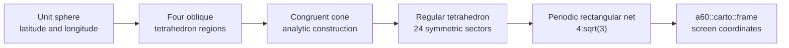
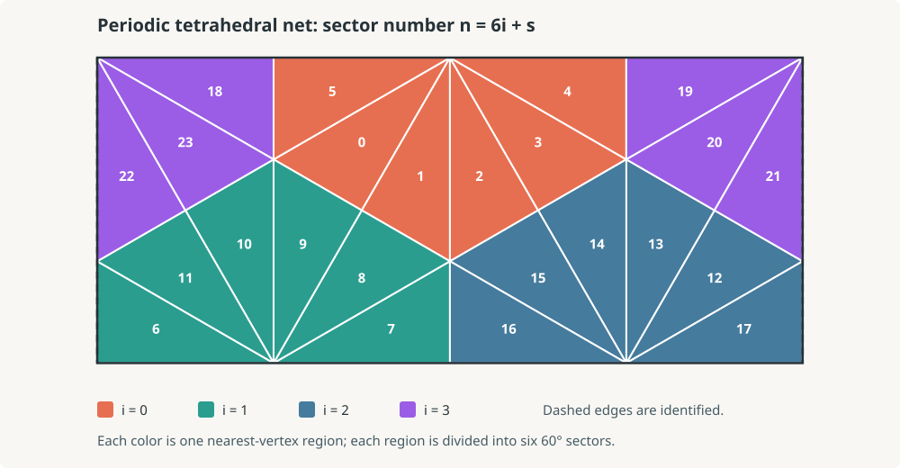
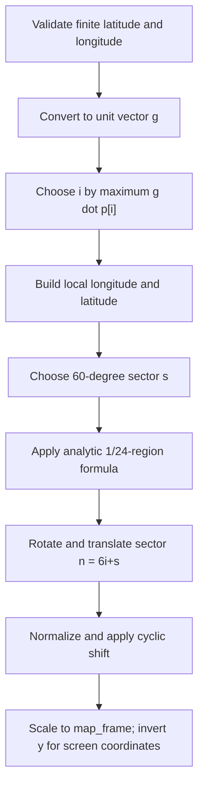

# AuthaGraph geometric context

[Documentation index](../../../../index.md) ·
[Implementation notes](implementation.md) ·
[Bibliography](bibliography.md)

## What kind of projection this is

AuthaGraph is a polyhedral, rectangular world-map projection. Instead of
wrapping a cylinder or cone around Earth's ordinary geographic axis, it places
a regular tetrahedron in an oblique orientation, distributes the globe among
four symmetric vertex regions, projects through a curved intermediate
surface, and unfolds the result into a periodic rectangle.

The 2022 analytic formulation models the curved intermediate surface as four
congruent cones. That model makes a direct latitude/longitude formula possible
while retaining the design's central goals: distribute distortion rather than
concentrating it at the geographic poles, keep a rectangular world view, and
allow the map to repeat in both planar directions.



The arrows describe mathematical stages, not temporary meshes in the C++
implementation. The code reduces them algebraically to a direct forward
transform.

## Why ordinary geographic quadrants are not the units

North/south and east/west quadrants are useful for reading a conventional
map, but they do not control this projection. The tetrahedron is deliberately
oblique to Earth's axis so that no geographic pole becomes the unique center
of the map's distortion.

The implementation uses these four tetrahedron vertices:

| Vertex | Latitude | Longitude | Broad location |
| ---: | --- | --- | --- |
| `p0` | 76° 52′ 51.82608″ N | 149° 27′ 03.56868″ E | Arctic Ocean |
| `p1` | 27° 57′ 09.99792″ S | 97° 21′ 25.2126″ E | eastern Indian Ocean |
| `p2` | 22° 55′ 41.65104″ S | 133° 16′ 57.93168″ W | South Pacific |
| `p3` | 6° 38′ 13.37028″ S | 18° 51′ 08.037″ W | South Atlantic |

For a unit geographic vector `g`, the selected region is the vertex `p[i]`
that maximizes `g dot p[i]`. The boundaries occur where two dot products are
equal. They are great-circle arcs and form four congruent spherical triangular
Voronoi regions.

Each pair of distinct vertex vectors has dot product `-1/3`; the angle between
them is therefore:

```text
acos(-1/3) = 109.471220634... degrees
```

That is the central angle between vertices of a regular tetrahedron. The four
vectors also sum to zero, placing the tetrahedron's center at the sphere's
center.

## Local pole and six sectors

After choosing `p[i]`, the algorithm temporarily treats it as a local north
pole. The next vertex in implementation order sets the local prime meridian.
Local longitude around that pole divides the region into six 60-degree
sectors:

```text
vertex regions:  4
sectors per region: 6
total symmetric regions: 4 x 6 = 24
```

The projection's analytic derivation needs only one of these congruent
1/24-regions. Reflection, rotation, and translation place its result in every
other position. This use of 24 symmetric regions should not be confused with
the earlier modeling workflow's 96 control regions: that workflow split each
of the 24 regions into four additional pieces for its area adjustment.

Calling the units “sectors” or “1/24-regions” is less ambiguous than calling
them quadrants. A global sector number is:

```text
n = 6i + s

i = nearest tetrahedron vertex, 0 through 3
s = local 60-degree sector, 0 through 5
```

## The 24-sector net

<p align="center">
  
</p>

The diagram is generated from the same exact origin and rotation table used by
the implementation. Color identifies the nearest-vertex region `i`; the label
inside each triangular half-sector is `n = 6i + s`. The purple `i=3` region is
split at the left and right sides because those vertical edges are the same
edge in the periodic plane.

Several apparently separate triangles therefore become neighbors when copies
of the rectangle are tiled. This is the key to reading the layout: it is a
single chosen window into a repeating tetrahedral net, not a claim that the
left and right borders are geographically unrelated.

Within one canonical region, the important planar points are:

```text
tetrahedron vertex       N' = (0, sqrt(2/3))
opposite-edge midpoint   O' = (0, 0)
outer edge endpoints        = (±sqrt(2)/3, 0)
```

Neighboring half-sectors share these edges to make the triangular faces of the
unfolded tetrahedron. The explicit origin/rotation table then arranges those
faces inside the rectangular period.

## Where the aspect ratio comes from

The raw net uses a triangular lattice with fundamental edge scale:

```text
l0 = sqrt(2/3)
```

Its complete period is four such units wide and `sqrt(2)` high:

```text
W0 = 4 sqrt(2/3)
H0 = sqrt(2)

W0 / H0
  = 4 sqrt(2/3) / sqrt(2)
  = 4 / sqrt(3)
  = 2.309401076758503...
```

Every variable-sized map must preserve this ratio. Scaling both axes by the
same factor changes size without changing the triangular geometry. A familiar
`2:1` world-map frame is close but is not valid for this AuthaGraph net.

## Cuts, repetition, and map aspect

A globe cannot be flattened into one rectangle without cuts or distortion.
Here, cuts follow selected edges in the tetrahedral net. After normalization,
the horizontal coordinate uses modulo one, so the right boundary continues at
the left boundary.

The implementation also applies a constant cyclic horizontal shift:

```text
delta = -0.08797138953590078
```

Changing this shift slides the periodic world beneath the rectangular window.
It changes which seam is visible and which geography appears near the center,
but it does not change the projection inside a sector. The selected value
registers the implementation with the checked-in A3 AuthaGraph drawing sheet.

AuthaGraph's periodic construction admits other map aspects: tiled copies can
be cut and centered differently to emphasize another ocean, continent, or
relationship. This implementation exposes one fixed, tested aspect. A renderer
must still split polylines that cross the chosen seam; otherwise it may draw a
spurious line across the map.

## From a location to a map point

The complete decision path for one coordinate is:



At an exact tetrahedral boundary, multiple regions describe the same geometric
edge. The implementation makes the result deterministic by keeping the
lower-indexed vertex in a closest-dot tie. At `-180` and `+180` degrees, the
periodic normalization produces equivalent positions.

## Relationship to the source drawing sheet

The repository includes
[`assets.static/authagraph/15-SP-TESD-03-AG.pdf`](../../../../assets.static/authagraph/15-SP-TESD-03-AG.pdf),
a one-page A3 AuthaGraph drawing sheet. It serves two purposes:

- a visual reference for the graticule, cuts, and chosen world-map aspect; and
- a compatibility coordinate system for the named `ag_a3` preset.

The map occupies a `4:sqrt(3)` viewport inside the larger A3 page. Generic
projections use a map-only frame starting at `(0, 0)`; `ag_a3` instead returns
coordinates in the full page so projected geometry can align with that asset.

The 2022 paper documents that its formula uses a slightly revised intermediate
surface and compares it with the prior construction. Consequently, small
coastline and graticule differences between the analytic projection and the
older plate are expected. The source asset supplies registration, not a
pixel-by-pixel oracle.

## Distortion in context

“Equal-area type” describes the design goal more accurately than an
unqualified claim that every infinitesimal area is preserved. The official
AuthaGraph description notes that further subdivision would be needed for a
strictly equal-area map, and Narukawa's analytic evaluation finds remaining
local area distortion as well as angular and distance distortion.

The geometric benefit is distribution: four oblique tetrahedral regions avoid
putting all exceptional behavior at the ordinary North and South Poles. No
projection can preserve area, angle, distance, and shape everywhere. This one
uses tetrahedral symmetry and a curved intermediate construction to balance
those errors while retaining a rectangular, repeatable map.

---

[Documentation index](../../../../index.md) ·
[Implementation notes](implementation.md) ·
[Bibliography](bibliography.md)
