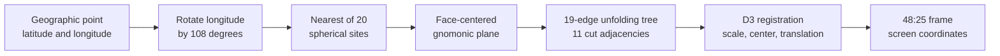
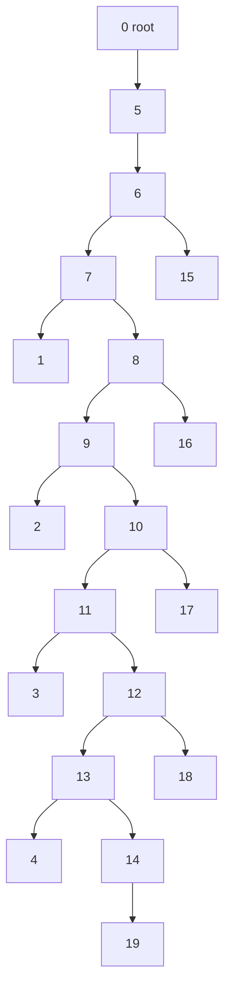

# Icosahedral Voronoi geometric context

[Documentation index](../../../../index.md) ·
[Implementation notes](implementation.md) ·
[Bibliography](bibliography.md)

## What kind of projection this is

This projection replaces one global plane, cylinder, or cone with twenty
small tangent planes. A regular icosahedron divides the spherical Earth into
twenty triangular regions. The center of each triangle is a Voronoi site; a
geographic point uses whichever site is nearest on the sphere. A gnomonic
projection maps that one region into a planar triangle, and a fixed tree says
how the twenty triangles remain hinged when the surface is unfolded.



The stages are evaluated directly from formulas and fixed arrays. The C++
implementation does not build a physical solid or consult a polygon mesh at
each call.

This map should not be confused with the repository's Myriahedral projection.
Both start from an icosahedron and unfold a tree, but their working scales and
local maps differ:

| Property | Icosahedral Voronoi | Myriahedral |
| --- | --- | --- |
| Spherical faces | 20 regular triangles | 5120 subdivided triangles |
| Face choice | nearest of 20 centroid sites | hierarchical mesh containment |
| Local projection | exact face-centered gnomonic | affine transfer from a small chord face |
| Tree | fixed conventional 20-face net | fixed land-aware 5120-face net |
| Registered canvas | D3-compatible `960 x 500` | raster-compatible `4480 x 2520` |

## Twelve vertices and twenty faces

An icosahedron has twelve vertices, thirty edges, and twenty triangular faces.
This orientation puts one vertex at each geographic pole and the other ten on
two staggered latitude rings:

```text
                         v0  North Pole, +90 degrees
                         /|\

 northern ring, +theta: v11   v3   v5   v7   v9
                         \   zigzag face belt   /
 southern ring, -theta:  v10   v2   v4   v6   v8

                         \|/
                         v1  South Pole, -90 degrees

 theta = atan(0.5) = 26.56505117707799... degrees
```

The sketch shows the layers, not a perspective drawing or the exact cyclic
longitude order. The coordinates are:

| Ring | Vertex longitudes |
| --- | --- |
| North pole | `v0: 0°` at latitude `+90°` |
| Northern `+theta` | `v3: 36°`, `v5: 108°`, `v7: -180°`, `v9: -108°`, `v11: -36°` |
| Southern `-theta` | `v2: 0°`, `v4: 72°`, `v6: 144°`, `v8: -144°`, `v10: -72°` |
| South pole | `v1: 0°` at latitude `-90°` |

Five faces meet at each pole. Ten more triangles alternate around the band
between the two rings. The chosen latitude makes every chord edge the same
length, so all twenty spherical triangles are congruent under icosahedral
symmetry.

Face IDs `0–4` touch the north pole, `5–14` form the equatorial belt, and
`15–19` touch the south pole. These IDs are stable implementation topology;
they are not geographic quadrants or drawing layers.

## Why the faces are Voronoi cells

For each triangular face, normalize the sum of its three vertex vectors. The
result is a unit vector `s[i]` pointing through the spherical face center.
These twenty centers are the sites of a spherical Voronoi diagram.

For a geographic unit vector `g`, the nearest site's angular distance is:

```text
distance(g,s[i]) = acos(g dot s[i])
```

The selected cell can therefore be found by the largest dot product. Its
boundaries occur where two site dot products are equal:

```text
g dot s[i] = g dot s[j]
```

Each equality traces a great-circle bisector. Three bisectors bound one
spherical triangular cell, and five cells meet at every original icosahedron
vertex.

There are two useful dual views of the same structure:

- the original icosahedron has 20 triangular faces whose centers are the
  sites;
- connecting neighboring sites produces the dodecahedral face-adjacency
  graph, with 20 nodes, 30 edges, and degree 3 at every node.

“Voronoi” here refers to this nearest-site face dispatch. It does not mean the
output contains arbitrary planar Voronoi polygons or that callers can supply
their own sites.

## One face and its gnomonic plane

The face site `s` is also the outward normal of a plane tangent to the unit
sphere. A ray from the sphere's center through geographic point `g` meets that
plane at the gnomonic image:

```text
                         tangent plane at s
                         +------------------+
                        /        p         /
                       /        *         /
                      +--------/---------+
                              /
                         g   *       unit sphere
                            /
                           /
                          O  sphere center

                    ray O -> g -> p
```

With tangent basis vectors `east` and `north`, the scale along the ray is the
reciprocal of `g dot s`:

```text
p = ((g dot east) / (g dot s),
    -(g dot north) / (g dot s))
```

This central projection has an important cartographic property: every
great-circle arc maps to a straight line on a gnomonic plane. Since every cell
is much smaller than a hemisphere, all of its points have a positive
denominator and a finite local image.

The benefit is straight triangular edges and a clean hinge construction. The
cost is distortion that increases with angular distance from the face site.
Gnomonic projection is neither equal-area nor conformal, and joining twenty
planes does not change that local fact.

## From face adjacency to a planar net

The full face-adjacency graph has thirty edges. Keeping all of them while
flattening would impose cycles that cannot close in a plane. The selected
spanning tree retains nineteen edges as hinges and cuts the other eleven.

The exact parent tree is:



For each arrow, the child and parent project their two common icosahedron
vertices into their own tangent planes. A similarity transform rotates,
uniformly scales, and translates the child until those two edge images
coincide. Composing transforms back to face `0` places every triangle in one
root plane.

```text
retained hinge                       cut adjacency

       /\  /\                          /\       /\
      /__\/__\                        /__\     /__\
       one shared                       two separated
       planar edge                      edge copies
```

Across a hinge, the two faces agree exactly on position along the shared edge.
Across a cut, nearby spherical points can be far apart in the map. That
discontinuity is necessary to open a closed surface into a plane.

## Geographic rotation and map registration

The icosahedron above is defined around the ordinary north/south axis, but the
public map yaws geography by `108°` before choosing a face. This moves the net
cuts relative to continents without changing latitude or the icosahedron's
shape.

After unfolding, the default D3 settings apply:

```text
geographic center = [162 degrees, 0 degrees]
scale             = 131.777
translation       = [480, 250]
planar angle      = 0 degrees
```

Rotation and center work together. Public longitude `54° E` becomes
`162° E` after the `108°` yaw, so public `(0°,54°)` maps to `(480,250)`.
Public `(0°,0°)` maps to approximately `(349.228,250)`.

The C++ implementation keeps this complete coordinate registration, then
scales it proportionally to the requested frame.

## Geographic quadrants

Latitude and longitude define the familiar four input quadrants before the
registered rotation:

```text
                         north, +latitude
                                ^
                                |
       northwest (NW)           |           northeast (NE)
       -longitude,+latitude     |           +longitude,+latitude
                                |
 west, -longitude <-------------+-------------> east, +longitude
                                |
       southwest (SW)           |           southeast (SE)
       -longitude,-latitude     |           +longitude,-latitude
                                |
                                v
                         south, -latitude
```

Reference anchors at the `960 x 500` registration illustrate argument order,
signs, and screen orientation:

| Quadrant | Anchor `(latitude, longitude)` | Projected `(x, y)` |
| --- | --- | --- |
| Northeast | Tokyo `(35.6895, 139.6917)` | `(674.4406, 153.2639)` |
| Northwest | New York `(40.7128, -74.0060)` | `(149.7460, 139.3111)` |
| Southeast | Sydney `(-33.8688, 151.2093)` | `(712.5164, 331.6337)` |
| Southwest | São Paulo `(-23.5558, -46.6396)` | `(233.0890, 310.3372)` |

These are validation groups, not the projection's working regions. One
geographic quadrant intersects several of the twenty cells and may cross
several net cuts. Conversely, faces containing different longitude signs can
be adjacent after the `108°` rotation. There is no rule that maps NE, NW, SE,
and SW into four rectangular quarters of the output.

Points on latitude `0°` or longitude `0°` lie on quadrant axes rather than in
one open quadrant. Their face choice still follows the same nearest-site rule.

## Boundaries, ties, and the antimeridian

A point on a Voronoi boundary is equally close to two sites; a point at an
icosahedron vertex is tied among five. The C++ scan keeps the lowest face
index in such a tie. At the geographic poles, explicit handling chooses the
same stable faces without allowing floating-point longitude residue to break
the tie.

If the chosen boundary is a retained hinge, either face gives the same planar
edge position. If it is a cut, both separated edge copies are geometrically
valid and the tie rule selects one. A forward point API can return only one of
those images.

Public longitudes `-180°` and `+180°` name the same meridian. Both rotate to
`-72°`, and tests require exactly equivalent projected coordinates from pole
to pole. This input equivalence does not remove the net's other interrupted
edges; the map has eleven polyhedral cuts rather than one cylindrical date-line
seam.

## Screen axes and the `48:25` canvas

The public coordinate system follows SVG and raster screen convention:

```text
  (0,0) +------------------------------> +x
        |
        |
        |
        v
       +y
```

D3's default translation `[480,250]` is the center of a `960 x 500` area:

```text
960 / 500 = 48 / 25 = 1.92
```

The C++ frame contract preserves that entire area, including intentional
whitespace around and between net branches. Valid examples include `48 x 25`,
`960 x 500`, and `1920 x 1000`.

This ratio comes from the selected registration canvas, not polyhedral
geometry. A different parent tree, rotation, scale, translation, or crop could
require another ratio even while using the same regular icosahedron.

## What is and is not preserved

- Great-circle portions are straight within each gnomonic face.
- Positions agree across the nineteen retained hinges.
- The eleven cut adjacencies are intentional global discontinuities.
- Scale, area, angle, and distance are not globally preserved.
- The derivative can change at a face boundary even when position is
  continuous there.
- Distance between points on separated net branches has no direct geographic
  meaning.
- A renderer must split a path when it crosses a cut; connecting projected
  endpoints blindly can draw a false line across the map.

The design trades one continuous global formula for twenty simple local
projections and an inspectable cut topology. Its useful invariant is faithful
compatibility with D3's fixed icosahedral view, not a claim of equal-area or
conformal behavior.

---

[Documentation index](../../../../index.md) ·
[Implementation notes](implementation.md) ·
[Bibliography](bibliography.md)
