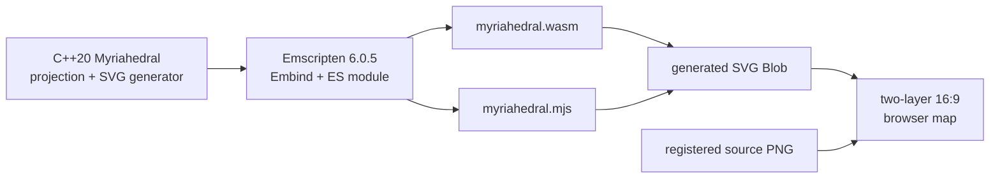

# Illustrative Myriahedral WebAssembly overlay

[Documentation index](../../../index.md) ·
[Prerequisites](../getting-started/prerequisites.md) ·
[Complete example](myriahedral-example.md) ·
[Myriahedral implementation notes](../projections/myriahedral/implementation.md) ·
[Generation pipeline](../getting-started/generation.md)

## Result

This workflow compiles the repository's C++20 Myriahedral forward projection
and a browser-oriented SVG generation function to WebAssembly with
Emscripten. The example:

- constructs an exact `1920 x 1080` Myriahedral projection;
- generates a seam-aware 10-degree graticule and six city anchors in C++;
- exports the generator through Embind as `generateMapSvg()`;
- loads the checked-in Myriahedral reference raster in the browser;
- turns the generated SVG string into a Blob URL; and
- layers the SVG over the raster in one responsive 16:9 viewport.

This is an illustrative, copyable raster-overlay workflow. The current
[all-projection quick start](webassembly-quick-start.md) covers the
production runtime, typed geometry, slices, Canvas/SVG/D3, and workers. The
older Myriahedral compatibility option still generates only `ocean` and
`land`; this separate example keeps its graticule and city anchors over the
checked-in raster. The example filenames and outputs below remain local so
they cannot collide with either production module.

The build produces:

```text
src.wasm/
├── index.html
├── myriahedral.mjs
├── myriahedral.wasm
└── smoke.mjs
```

The source raster remains at
[`assets.static/myriahedral/black-white-downsampled.png`](../../../assets.static/myriahedral/black-white-downsampled.png).
It is served as an ordinary browser asset rather than copied into the WASM
linear memory or Emscripten's virtual filesystem.



## Why 1920 by 1080 is exact

The checked-in raster is `4480 x 2520`, and this implementation preserves
its complete 16:9 canvas as the registration contract:

```text
4480 / 2520 = 16 / 9
1920 / 1080 = 16 / 9
```

No approximation is necessary: `{1920, 1080}` is itself the closest valid
frame. Both dimensions scale from the source by exactly `3/7`:

```text
4480 * 3/7 = 1920
2520 * 3/7 = 1080
```

The browser may display the composed map at a smaller CSS size, but the raster
and SVG use the same intrinsic ratio and therefore remain registered without
cropping or anisotropic stretching.

The ratio belongs to this fixed raster-compatible Myriahedral configuration,
not to every possible Myriahedral cut tree. See the
[geometric context](../projections/myriahedral/context.md#the-169-canvas) for that
distinction.

## What is compiled

The example includes the normal project headers:

```c++
#include <a60-io.h>
#include <izzi-svg.h>

#include "a60-carto-frame.h"
#include "a60-carto-projection.h"
#include "cart0freak0-myriahedral.h"
```

`cart0freak0-myriahedral.h` contains the depth-5 icosahedral subdivision,
the fixed 5120-face spanning tree, planar unfolding, hierarchical face search,
and affine forward transform. The browser build does not need the historical
`myriaworld` executable, GDAL, Boost, S2, or Natural Earth.

The wrapper in [the complete example](myriahedral-example.md#c-source) adds:

- the fixed web frame;
- face-aware graticule sampling;
- bisection at face transitions;
- SVG path serialization; and
- four small Embind exports.

The projection itself is still constructed by
`make_myriahedral_projection()` and every displayed coordinate comes from
`myriaproj::meridians_to_point_2d()`.

## Install and activate the local SDK

The local SDK manager is:

```text
/home/bkoz/src/emsdk
```

The example was verified with Emscripten 6.0.5. Pinning the version makes the
JavaScript glue shape and measured output reproducible:

```sh
cd /home/bkoz/src/emsdk
./emsdk install 6.0.5
./emsdk activate 6.0.5
source ./emsdk_env.sh
em++ --version
```

`activate` selects the compiler in Emscripten's configuration;
`emsdk_env.sh` changes `PATH` and related variables only in the current
shell. Sourcing it from a shell startup file is optional and can also change
which Node executable other projects see.

The official Emscripten instructions describe the same
[`install`, `activate`, and environment steps](https://emscripten.org/docs/getting_started/downloads.html).

## Prepare the example files

From the cartofreako repository root, create these local example sources
beside the production WebAssembly adapters:

```text
src.wasm/
├── index.html
├── myriahedral-web.cc
└── smoke.mjs
```

The complete contents of all three files are in
[complete Myriahedral example](myriahedral-example.md). They are kept in the documentation
so the requested example consists only of the two web documentation pages;
copy the fenced source blocks verbatim when running it.

## Compile the ES module and WASM binary

With the SDK environment active and the current directory set to the
cartofreako root:

```sh
mkdir -p src.wasm

em++ src.wasm/myriahedral-web.cc \
  -I src.projections \
  -isystem ../alpha60/src \
  -isystem ../izzi/src \
  -std=c++20 \
  -O3 \
  -Wall -Wextra -Wpedantic -Werror \
  --bind \
  --no-entry \
  -sMODULARIZE=1 \
  -sEXPORT_ES6=1 \
  -sEXPORT_NAME=createMyriahedralModule \
  -sENVIRONMENT=web,node \
  -sALLOW_MEMORY_GROWTH=1 \
  -sFILESYSTEM=0 \
  -o src.wasm/myriahedral.mjs
```

Alpha60 and Izzi are marked as system include directories so warnings inside
those neighboring header trees do not become errors in this wrapper's strict
Clang build. `src.projections/` remains a normal include path, so warnings in
the projection and adapter are still checked.

### Linker and runtime flags

| Flag | Reason |
| --- | --- |
| `--bind` | Links Embind and exposes the named C++ functions on the module instance |
| `--no-entry` | Builds a callable library; the wrapper deliberately has no C++ `main()` |
| `-sMODULARIZE=1` | Produces an asynchronous module factory instead of a global `Module` |
| `-sEXPORT_ES6=1` | Emits an ES module with a default factory export |
| `-sEXPORT_NAME=...` | Gives the generated factory a useful internal/debug name |
| `-sENVIRONMENT=web,node` | Supports the browser example and the Node smoke test |
| `-sALLOW_MEMORY_GROWTH=1` | Allows future, larger generated strings without fixing a large initial heap |
| `-sFILESYSTEM=0` | Omits Emscripten filesystem support; this example returns SVG directly |

Emscripten's
[modularized-output documentation](https://emscripten.org/docs/compiling/Modularized-Output.html)
defines the asynchronous factory used here. The
[Embind documentation](https://emscripten.org/docs/porting/connecting_cpp_and_javascript/embind.html)
describes `EMSCRIPTEN_BINDINGS()` and the `--bind` interface.

The `.mjs` file and `.wasm` file must stay together unless a custom
`locateFile` callback is supplied when creating the module.

### Cache permissions in a sandbox or CI job

Emscripten normally writes compiled system libraries beneath its SDK cache.
If that checkout is read-only to the build user, select a task-specific
writable cache:

```sh
export EM_CACHE=/tmp/cartofreako-emscripten-cache
```

Do not share one writable cache between mutually untrusted jobs. A persistent
job-local cache is faster than `/tmp` for repeated builds.

## Run the non-browser smoke test

The ES module includes Node support solely so the generated function can be
checked without a browser:

```sh
node src.wasm/smoke.mjs
```

The smoke program:

- instantiates the module asynchronously;
- verifies the `1920 x 1080` exports and raster path;
- calls `generateMapSvg()`;
- requires the SVG view box, latitude and longitude groups, and an anchor;
- checks that exactly 53 graticule paths were generated;
- rejects `nan` and `inf`; and
- writes `src.wasm/myriahedral-1920x1080.svg` for inspection.

With Emscripten 6.0.5, the verified example produced:

```json
{"wasmBytes":270756,"svgBytes":574903,"paths":53}
```

Exact byte counts can change with compiler and standard-library revisions.
The dimensions, path count, IDs, and finite-coordinate checks are the stable
contract.

## Serve it over HTTP

WebAssembly is fetched asynchronously. Do not open `index.html` with a
`file://` URL. From the repository root, use the SDK's local server:

```sh
emrun \
  --no_browser \
  --serve_after_close \
  --serve_root "$PWD" \
  --port 8000 \
  src.wasm/index.html
```

Then open:

```text
http://localhost:8000/src.wasm/index.html
```

`--serve_root` is important: it makes both `src.wasm` and the repository's
`assets.static` directory available beneath the same origin. The official
[`emrun` documentation](https://emscripten.org/docs/compiling/Running-html-files-with-emrun.html)
also explains browser launching, ports, and server lifetime.

For another web server, configure at least these content types:

| Extension | Content type |
| --- | --- |
| `.mjs` | `text/javascript` |
| `.wasm` | `application/wasm` |
| `.png` | `image/png` |
| `.svg` | `image/svg+xml` |

`application/wasm` permits efficient streaming compilation. A wrong MIME
type, a 404 for `myriahedral.wasm`, or opening the page from `file://` are
the most common startup failures.

## Browser-side generation and image loading

The page imports the generated factory:

```js
import createMyriahedralModule from "./myriahedral.mjs";

const module = await createMyriahedralModule();
const svg = module.generateMapSvg();
```

Embind converts the returned `std::string` into a JavaScript string. The
page wraps it in a Blob, creates an object URL, and assigns that URL to the
upper `` layer.

The lower `` independently loads
`assets.static/myriahedral/black-white-downsampled.png`. Keeping the layers
separate has several advantages:

- the 1.2 MiB source raster stays out of WASM memory;
- the browser can cache and decode it normally;
- no Emscripten `.data` package or virtual filesystem is needed;
- the generated SVG remains downloadable by itself; and
- an SVG loaded as an image does not need permission to fetch an external
  nested image.

Both images have intrinsic `1920 x 1080` dimensions in the page and occupy
the same CSS `aspect-ratio: 16 / 9` box. The source PNG is larger, but
downscales uniformly by `3/7`.

The Blob URL remains live while the image and download link use it and is
revoked on `pagehide`. Revoking it immediately after setting `src` can race
the image decoder.

## Seam-aware graticule generation

The Myriahedral surface has 5120 small spherical triangles. Tree edges are
retained hinges; every non-tree edge is a cut. A plain SVG polyline must not
connect samples across a cut because the two projected endpoints can lie on
distant branches.

The example samples every parallel and meridian at 0.5-degree intervals. For
each pair of adjacent samples it:

1. finds both containing face indices;
2. bisects a face change 48 times in geographic coordinates;
3. projects the limiting point from each side;
4. treats coincident limits as a retained hinge; and
5. starts a new SVG subpath when the limits are separated.

At the `1920 x 1080` frame, a separation greater than
`1920 * 1e-5 = 0.0192` output unit identifies a cut. Retained hinges agree
to floating-point precision, so this threshold is well above roundoff and
well below a visible jump.

The fixed sampling step makes the example readable and deterministic. It
assumes no more than one face transition between adjacent samples. The
production ocean-and-land renderer instead clips filled geometry to exact
terminal-face triangles. This example's line renderer should adaptively
subdivide any interval that can cross multiple faces or whose projected chord
error exceeds a display-space tolerance.

The example calls `myriahedral_detail::containing_face()` to expose the cut
topology. That is an implementation-detail dependency. The point transform
itself uses the public `myriaproj` API.

## Initialization and responsiveness

The first module use constructs and unfolds the fixed 5120-face layout into a
function-local static object. Later projection calls reuse it. The example
then performs tens of thousands of forward queries while generating the
graticule, so `generateMapSvg()` can briefly occupy the browser's main
thread.

For interactive production pages:

- instantiate the module and generate SVG in a Web Worker;
- post the SVG string or a transferable byte buffer back to the UI thread;
- cache the result by projection version, frame, and layer settings;
- consider generating one layer at a time for progressive display; and
- replace fixed sampling with a projected-error criterion.

The example keeps generation on the main thread to show the complete data
flow without worker glue.

## Perceptual considerations

The grayscale raster and blue/orange graticule are deliberately separate
visual channels. Thirty-degree lines are heavier than the other ten-degree
lines, city anchors have a white keyline, and
`vector-effect: non-scaling-stroke` keeps responsive resizing from making
the overlay unusably thin.

Several caveats remain:

- many short interruptions are intrinsic Myriahedral cuts, not missing data;
- dense lines near the poles can dominate local land detail;
- the source raster includes deliberate whitespace and branching geometry;
- the map is neither globally conformal nor exactly equal-area; and
- a generated graticule can look plausible even when one cut was joined
  incorrectly, so visual inspection at high zoom remains necessary.

The browser stage supplies one accessible label for the composed image and
marks both child images decorative, avoiding duplicate screen-reader
announcements.

## Deployment and security

For deployment:

- serve the raster, `.mjs`, and `.wasm` from versioned URLs;
- enable Brotli or gzip for the text glue and WASM;
- give immutable hashed assets long cache lifetimes;
- keep the module and WASM on the same origin unless CORS is configured;
- permit `blob:` in the Content Security Policy's `img-src` directive for
  the generated SVG object URL; and
- preserve the source raster's provenance and licensing information.

If `blob:` is disallowed, insert the generated SVG markup into a carefully
controlled container instead. Do not do that with untrusted SVG strings; this
example's SVG is entirely generated from fixed C++ data.

## Troubleshooting

| Symptom | Likely cause and correction |
| --- | --- |
| `em++: command not found` | Source `/home/bkoz/src/emsdk/emsdk_env.sh` in the current shell |
| SDK cache is not writable | Set `EM_CACHE` to a writable job-specific directory |
| Alpha60 unused-parameter warning becomes an error | Keep Alpha60 and Izzi on `-isystem` paths as shown |
| Browser reports a WASM MIME error | Serve `.wasm` as `application/wasm` |
| Browser fetches the wrong WASM path | Keep `.mjs` and `.wasm` together or pass `locateFile` |
| Raster is 404 | Serve from the repository root and retain the `src.wasm/` layout |
| Overlay is missing under a strict CSP | Allow `blob:` for images or use a reviewed inline-SVG strategy |
| Projection rejects the frame | Use an exact 16:9 pair such as `1920 x 1080`, not an approximate decimal ratio |
| Long lines bridge separate branches | Preserve face-transition bisection and split at detected cuts |

---

[Documentation index](../../../index.md) ·
[Complete example](myriahedral-example.md) ·
[Myriahedral implementation notes](../projections/myriahedral/implementation.md) ·
[Generation pipeline](../getting-started/generation.md)
