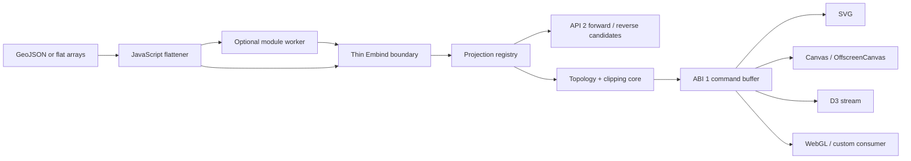

# Stage 10: projection-neutral browser renderer

**Implementation date:** 2026-08-06  
**Status:** geometry ABI 1 complete; runtime API 2 face-qualified reverse
extension implemented 2026-08-09; measured WebGL/LOD remains optional

[Documentation index](../../index.md) ·
[Web-developer quick start](webassembly-quick-start.md) ·
[Forward/reverse API](../forward-reverse-projection-api.md) ·
[Runtime reference](../../src.wasm/README.md) ·
[Originating evaluation](converge-generation.status-20260806.md)

## Outcome

Stage 10 replaces projection-specific browser geometry logic with one runtime
registry and one topology-aware command-buffer pipeline. One ES module now
constructs Cahill-Keyes, AuthaGraph, Dymaxion, Myriahedral, Star-X, and Voronoi
carriers, including the five checked alternate Myriahedral layouts.

The two Stage 4.3 adapters remain unchanged as compatibility clients. They are
not the foundation of the new API.

The implementation provides:

- a C++ runtime registry shared with native SVG generators;
- variable, exact-ratio finite carriers for all six models;
- batched point, line, ring, Polygon, MultiPolygon, and GeometryCollection
  projection;
- native-cell classification, seam transition bisection, retained hinges,
  fold routing, and periodic-wrap diagnostics;
- exact face-local filled geometry for Dymaxion, Myriahedral, and Voronoi;
- octant-local filled geometry for Cahill-Keyes and Star-X;
- periodic-cell filled geometry for AuthaGraph;
- an owned typed-array command buffer with feature IDs and ring roles;
- exact carrier/ocean face buffers;
- named and custom slicing at four distinct geometry stages;
- SVG, Canvas/OffscreenCanvas, and D3-stream consumers;
- an ordinary ES-module Web Worker and main-thread client;
- runtime projection/capability/license manifests;
- runtime API 2 structured forward results plus analytic face-qualified
  reverse candidates for every Myriahedral layout and Voronoi;
- Node and real-Chrome integration tests; and
- interactive and command-line slice examples.

## Architecture implemented



The native generation header now delegates construction, frame validation,
point projection, native-cell lookup, and seam-safe paths to
[`cart0freak0-projection-runtime.h`](../../src.projections/cart0freak0-projection-runtime.h).
The browser therefore does not carry a second interpretation of projection
cuts.

Myriahedral layout metadata and embedded trees moved from generator-owned
paths to
[`cart0freak0-myriahedral-perspectives.h`](../../src.projections/cart0freak0-myriahedral-perspectives.h).
The old
[`myriahedral-perspective-generation.h`](../../src.generate/myriahedral-perspective-generation.h)
path is a compatibility include.

## Stable browser paths

The checked-in interface layer is:

```text
src.wasm/cartofreako-web.mjs
src.wasm/cartofreako-web.d.ts
src.wasm/cartofreako-svg.mjs
src.wasm/cartofreako-canvas.mjs
src.wasm/cartofreako-d3.mjs
src.wasm/cartofreako-projections-worker.mjs
src.wasm/cartofreako-worker-client.mjs
```

`make wasm-projections` produces:

```text
src.wasm/cartofreako-projections.mjs
src.wasm/cartofreako-projections.wasm
```

The generated loader is deliberately lower-level. Web applications should
import `cartofreako-web.mjs`, which owns GeoJSON flattening, default-frame
selection, lifecycle checks, and future ABI adaptation.

## Geometry protocol

Input consists of interleaved geographic positions plus part offsets, part
types, feature IDs, and ring roles. JavaScript flattens nested GeoJSON once;
the C++ call receives the complete batch.

Output ABI 1 consists of:

```text
coordinates      Float64Array [x0, y0, x1, y1, ...]
partOffsets      Uint32Array  point offsets, final item = point count
partTypes        Uint8Array   point=0, line=1, ring=2
featureIds       Uint32Array  flattened source feature index
nativeCells      Uint32Array  authoritative C++ topology cell
componentIds     Uint32Array  disconnected component identity
ringRoles        Uint8Array   none=0, exterior=1, hole=2
closed           Uint8Array   renderer close-path flag
frame            originX, originY, width, height
diagnostics      samples, transitions, cuts, wraps, clips, drops
```

Output arrays are copied into JavaScript-owned typed arrays. This is one
intentional copy: Emscripten uses `ALLOW_MEMORY_GROWTH`, so retaining typed
views into the heap would let a later allocation invalidate application data.
The worker can transfer the owned buffers without another copy.

## Line processing

Open paths use adaptive great-circle subdivision. An edge subdivides when its
angular span is too large, projected midpoint error exceeds `tolerancePx`, or
its endpoints/midpoint reveal a topology transition. The native seam router
then:

1. identifies outer Cahill-Keyes folds before generic cell splitting;
2. uses the Star-X registered edge router for its paired group layout;
3. bisects generic native-cell transitions to one-sided limits;
4. preserves a retained hinge when those limits coincide;
5. starts a new component when they are disconnected; and
6. resolves AuthaGraph's repeated rectangular seam as a periodic wrap.

Diagnostics expose every transition, geometric cut, periodic wrap, and
fallback split.

## Filled geometry

A raw projected ring cannot be closed safely across an interrupted net. ABI 1
uses projection-family-specific topology before emitting closed pieces:

| Family | Fill method |
| --- | --- |
| Cahill-Keyes and Star-X | Geographic clip to registered 90-degree octants and hemispheres, densify, then project within one native cell |
| Dymaxion, Myriahedral, Voronoi | Five-degree geographic working cells, face candidates, forced face-local transform, exact convex clip to the registered planar face triangle |
| AuthaGraph | Five-degree geographic working cells, periodic-x unwrapping, and exact clipping to the finite repeated rectangle |

Exterior and interior rings are processed independently but retain feature ID
and `ringRole`. SVG and Canvas group all pieces of a feature and use the
even-odd rule, preserving holes after face splitting.

As with RFC 7946, polygon input should be cut at the geographic antimeridian.
The checked Natural Earth input already satisfies that contract.

## Slicing implemented

The generic descriptor makes four operations explicit:

```text
carrier-viewport    projected rectangular view
native-cell-mask    retained topology cells and exact masks
geographic-preclip  WGS 84 source rectangle before projection
planar-tile         non-wrapping delivery rectangle after projection
```

The invariant is carrier first. A slice never supplies dimensions to the
projection factory. Retained coordinates become local only through:

```text
x_local = x_carrier - source_view.x
y_local = y_carrier - source_view.y
```

Named descriptors reproduce all four full-height Cahill-Keyes strips, all
eight exact octants, and the two complementary 2,722/2,398-face Myriahedral
reference groups. Custom viewports, geographic bounds, planar tiles, and
native-cell sets use the same protocol.

See the [quick-start slice section](webassembly-quick-start.md#use-a-slice)
and [`src.wasm/examples`](../../src.wasm/examples/README.md).

## Existing cartography libraries

D3 remains the closest interface match. Its spherical stream separates
geometry from SVG/Canvas serialization, so the supplied adapter buffers one
line or polygon, invokes Cartofreako's topology engine, and replays safe stream
events. D3 controls path serialization; Cartofreako remains authoritative for
interrupted cuts and face IDs.

Leaflet and OpenLayers can host the finite output as a non-wrapping planar
carrier. They should not assume a globally unique inverse: API 2 exposes
face-qualified Myriahedral/Voronoi candidates while the other families remain
explicitly unsupported. MapLibre integration remains a custom WebGL
consumer of the command buffer, not a projection mode in its Mercator tile
pipeline. The detailed comparison is retained in the
[originating evaluation](converge-generation.status-20260806.md#context-existing-browser-cartography).

## Verification

| Check | Evidence |
| --- | --- |
| One public constructor for all six models and exact frame rejection | `tests/test-projection-runtime.cc`, Node smoke |
| Native/browser point authority | Native generators and WASM compile the same registry/header; established per-model API fixtures remain in `make check` |
| Seam-safe lines and filled rings | Native topology tests plus Node all-model chord/finite checks |
| Holes and multipolygons | All-model native and Node role/feature-ID checks |
| Existing CK/Myria base maps | Node projects the shared Natural Earth file through carrier plus land buffers |
| Existing CK/Myria slices | Native counts, Node catalogs, runnable examples |
| SVG and Canvas share geometry | Both adapters consume ABI 1 in Node; Canvas also runs in Chrome |
| Worker path | Real Chrome instantiates a second WASM runtime, projects a sliced path, and transfers its buffers |
| Native forward/reverse contract | `tests/test-forward-reverse-projection-api.cc` checks all 5,120 faces in all six Myriahedral layouts, all Voronoi faces, batches, boundaries, outside points, and unsupported families |
| Browser forward/reverse contract | Node checks typed-array batches and D3 behavior; real Chrome checks main-thread and worker reverse calls |
| Visible license metadata | `runtime.manifest` and `runtime.licenses` assertions |
| Node and real browser | `make check-wasm-projections`; `make check-wasm-projections-browser` |

The browser runner starts an ephemeral localhost server with explicit
JavaScript/WASM MIME types, launches headless Chrome, and polls the page via
the Chrome DevTools Protocol. This catches failures that Node cannot: module
workers, browser fetch resolution, Canvas, MIME handling, and WebAssembly
streaming.

## Deliberate API 2 / ABI 1 boundaries

- No false global inverse. Myriahedral and Voronoi return face-qualified
  candidates; Cahill–Keyes, AuthaGraph, Dymaxion, and Star-X return
  `unsupported`. Use feature IDs plus a planar index for feature picking.
- No built-in polygon triangulation or WebGL renderer. The command buffer is
  the stable input for one after profiling establishes the need.
- No geographic XYZ tiles. Tiles are clipped from the finite projected
  carrier and never wrap.
- No direct TopoJSON decoder. Decode or flatten it in JavaScript first.
- No projection-subset builds yet. The registry is structured so build-time
  inclusion macros can be added when bundle measurements justify them.
- No Leaflet/OpenLayers dependency in the core. Their role is an optional
  finite-carrier interaction shell.
- Component IDs are stable within one returned buffer, not across different
  tolerance, slice, or source configurations.

## Promising Stage 10 follow-ons

1. Benchmark bundle size, startup, peak memory, geometry time, and frame time
   on representative mobile and desktop devices.
2. Add planar R-tree hit testing keyed by `featureIds`.
3. Add a command-buffer WebGL renderer and triangulator only after the Canvas
   thresholds are measured.
4. Add build-time projection subsets while retaining the same JavaScript API
   and license manifest.
5. Evaluate TopoJSON/shared-arc input for stable feature IDs and smaller base
   map transfers.
6. Extend the checked reverse contract in order: Dymaxion, Cahill–Keyes,
   AuthaGraph, then Star-X and its separate unified-Antarctic semantics.

These are enhancements, not hidden prerequisites for the documented ABI 1
workflow.

---

[Documentation index](../../index.md) ·
[Web-developer quick start](webassembly-quick-start.md) ·
[Forward/reverse API](../forward-reverse-projection-api.md) ·
[Runtime reference](../../src.wasm/README.md) ·
[Stage 11 documentation plan](stage-11-documentation-plan.md)
