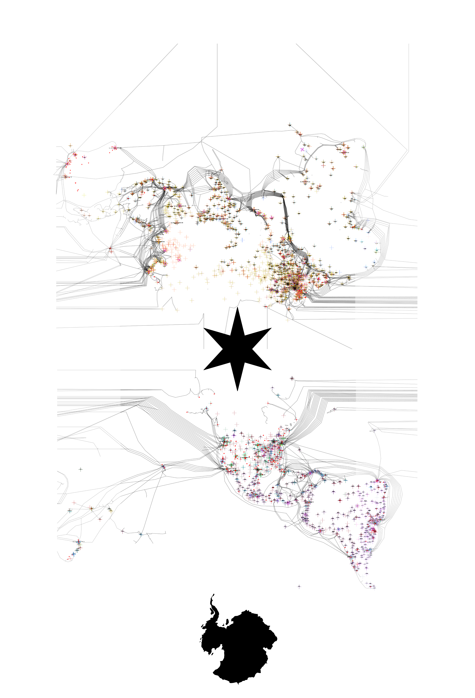
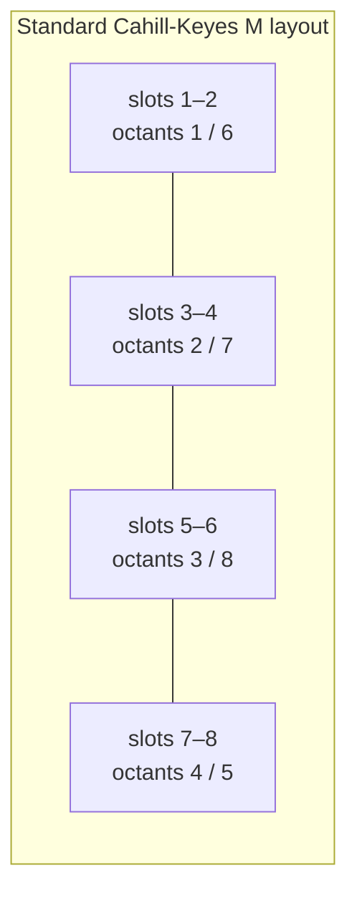
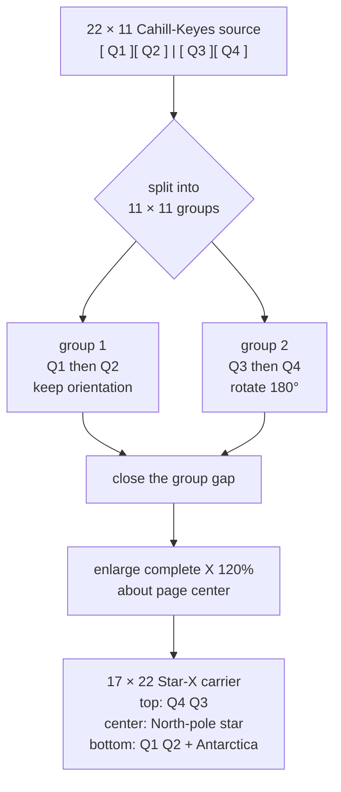
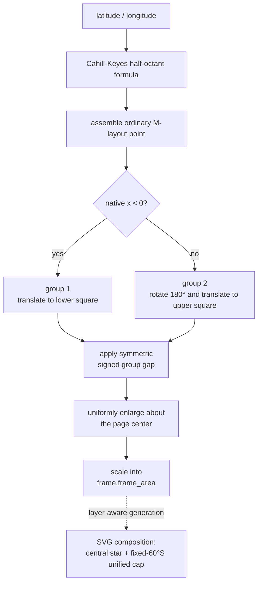

# Star-X geometric context

[Documentation index](../index.md) ·
[Implementation notes](star-x-implementation-notes.md) ·
[Bibliography](star-x-bibliography.md)

## What Star-X changes

Star-X is a rearranged Cahill-Keyes octahedral net. It does not replace the
curves inside an octant. The globe is still divided into eight spherical
triangles, every triangle still uses the Cahill-Keyes A–L construction, and
the same continental cuts remain available. Star-X changes where two groups
of those projected faces are placed on the page.

The ordinary Cahill-Keyes M map is horizontal. Star-X reads its four
north/south face pairs from left to right, keeps the first two pairs in the
lower half, rotates the last two pairs by 180 degrees, and puts them in the
upper half. The result is a portrait, polar-centered X.

<p align="center">
  
</p>

The checked-in image is a historical data visualization and a visual record
of the arrangement, not a pixel oracle for the C++ projection. It includes
symbols, links, crops, and page-layout decisions beyond the geographic
transform.

## Octahedral context

An octahedron has eight triangular faces. Four touch its northern vertex and
four touch its southern vertex. On the globe these become four 90-degree
longitude sectors per hemisphere. Flattening the faces requires cuts; a pole
or edge can therefore have several visible copies in a planar net even
though it is one location on the folded polyhedron.

The Cahill-Keyes algorithm calculates one mirrored half-octant and then uses
rigid rotations, reflections, and translations to form all eight faces. That
standard assembly produces the M profile shown in the
[Cahill-Keyes context](cahill-keyes-context.md). Star-X starts after this
calculation, so the local scale and carefully constructed graticule remain
unchanged.

## Face numbers and spatial slots

Two numbering systems must be kept distinct.

The official geographic octant numbering inherited from the Graça/Keyes
program is:

| Longitude sector | North octant | South octant |
| --- | ---: | ---: |
| Pacific and western North America | 1 | 6 |
| Americas and Atlantic | 2 | 7 |
| Europe, Africa, and Middle East | 3 | 8 |
| Asia and Australia | 4 | 5 |

In the rendered M layout, north and south partners are adjacent. Numbering
the triangular **spatial slots** from left to right therefore gives:

| Spatial slots | Official octants | Source half | Star-X group |
| --- | --- | --- | --- |
| 1–2 | 1 and 6 | left, outer | group 1 |
| 3–4 | 2 and 7 | left, inner | group 1 |
| 5–6 | 3 and 8 | right, inner | group 2 |
| 7–8 | 4 and 5 | right, outer | group 2 |

Thus the requested “octants 1–4 on the left” and “octants 5–8 on the
right” are spatial slots in the M map. Treating them as official geographic
octant numbers would instead split north from south, contradicting the
left/right geometry and the historical plate arrangement.



## From M to X

Split the M-layout rectangle vertically between the second and third face
pairs. Each half is square. Group 1 stays upright and moves below the
carrier midpoint. Group 2 rotates around the center of its square and moves
above the midpoint.



A compact page diagram is:

```text
17 units wide
┌─────────────────┐
│   ┌─────┬─────┐ │
│   │ Q4↻ │ Q3↻ │ │  group 2, rotated 180 degrees
│   └──╲──┴──╱──┘ │
│        NP         │  northern polar copies bound the X center
│   ┌──╱──┬──╲──┐ │
│   │ Q1  │ Q2  │ │  group 1, original orientation
│   └─────┴─────┘ │
└─────────────────┘
22 units high
```

Here `Q1` through `Q4` are the four ordinary Cahill-Keyes north/south face
pairs. A 180-degree rotation reverses both order and orientation, so the
upper row reads `Q4`, `Q3` from left to right. That is the same `4 3 / 1 2`
plate ordering documented for the historical composition.

## Why the center is the North Pole

In the lower group, northern polar vertices lie along its upper inward
boundary. In the rotated upper group they lie along its lower inward
boundary. Stacking those boundaries around the carrier midpoint makes the
North Pole the conceptual center of the composition.

Because an unfolded polyhedron has cuts, the geographic North Pole is not
forced into one shared planar coordinate. Its octant copies form a compact
locus around the midpoint. The converging face edges outline an eight-rayed
star or X; historical maps place a black star over this area. Preserving the
copies maintains continuity inside every octant and avoids an artificial
snap at exactly 90 degrees latitude.

The South Pole does not occupy the center. Group 2 carries its southern
vertices toward the top edge after rotation, while group 1 carries them
toward the bottom edge. The map can therefore be turned 180 degrees without
giving one half a permanent visual “top.” Stages 6 and 13 add a single
South-polar cap at the lower end. It is an explicit layer-aware cut and
reassembly, not a collapse of the point projection's polar copies.

## Polar marks and Antarctica

The finished presentation uses two different kinds of polar context. The
North Pole is a symbolic eight-point star over the central locus. Antarctica
is geographic source geometry. The final compositor cuts every source at the
fixed `60°S` parallel and reassembles all content south of it around one South
Pole at bottom center. Natural Earth mainland geometry is used only to align
the transformed continent vertically with its lowest point in the original,
uncut lower quadrant; it no longer chooses the cut radius.

This distinction is perceptual as well as numerical. The star makes the
rotation center immediately legible without pretending that all cut copies
of the North Pole are one topological vertex. The Antarctic cap restores a
recognizable continent where the ordinary octahedral net would divide it
among outer faces. Every point keeps its original distance from its quadrant
tip, so no independent inset scale is introduced. Geographic bearing is
normalized around the shared pole to join Cahill-Keyes's bent octant edges.
Ocean, land, bathymetry, ice, linework, and graticules all use the same cap;
the southern source portions are removed, so nothing is duplicated. Within
each thematic layer, transformed Antarctic paths are serialized after every
ordinary quadrant path and therefore paint on top.

## Quadrants in the final carrier

The portrait carrier has four practical drawing quadrants. They are page
regions rather than spherical quadrants:

| Final page quadrant | Source pair | Geographic octants | Orientation |
| --- | --- | --- | --- |
| upper left | Q4 | 4 and 5 | rotated 180 degrees |
| upper right | Q3 | 3 and 8 | rotated 180 degrees |
| lower left | Q1 | 1 and 6 | original |
| lower right | Q2 | 2 and 7 | original |

This ordering makes Asia/Australia and Europe/Africa approach the central
pole from above, while the Pacific and Americas approach it from below.
The equatorial edges and outer octant boundaries create the diagonal strokes
that give the net its X silhouette.

## Aspect and margins

A tight stack of two square groups would have a 1:2 ratio. Star-X retains
the historic four-panel carrier instead: two 17-by-22 portrait panels across
and two down make 34 by 44, whose reduced ratio is 17:22.

Using height units, the exact layout is:

```text
frame: 17/22 wide by 1 high
each group: 1/2 wide by 1/2 high
left and right margin: 3/22 each
signed carrier gap: R in [-1/2, 0]
default R: -9/88
page-centered enlargement E > 0
default E: 6/5
```

The margins are part of the frame contract, not anisotropic padding added
after projection. Both group squares, their vertical spacing, and every
Cahill-Keyes construction length scale uniformly with `frame.height()`.

The “carrier gap” is signed because it describes the spacing between the
two invisible square source regions. `R=0` gives their former edge-to-edge
placement. A negative value overlaps those regions while leaving every
octant rigid. The default `R=-9/88` translates each group inward by
`9/176` of frame height. On the 34-by-44 generated example that is exactly
2.25 units per group: the lower group rises and the upper group descends
toward the 22-unit centerline. Passing a zero ratio remains available when
the older, wider central opening is desired.

After the gap is closed, the complete arrangement is uniformly enlarged
about the page center. The default 6/5 factor reduces the historical margins
without changing the 17:22 page ratio or distorting any face. On the
34-by-44 page this is the affine translation-and-scale
`matrix(1.2,0,0,1.2,-3.4,-4.4)`.

## Cuts and continuity

Within one half-octant the projection is continuous. Discontinuities occur
at selected octant edges, at the standard M-layout wrap, and at the new
left/right group split. Those cuts are the price of laying an octahedral
surface flat.

A renderer should group or clip a coastline, graticule, or network path by
face before drawing. If two adjacent geographic samples project to opposite
parts of the page, joining them directly can draw a false line across the
carrier. Point markers such as those in `augment_carto_geo_specific` need no
special seam treatment.

## Orientation summary



Star-X is forward-only: it maps the globe to the X net. It does not solve the
inverse problem of selecting a geographic point from a page coordinate.

---

[Documentation index](../index.md) ·
[Implementation notes](star-x-implementation-notes.md) ·
[Bibliography](star-x-bibliography.md)
