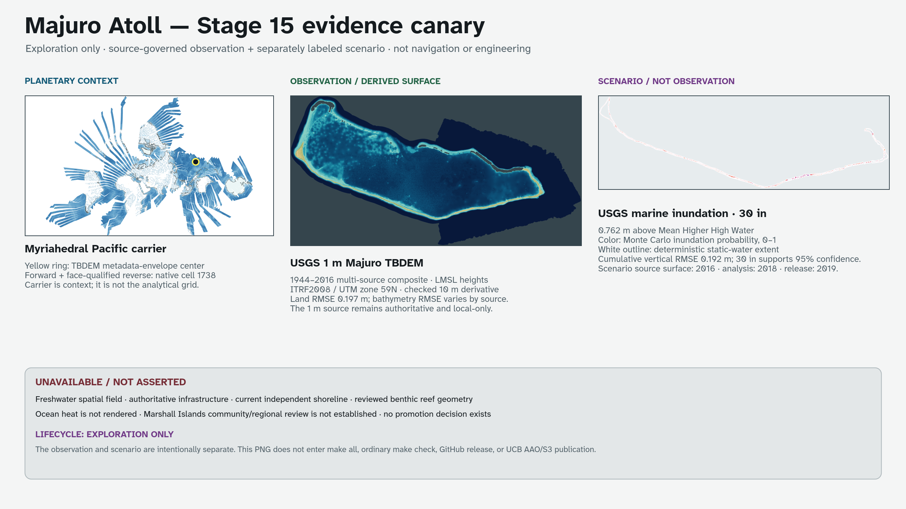
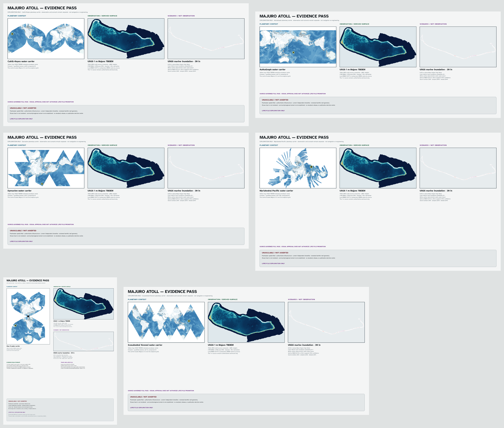

# Stage 15 R1 — Majuro atoll-scale evidence canary and full pass

Status: **implemented and checked exploration-only canary plus six-projection
full pass; no promotion, release, or external publication authorized**

Checked: 2026-08-10

[Stage 15 ledger](../docs/pages/development/stage-15.md) ·
[source-data instructions](../assets.static/atoll-evidence/README.md) ·
[evidence manifest](../fixtures/atoll-evidence/v1/manifest.json) ·
[coordinate fixture](../fixtures/atoll-evidence/v1/coordinates.json) ·
[full-pass manifest](../fixtures/atoll-evidence/v1/pass-manifest.json)

[](../output/atoll-evidence-canary-v01/majuro-atoll-evidence-canary.png)

[](../output/majuro-atoll-evidence-pass-v01/contact-sheet.png)

## Outcome

A first atoll-scale evidence tier is technically viable. The approved canary combines
one public USGS observation-derived topobathymetric surface, one separately
labeled USGS inundation scenario, and a planetary Myriahedral Pacific carrier.
It preserves source dates, spatial resolution, datum, uncertainty, preparation
history, and forward/reverse coordinate traceability rather than treating a
high-resolution raster as self-authenticating evidence. Its approved visual
grammar is now implemented for Cahill–Keyes, AuthaGraph, Dymaxion,
Myriahedral Pacific, Star-X, and Voronoi.

The full pass contains 24 products: layered SVG, authoritative print PDF,
3840-pixel-long-side PNG, and 480-pixel thumbnail for each projection. The
planetary carrier changes with the projection, while the analytical
topobathymetry and inundation panels retain their source grid and claim
boundary.

Both results remain exploration-only. They are not a standard or optional pass,
is absent from default generation and release graphs, and is unsuitable for
navigation, engineering, present-condition shoreline claims, or unreviewed
public interpretation. Marshall Islands community and regional review has not
been established.

## Implemented evidence

| Layer | Source and period | Canary treatment | Evidence boundary |
| --- | --- | --- | --- |
| Topobathymetry | [USGS Majuro TBDEM](https://doi.org/10.5066/F7416VXX), 1 m, 1944–2016 multi-source composite | Checked approximately 10 m Float32 derivative rendered as an observation-derived surface | Local mean-sea-level heights in ITRF2008 / UTM zone 59N; not a single-date surface |
| Marine inundation | [USGS Majuro exposure assessment](https://doi.org/10.5066/P9K1GD9W), 2016 source DEM, analysis 2018, publication 2019 | The 30-inch probability field is color; the deterministic extent is a white outline | Modeled 0.762 m above Mean Higher High Water; not an observed flood or forecast |
| Planetary location | Current `myriahedral-pacific` water plate | Yellow ring at the TBDEM metadata-envelope center | Context carrier only; never used as the analytical grid |

The TBDEM release reports land RMSE 0.197 m, Landsat-8-derived bathymetry
RMSE 1.066 m, and WorldView-3-derived bathymetry RMSE 1.112 m. The canary
retains that source-specific distinction and does not assign one value to
every cell. The inundation release reports cumulative vertical RMSE 0.192 m;
the chosen 30-inch increment supports its documented 95% confidence threshold,
and the probability layer represents 750 Monte Carlo DEM realizations.

Both USGS packages are public-domain U.S. government data. Their exact local
archive sizes and digests are frozen in the manifest. NOAA Coral Reef Watch
was assessed as a candidate but no NOAA raster was downloaded or rendered;
its product version, redistribution terms, scale, and observation/forecast
distinction still require review.

## Storage and preparation

The original packages live beneath ignored
`assets.static/atoll-evidence/.raw/`:

| Package | Bytes | Frozen identity |
| --- | ---: | --- |
| `Majuro_TBDEM_Data.zip` | 2,355,022,535 | Published MD5 `16b35677ba01331845285e178599b4ea`; SHA-256 `15f2e31655e980304f9590730f6a1768ca2dfa76ef3e11097509abd98fbdeb20` |
| `Inundation_Exposure_Raster_Layers.zip` | 80,927,783 | Locally frozen SHA-256 `6aea7d5b545825a83a9ab198af8695eeaf4cad507e69538b8dc684764e9f1818`; upstream checksum unavailable |

Git tracks only the three compact derivatives and their `SHA256SUMS`. Average
resampling produces the approximate 10 m TBDEM and probability grids; nearest
neighbor preserves the producer-defined deterministic zero/one class. CRS,
affine transforms, data types, and NoData values are retained. The source 1 m
rasters remain authoritative and local-only.

The small checked 700 × 394 planetary inset is a deterministic derivative of
the Stage 14 Myriahedral Pacific water raster. It is explicitly not the
analytical grid. Freezing it removes any generated-tree or Natural Earth fetch
dependency from the canary's offline render.

The frozen preparation toolchain is GDAL 3.11.5 for GeoTIFF resampling and
ImageMagick 7.1.2-27 for the context derivative and final composition. A
different tool version must reproduce the checked digests or be reviewed as a
new derivative set.

The workflow is deliberately non-transitive:

```sh
make fetch-atoll-evidence-data       # network; ignored raw packages
make prepare-atoll-evidence-data     # requires raw; writes compact derivatives
make generate-atoll-evidence-canary  # offline; never fetches
make check-atoll-evidence-canary     # offline reproducibility and API checks
```

## Coordinate and reverse trace

The checked coordinate fixture records five WGS84 source-envelope anchors and
one prepared-raster pixel trace. Each point stores:

- its source or GDAL-transformed geographic coordinate;
- the forward `myriahedral-pacific` pixel, native cell, and component in a
  3840 × 2160 frame;
- a reverse call qualified by that native cell and component; and
- the unique candidate and forward residual.

All six qualified round trips reproduce longitude and latitude within
`2e-8` degrees. The central source anchor resolves to native cell `1738`,
component `0`. The qualifier is evidence: an unqualified reverse at a cut or
overlap must retain every valid candidate rather than guessing one source
location.

## Render identity and visual review

The output is an opaque 8-bit sRGB 2560 × 1440 PNG:

```text
output/atoll-evidence-canary-v01/majuro-atoll-evidence-canary.png
SHA-256 d132b7fe925fde96acdefce772b93653e30877cb8e52692b04e779bf1925f49e
```

Visual inspection confirmed that the planetary locator, topobathymetric
surface, scenario field, dates, uncertainties, and lifecycle boundary are
legible. The deterministic scenario uses an outline instead of an opaque fill
so it cannot erase the Monte Carlo probability field. The plate explicitly
marks all unsupported categories as unavailable or not asserted.

## Unavailable evidence and stop conditions

The canary does not render a freshwater spatial field, authoritative
infrastructure, a current shoreline independent of the multi-date TBDEM,
reviewed benthic reef geometry, or ocean heat. It also lacks Marshall Islands
community and regional review. Missing evidence is `UNAVAILABLE`, never zero,
transparent certainty, or implied absence.

No future iteration may:

- label a scenario as an observation;
- borrow the TBDEM's 1 m resolution for another layer;
- discard valid reverse candidates at a projection cut or overlap;
- trace an unlicensed source graphic into geometry;
- infer a current, legal, or observed shoreline from this composite alone; or
- enter standard generation, GitHub release, or UCB AAO/S3 publication without
  a separate reviewed promotion decision.

## Verification surface

`make check-atoll-evidence-canary` deterministically rebuilds the PNG and
checks both JSON schemas, all compact-file and output hashes, raster dimensions,
the ignored/untracked raw-package boundary, evidence statuses, and the six
live WebAssembly forward/reverse traces. `make check-stage-15-research-prototypes`
and `make check-stage-15-active` include that isolated check. None is part of
ordinary `make check` or a release target.

`make check-majuro-atoll-evidence` independently validates the full-pass
schema and manifest, six context carriers, 24 product paths, layered SVG
evidence groups, print/full/thumbnail dimensions, hashes, claim boundaries,
and the same qualified coordinate behavior. It may regenerate only local
exploration products; it never fetches, promotes, releases, or uploads them.
